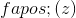
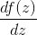

# 4.2 二次函数的斜率

> 原文： [http://math.mit.edu/~djk/calculus_beginners/chapter04/section02.html](http://math.mit.edu/~djk/calculus_beginners/chapter04/section02.html)

如果您绘制二次曲线图，您会注意到没有直线。另一方面，如果你在显微镜下观察你的图形，你可能会认为它是一条直线。从同样的意义上说，虽然地球是圆的，但当我们走在街上时，它看起来对我们这些可怜的微小生物来说非常平坦。

如果你看某个特定参数的二次函数，称之为，并且非常接近，那么将看起来像一条直线。 **在参数处类似于的[fGG]切线在处被称为** ，而**这条切线的斜率为 **at 在中被称为的导数。** 这个斜率通常写成**

特定参数处函数的切线是线性函数的图形。该函数**在参数中称为的线性近似。请注意，它与的函数不同，并且仅在附近的参数进行评估时通常接近。**

**_ 相同的确切词可以用来定义任何函数的导数，它看起来像是参数附近的一条直线。 _ 在论证中的导数，我们写为或，将是该直线的斜率。**

导数和切线 mathlet 允许您输入可以构造到其中的任何函数，并查看其值的图形及其斜率，即它在您选择的任何间隔上的导数。

接下来我们将看到如何找到二次函数的导数，或者给出其公式的任何多项式函数。

&lt;iframe frameborder="0" height="620" src="../mathlets/derivative-tangent-line.html" width="100%"&gt;&lt;/iframe&gt;