# 5.1 有理函数的导数

> 原文： [http://math.mit.edu/~djk/calculus_beginners/chapter05/section01.html](http://math.mit.edu/~djk/calculus_beginners/chapter05/section01.html)

以下是有关导数的一些事实。

1.导数有两个**伟大的属性**，如果我们有我们想要区分的函数的公式，它们允许我们找到它们的公式。

2.我们可以计算和绘制各种函数的和本身的导数，并且在电子表格上没有太多工作（事实上，找到导数和函数需要做些什么工作只需要完成一次，你可以几乎完全切换函数，就像你只绘制函数一样，并得到两者的图。我们很快就会明确看到这一点。）

**什么是“伟大的财产”？**

我们已经知道**线性函数的导数。** 它的**斜率。** 线性函数是它自己的线性近似。因此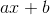的导数是; 的导数是。导数会杀死常数项，并在任何线性项中将 x 替换为 1。

第一个伟大的属性是：**如果一个参数，在参数的值的公式中出现不止一次**，那么**你可以找到它的导数通过分别查看每次事件引起的导数，将其他事件视为仅仅是常数;然后添加所有这些。我们称之为“多重发生规则”。**

例如，考虑二次方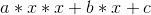。参数在其中出现三次。取一个单一事件的导数，即单独的任何单个的导数，将改变为。如果我们分别对每次出现这样做，忽略其他事件，我们会得到三个术语：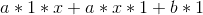或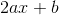，这个和是我们的二次方的导数。

请注意，常数项对导数没有影响。

这个属性允许我们直接从多项式本身的公式计算任何多项式的导数的公式，我们很快就会看到。

这个基本规则的一个特例是**取导数是一个线性运算。** 这意味着如果由两个术语组成，您可以通过分别添加每个术语的派生词来找到的派生词，在两种情况下计算，就好像另一个术语不存在一样。

该声明可写为：

****

另一个特例是**两个因子乘积的导数公式。** 如果我们有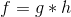，那么的变化和的变化将对的变化做出贡献，这些可以单独计算。结果是声明：

**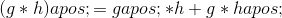**

被称为**产品规则**用于分化。

作为**产品规则的特殊情况，我们可以推导出** **的导数的倒数**是什么。 **函数的倒数是除以该函数;** 通常写为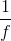或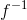。

通过的倒数的定义，在的整个域中。 的导数是，它是一个数字，在这里是右手边。我们可以推断出左手边的导数也是。

根据产品规则，我们得到：。

我们可以除以并重新排列告诉我们：

我们的第一个伟大的属性实际告诉我们所有我们需要找到任何多项式的导数或任何**有理函数，**我们指的是两个多项式的比率。这些都是我们通过对身份函数应用加法，减法，乘法和除法运算得到的所有函数。

任何正整数幂的导数，例如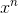，是通过注意到的每个 n 次出现的导数的贡献是通过用替换该出现来获得的，或换句话说，获得通过这里除以：因子的所有的总结果，的导数，然后是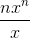，或者如果您愿意，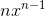。 （这个陈述适用于负权力和正面权力，并且对于任何权力都是分数的，实际上是任何权力，我们很快就会看到。）

这个以及用于区分给定导数的导数的和的规则，告诉您如何区分任何多项式。

上面最后一个等式的倒数规则**告诉我们如何区分任何有理函数，**说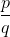其中和是多项式。我们应用产品规则和互惠规则来获得

**练习：**

**5.1 求以下多项式的导数：**

**a。 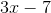**

**b。 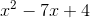**

**c。 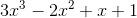**

**d。 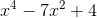**

**e。 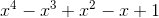**

**5.2 找出以下有理函数的导数：**

**a。 **

**b。 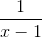**

**c。 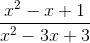**

您应该使用这些规则练习找到多项式和有理函数的导数，直到您对它们感到满意为止。事实上，你应该练习，直到你可以区分任何理性函数与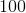％的准确度。

**但是没有人可以对％的准确度做任何事情，我当然不能。**

在计算机时代，任何小小的错误都会搞砸一切。学习使用％准确度做的事情非常重要。这听起来毫无希望，但事实并非如此。并不是说你必须完美地完成所有事情;离得很远。你只需要学会发现你的错误并修复它们。如果您不厌其烦地解决所有问题，您可以通过十几个来制作它们。

你用计算机犯的大多数错误都是如此严重，以至于你可以立即看到你做错了什么，找到并修复它是什么。一些错误是微妙的，你可能会想念他们。获得完美答案的关键是检查你做了什么，看它是否正确，直到它是正确的。

顺便说一句，到目前为止最常见的细微错误包括使用不正确的输入，这意味着，试图解决错误的问题。检查是否已将输入信息正确复制到计算中是绝对必要的。

假设您找到了导数的公式。不要停止使用公式，你应该检查它是否正确。计算机为您提供了一种简单的方法：您可以用数字计算导数，并查看是否得到相同的答案。如果你这样做，你知道你的答案是对的。

如果你没有从公式中得到相同的答案，你必须找到出错的地方。第一次，甚至第七次，你不必是完美的。但最后，如果你正在处理机器，你必须是完美的。

**如何轻松检查我的差异？**

一种方法是将您计算的函数作为导数与 [**派生小程序**](../chapter04/section02.html#DerivativeTangentLine) 找到的导数进行比较，方法是输入您自己的函数。请记住，在这样做时，时间符号是*，指数前面是^所以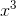输入为 x ^ 3。

您还可以使用电子表格检查衍生产品以设置自己的 applet。 [**第 3A 节**](../chapter03/section03.html#SubSection3A) 中描述的用于绘制函数的设置可以增强，不仅可以绘制函数，还可以绘制其数值导数和区分它的答案，没有你花费太多精力。

完成此设置后，您只需在一个地方输入您的函数，在另一个地方输入导数的答案，适当地复制每个部分，然后您可以在图表上查看答案和数字。如果它们相同，那么你的答案是正确的。如果不是，您必须对您的区别和/或电子表格计算进行解决。成为一名专家意味着通过丰富的经验熟练掌握解决方案。

**好的，我怎么设置它？**

有关明确说明，请参阅 [**第 9 章**](../chapter09/contents.html) 。