# 6.1 最有用函数的导数

> 原文： [http://math.mit.edu/~djk/calculus_beginners/chapter06/section01.html](http://math.mit.edu/~djk/calculus_beginners/chapter06/section01.html)

Rational 函数是一个重要且有用的函数类，但还有其他函数。我们实际上通过从身份函数之外的两个附加函数开始获得最有用的函数，并且除了加法减法乘法和除法之外还允许两个以上的操作。

**还有什么额外的启动函数？**

这两个是**指数函数，**我们将暂时写为 **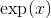，**和**正弦函数，**通常写为 **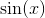。**

**这些是什么？**

我们将花费一些时间和精力来尽快介绍和描述这两个函数及其众多精彩属性。目前，我们关心的只是它们存在，你可以在电子表格和科学计算器上找到它们，我们可以对它们进行算术运算（加法，减法，乘法和除法）。如果你只需要一个提示，正弦函数是角度研究的基本函数，称为三角学。 **指数函数**根据导数定义。 **它是在参数 0 处的值为 1 的函数，它具有与其自身相同的导数。** 我们有

这个定义可能会使函数起初有点神秘，但你必须承认它可以很容易地区分这个函数。

**这个指数函数有一个重要而有趣的特性：即**

****

_**（证明的想法）作为的函数，通过以下关于替换导数的陈述，我们可以推断出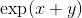的导数本身。它在的值是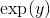。该导数与的区别仅在于为时的值而不是。这意味着的导数本身是乘以。我们忽略了对的任何可能依赖性。这样做只意味着我们正在计算所谓的“关于变量 x 的偏导数，保持变量 y 固定”。别担心;当有多个变量时，它是我们处理微积分的​​方法之一）**_

**的定义属性允许我们推导出它的幂级数表示。 ** 具有常数项，并且作为其自身的导数必须具有线性项，其导数是，即。同样，它必须有一个二次项，其导数为，即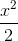。继续这种演绎永远给了我们

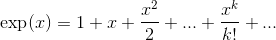

**还有哪些额外的操作？**

我们想要使用的两个新操作是**替换，**和**反转。**

**And what are these?**

如果我们有两个函数，和，参数的值为和，我们可以构造一个新函数，我们写为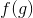，由**得到]在参数中取的值，作为的参数。**

**** 的值，我们写为，是的值的值的值;它是 **在中的值。** 我们称这个新函数**将替换为。** 我们将在第 8 章中进行反演。

替换比听起来更简单。假设您在框 A5 中的电子表格中有的值，并且您在框 B5 中放置= g（A5），在 C5 中放置= f（B5）。那么 C5 将包含。

如果将多项式替换为多项式，则只需得到多项式，如果将有理函数替换为有理函数，则仍然具有有理函数。但如果你把这些东西替换成指数和正弦，你会得到全新的东西（如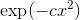），这是概率论的基本函数。

正如利用指数函数或正弦函数的复制品对电子表格或科学计算器没有任何问题一样，替换也没有真正的问题。我们已经看到你可以在 B10 中创建 g（A10），然后在 C（10）中创建 f（B10）并且在 C10 中创建了替换值 f（g（A10））。你可以通过重复这个过程，构建最可怕的替换组合和可想象的算术运算，甚至比你想象的还要糟糕，只有很少的难度，你也可以找到它们的数值导数。

在我们继续上一次操作之前，我们注意到有一个与替换操作相关的很好的属性。正如我们已经找到上面的公式来找到总和或乘积的导数或者我们知道的导数的函数的比率，我们**根据其成分的导数得到了替代函数的导数的整齐公式。** 实际上它可以是一个简单的公式。

结果通常称为**链规则：**

某些自变量的的导数与任何其他导数一样，是在函数处与该函数相切的直线的斜率。与所有斜率一样，该斜率是给定函数的变化与其参数变化的比率，在非常接近参数的任何区间。因此，的导数是的微小变化除以的变化。替换将分母改为中的微小变化。

假设，我们对变量做了一个非常小的变化，非常接近，这个变化足够小，以至于和的线性近似在变化的区间内非常准确。让我们称之为改变。这将引起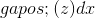的的变化，（因为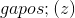的定义是的变化与的变化非常接近的比率。 ）

如果为 0，那么当取决于时，g 不会改变，也不会改变，因为它的参数取决于。 （如果 f 对具有其他依赖性，那么从其他依赖性对其导数的贡献会增加来自变化的贡献，并且在这里无关紧要。）

如果不是，我们可以将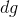定义为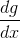，并使用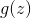中的参数的变化由给出的事实

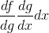，其中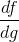在评估，在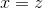评估。

根据这一说法，链条规则可以读取

**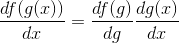**

换句话说，这意味着取代函数的**导数值，相对于变量是组成函数和的导数的乘积，取自相关论点：本身为，为。**

**一些例子怎么样？**

我们将给出两个例子，但你应该为自己制定至少十几个例子。

**例 1：假设我们将具有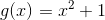给出的值的函数替换为取值的函数。**

替代函数具有值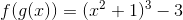。
让我们计算这个函数的导数。 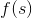相对于的导数是 **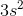，**，相对于的导数是 **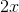。** 
如果我们设置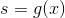 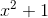，并取这两个产品，我们得到：

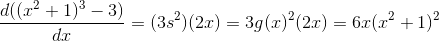

你可以在这里将多维数据集相乘，然后进行区分以获得相同的结果，但这样做会更加混乱，并且大多数人在执行此操作时至少会犯一个错误。如果按照连锁规则进行，那么即使是第一次，你也有可能把这些事情做好。 （不幸的是，如果你正确地执行它，你将无法从中进行任何练习调试。）

**例 2：找到函数的导数。**

这是通过将函数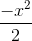代入指数函数而获得的函数。
函数的导数是函数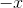;指数函数是它自己的导数。
在应用链规则时，我们发现：的导数是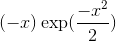，后一因子是在评估的指数函数的导数。

**练习：**

**6.1 写下代入的结果的表达式，形成下列函数对的，并使用链规则找到它们的导数的表达式。**

**a。由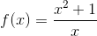定义的，由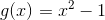定义的。**

**b。 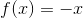由定义，由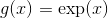定义。**

**c。 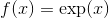由定义，由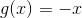定义。**

**6\. 2 使用[衍生小程序](../chapter04/section02.html#DerivativeTangentLine)检查每个结果。**

**6.3**

**a。考虑公式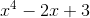定义的函数。使用小程序绘制它并查看其导数。它的最小值在哪里，它是什么？它在最小点的导数是什么？从 applet 估计这些东西。**

**b。找到的最大点和该参数的的值近似为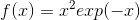，**定义的

**c。如果函数在从到的区间内是可微分的并且在和之间的点处具有最小值，那么它在处的导数是什么？**

**6.4 使用链规则显示：。**

**好的，我现在在哪里？**

此时，您可以使用规则来区分使用算术运算和以身份函数（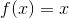开头）或神秘指数函数开头的替换所能完成的所有函数。
**在下一节中，我们将扩展内容，以便您可以从正弦函数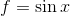开始，并区分您可以创建的任何内容。最后，我们将扩展规则以区分反函数。**

**这是什么？**

数字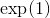称为。性质：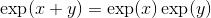暗示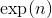是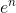，因为是 倍的产物。当不是整数时，我们还没有定义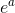。当我们确定它时，我们会发现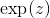对于所有实数或复数都是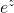。实际上，我们将明确定义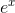的的合理值，并显示它是和**然后将定义为无理值为。**

**什么是？**

回答这个问题的一个简单方法是将写为的幂和乘以适当的系数，然后设置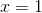。我们可以通过要求其导数是前一项来计算总和中每个幂的系数。

因此，根据定义，我们知道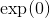，总和中的常数项是 1.对于是它自己的导数，它必须包含其导数是这个常数项的东西，。导数为的术语是;导数为的术语是;其导数为的术语是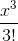，其中是乘以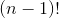。而总和中的一般术语是。 （我们已经证明了这一点，但我非常喜欢它，我正在重复它。）

这告诉我们是

**练习 6.5 使用电子表格**对本系列的前 18 个术语求和。

我得到的数字。事实证明，不是理性的，甚至不是多项式方程的解。这些数字被称为**超验。**

**当不是整数时，如何定义？**

**当合理时，说，是的根。否则它由上面证明的无穷大功率系列定义：**

****