# 7.1 二维数学

> 原文： [http://math.mit.edu/~djk/calculus_beginners/chapter07/section01.html](http://math.mit.edu/~djk/calculus_beginners/chapter07/section01.html)

## 7.1a 平面几何的回顾

本节是对平面几何的回顾。平面几何是关于平面中的点线和图形的属性（或更一般地在其他表面中）。基本概念是点和直线。不相交的线被认为是平行的。

Euclid 很久以前就注意到了以下几点：

每对点确定包含两者的独特直线。
如果他们从未见过面，两条线是平行的。
在一个平面中，每条线和一条不在其上的点确定与包含后者的前者平行的唯一线。 （在所有其他表面上都不是这样）
每对不平行的线都有一个独特的交点。

他从这些陈述中得出了各种奇妙的后果。

如果你在点切两行，则每一半被称为**射线，**从开始。

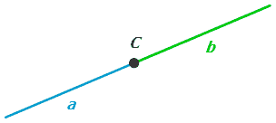

如果你在切割从开始的任何光线，你会得到另一条光线从和**线段**开始，末端为和。

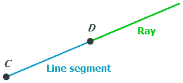

两条射线和均从开始并且仅在处相遇，确定处的两个角度。除非和是同一直线的一部分，否则其中一个比另一个小。我们可以称之为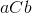和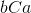。我们可以将角度描述为对应于发出的所有光线，这些光线顺时针过并且在之前。

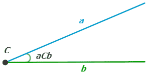

我们可以用和坐标来描述平面中的任何点。我们总是把 x 坐标放在第一位。因此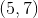表示坐标为且坐标为的点。然后可以通过其两端的坐标来描述线段。 **如果两个端点都具有相同的坐标，则段的长度是它们的坐标之间的差异（和和反转相同）。** 因此坐标和的点之间的距离是。

**当两个坐标中的点彼此不同时，我们必须定义点之间的距离。** 我们希望距离是一个有意义的概念，而不依赖于所使用的坐标系。我们选择的定义具有重要且必要的特性，无论我们选择哪个方向作为 x 方向，段的长度都是相同的;那个方向是我们的选择。 （如果它们随着那个选择而改变，则长度和距离不是段的固有的。）

这就是定义： _**两点之间距离的平方是每个坐标差异的平方和。** 距离是此总和 _ 的正平方根。因此，具有坐标和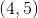的点之间的距离平方是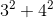或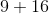，即;这些点之间的距离是。

我们将某个特定长度称为单位长度，并且假设**一个段具有长度，如果它长于该单位。** 单位是什么并不重要，平面几何与任何相同。 （顺便说一句，如果我们处理的是球体的表面而不是平面，则情况并非如此。）

接下来的问题是，**我们如何描述角度？** 我们可以将任何角度声明为单位角度，并将任何其他角度的大小与该单位角度的任何倍数相关联。传统上，有两种常用的单位角度，熟悉两者都是明智之举。

欧几里德（或其他一些古代人）定义了从光线的一侧到另一侧的所有方向获得的**角度，为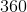度。** （为什么？我认为答案是通过小数字很容易划分 360;实际上 360 除了 7 之外可以被 1 到 10 之间的所有数字整除，而且它本身并不是一个非常大的数字。）

根据该定义，当和（角度的两侧）**指向彼此完全相反时出现的“**直线”角度**是度** ]。直角，即直线角度的一半，是度，依此类推。 **在处形成直角**的两个区段或光线或线被称为**垂直**。

第二个常用的度量涉及单位圆。这是与中心点相距所有单位距离的点集。然后我们可以通过角度内单位圆的部分的**长度来测量角度。** 单位圆周围的距离是单位圆的圆周，即。这意味着直角的大小和直角大小是。这里的距离单位称为**弧度**。

**什么是弧度？**

好吧，接近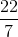。因此接近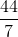或大致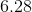弧度。如果我们将除以，我们得到一个弧度接近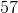度。）

更具体地，是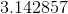 ... 是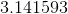 ... 弧度是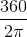，其是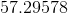度，而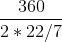是。
（你最好不要试图记住这些细节。足以记住围绕一个圆的角度变化是度，也是弧度。这意味着一个弧度是度。如果你不想用机器得到上面的答案，你可以用代替并用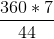 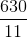代替弧度，你就错了略低于百分之二十分之一。）

**欧几里德从他的假设中推断出什么？**

这是一个简单的事实及其证据：

事实：**当线相遇时，相反的角度是相同的，任意两个相邻角度的总和是弧度。**

_ 证明：假设线和在处相遇，并且在点的一侧表示的光线，在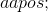的另一侧表示的光线。为做类似的事情。然后有 4 个角度：它们是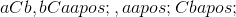和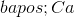。_

_ 然后，如果加在一起，任何连续的这些，包括和，形成一个直线角度。_

_ 这意味着，例如和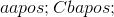加入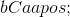时两者都相同，这意味着和是相同的。_

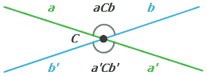

在提到任何更多结论之前，我们再提出一个定义。假设我们的角度小于直角。

## 7.1b 正弦函数

我们选择一个中心点并在其周围绘制**单位圆**。 （这是一个半径长度为的圆。）我们在中心绘制有问题的角度，并选择它的一侧为轴（为。）。设为角度的另一侧与圆相交的点。然后我们在 y 轴方向上绘制一条线段，该线段位于 x 轴和之间。

**点的坐标，即该垂直线的长度，称为角度的正弦，写为。** 请注意，垂直线是从 P 到 x 轴的直线，因此比沿着圆的 P 到该轴的路径短，这是以弧度表示的角度大小。这意味着**正弦值总是小于以弧度为单位测量后者时的角度。当角度很小时，正弦非常接近角度大小，以弧度为单位，因为直线路径和圆上的路径几乎相同。** 因此，当以弧度为单位测量角度时，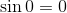和的的导数是。

另请注意，正弦以的角度开始，当角度变为时，正弦开始增加到。对于较大的角度，我们可以用相同的方式定义它，作为的 y 坐标。在之后，当角度增加时正弦减小，并且当我们绕圆圈四分之三处时，以角度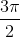达到。然后当增加时它再次上升。当然，当正弦为负时，它减去垂直线的长度，这对应于的坐标在那里为负的事实。

**角度经常被描述为（以弧度表示）从围绕圆圈的到。** 这样，角度通常对应于正 x 轴，但低于 x 轴的角度具有负大小。如果是这样，正弦为负的角度是负角度。正弦是其角度参数的**奇函数**，意思是：

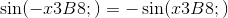

与 的角度**“互补”是侧面为正 y 轴的角度和从圆心（此处为原点）到的光线。与互补角度的正弦称为的余弦，写为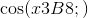。 **该余弦是单位圆上点的坐标。** 瞥一眼图片显示，的余弦坐标是角度的偶函数。角度是正还是负是相同的。**

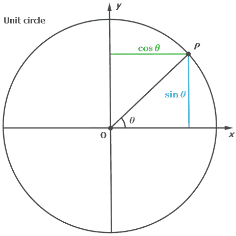

**三角形**

当小于时，描述的正弦的另一种方式是由**形成的三角形，角度的双边和以及垂直于一个的任何直线。方**。

该三角形具有直角，其中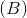与垂直线相交。 的正弦值是**直线三角形**与相对的一侧的长度除以与直角相对的一侧的长度，称为该三角形的斜边。 （我认为使用希腊字母作为角度，并使用像斜边这样的词来表示直角三角形的最长边是很麻烦的，但这就是每个人所做的。）

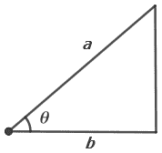

单位圆上的点都具有长度，这意味着分量和其上所有点的分量的平方和是。 组件的长度为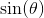;它的方格是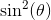。我们可以推断组分的平方，即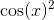必须是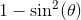。这告诉我们

**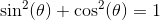**

假设我们在一条线上选择三个不是全部的点，并按线段成对连接它们。它们形成一个三角形。每个三角形有三个边和三个内角。 **两个三角形**被认为是**全等，当一个三个内角与另一个内角相同时，三个边长与另一个**相匹配。如果角度相同，即使长度不同，我们也称它们为**相似的**三角形。

关于三角形有两个有趣的问题：首先， _**三个边长有什么限制，三个角度尺寸形成三角形？**_

如果我们单独考虑长度，为了形成三角形，**最大边不能大于另外两边的总和**。 （证明：两个较小的边必须遇到最大边的两端，否则它们的长度不足以相互接触。如果两个较小的一边的长度总和恰好是最大长度的总和，它们所有这些都必须位于不描述三角形的一条线上。）这种情况称为**三角形不等式。**

我们可以证明三角形中的角度之和是弧度，但它需要使用“平行假设”。 （平行假设表示只有一条线平行于任何穿过任何点的线。）这必须是，因为三角形的角度之和不是球体表面上的弧度。如果将每对对映点定义为单个点，则球体表面上的几何体将遵循欧几里德公理和假设的所有其他对应点。

如果我们单独考虑角度，我们已经看到在直角三角形中，另外两个角度是互补的，这意味着它们的大小之和（弧度）是。因此，直角三角形的所有三个角的总和是，即直线角度。

对于任何三角形都是如此：

**任何三角形的内角之和为弧度。**

_ 证明：假设我们从最大角度为的三角形开始。如果我们从到绘制一条直线与后者相交的线段，我们将三角形划分为两个直角三角形，这两个角度的总和是弧度。该总和由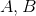和的内角和的直线角组成。由于的角度大小为弧度，因此内角也与相加。_

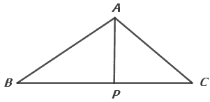

_**练习 7.11：假设垂直方向使在原始三角形之外。通过类似推理证明该三角形的角度之和为弧度。** _

第二个问题是： _**需要六个参数中的多少个（角度大小和边长）来确定三角形的所有尺寸参数？**_

Euclid 使用带有标尺和指南针的结构来回答这些问题，这些都很有趣。但是我们可以使用正弦的概念做得更好。有了它，我们实际上可以在确定三角形时找出缺失的信息。

显然，如果我们所知道的三角形是一个边长，那么有许多三角形彼此不相似，可以有一个长度的边。如果我们只知道一个角度，情况也是如此。知道两个角度也告诉我们第三个角度，因为所有三个角度的总和是弧度。 **意味着知道两个角度意味着所有相同的三角形都相似，**但我们对它们的边长不知道。 **我们将看到，知道任何特定角度对之间的两个角度和边长确定了所有三个长度**。

仅了解两个边长并不能确定角度**;知道两个边长和它们之间的角度确实如此，知道所有三个边**也是如此。正如我们将要看到的那样，有一些优雅的事实可以让我们确定所有缺失的信息。

实际上**知道两个边长和 大于，知道侧与第三侧相交的角度，也决定了一切，** ]我们也可以在这里找到缺失的信息。

当边长为和，大于时，我们知道侧与侧相交的角度，有或两个解决方案，除了一个特殊情况（当边长和确定一个直角三角形以便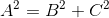时发生。）要得到解决方案，必须至少为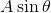。

**知道三个边长完全决定了三角形。** 我们现在将通过使用正弦来证明所有这些陈述。

**我们如何找到缺失的三角参数**

这样做的一个工具是**正弦法**。这是声明**侧面的大小除以侧面的大小，是角度对侧的正弦（这是和的角度） （相反）除以角度相反的正弦。** 如果我们知道两个角度，我们知道第三个和它们的正弦，所以如果我们知道任何一个边长，我们知道它与所有其他边长的比率，并且可以计算另外两个边长。

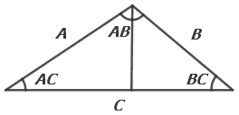

_ 正弦定律的证明：给定一个具有**边长** 和的三角形，绘制一条垂直于侧的线段，从它到与其相对的顶点。根据正弦的定义，该段的长度是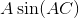，也是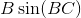。这意味着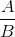是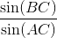，这是上面的陈述。_

**练习 7.12：用顶点标签而不是段长度标签绘制自己的图片并验证这些语句。**

**正弦定律告诉我们，如果我们知道三角形的所有角度，那么我们就知道它们的正弦，因此我们知道它的边长之间的所有比率。因此，我们可以推断出相似的三角形具有相同边长的相同比率。**

## 7.1c 向量

在我们只知道三个边，或两个边和一个角之后，如何在三角形中找到缺失参数之前，我们再做一个定义。我们使用符号来描述具有坐标和坐标的点。在这些术语中，通过给出每个端点的两个坐标来描述线段。这很麻烦。 **出于许多目的，例如确定长度，我们并不关心细分市场的开始位置;对我们来说重要的只是两个端点上两个坐标之间的差异。** 这些决定了细分的长度和方向。

因此，给定端点为和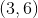的线段，两个端点的差异在坐标中为 2，在 y 坐标中为。我们将此信息写为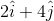，其中和在和方向被称为单位向量，并且说给定的线段具有作为其**向量。** 实际上**这个符号描述了从到的方向的有向段;相反指向的部分是这一部分的否定。**

一般来说，**每个有向线段，比如到，定义了一个载体，即** ，中的和单位载体， 方向分别。此向量包含与对我们重要的片段相关的信息，但没有说明它开始的位置，或和方向是什么，除了它们彼此垂直。

为了看到这个定义的用法，假设我们有一个带有顶点，和的三角形

三角形的每一边由这些点描述符中的两个描述，即其两个端点的描述符。而且我们通常对三角形在平面中的位置没有兴趣。假设我们引导细分形成一个循环。

线至具有矢量。线至具有载体。线至具有载体。

注意，对应于该循环的向量之和是向量。

**通常，对应于有向路径的线段的一组向量的总和是从该路径的开始到其结束的向量。在循环的情况下，这些是相同的点，因此总和是向量。**

_ 证明：在形成和矢量时，中间坐标从它们的输入矢量中加上，并从它们的输出矢量中减去，然后辍学。只有端点的贡献仍然存在。_

此信息隐含在按点描述行的符号上，但该符号具有太多信息，并且更难以使用。

但奇妙的是，给定两个线段，我们可以轻松地从它们的向量中提取重要信息。第一点信息是所谓的**点积：**给定，，它们的点积是。 **你像组件一样将它们相加并加起来**。我们已经看到**矢量与其自身的点积给出了其线段长度的平方。** 一般来说，正如我们将要证明的那样，两个不同向量的点积**给出了两个段长度的乘积，乘以它们之间角度的余弦。它们之间的角度**是你用相同的后顶点向上排列两个线段时所得到的角度。

当两个分段形成循环三角形的边界的一部分时，三角形的内角不是它们之间的大小角度，而是具有大小，并且该角度的余弦是 。 **绘制图片并使用它们来验证此声明。**

这里对点积的评价证明来自于该产品是**不变量的事实。** 这意味着它不依赖于坐标系的方向。

**你怎么知道点积是一个不变量？**

声明：如果我们旋转坐标以便单位矢量被替换而被替换，则任何两个矢量之间的点积不会改变。

_**练习 7.13：证明这是指向方向的载体和一般载体。** _

这意味着我们可以选择我们的坐标系，以便长度为的第一个矢量指向方向，这样就是。当和之间的角度是时，第二载体类似地是。根据其定义，两者的点积是。

**余弦定律：如果三个有向线段形成一个循环三角形，那么它们的边长，和服从，其中是三角形的内角。 和细分相遇。**

_ 证明：我们已经看到三角形所有边的向量之和是向量。这意味着区段的载体减去和载体的总和。_

_或长度的平方则是和向量之和的平方，它是该和与其自身的点积。这是，（记住和段相遇的内角是）。结论来自以下事实：。_

**我们可以立即从这个定律看出知道和和确定，并且知道，和确定。**

**因此，这个余弦定律允许我们推导出三个边长或两个边长的三角形的所有边长和角度以及两个相应边之间的角度。**

可以推导出所有信息的另一种情况是，在上面的公式中，我们知道和和，这是和相遇的角度，比大。在余弦定律中填充给定信息会产生的二次方程。当小于时，该等式的两个解中的一个是负的，因此我们可以通过找到所获得的二次方程的一个正解来确定唯一解。

**练习 7.14：定义和的长度和角度，得到的二次方程并找到其正解。验证其他解决方案是否定的。**

**跨产品和领域**

我们已经在上面看到两个向量的点积（以及它们自身的点积）如何传达关于它们描述的段的有用信息，即它们的长度与它们之间角度的余弦的乘积。

我们可以用平面中的矢量称为**交叉积**。该产品不仅取决于线段的方向，还取决于放置线段的顺序。但这很简单。

在形成点积时，您可以像组件一样进行乘法并添加它们。 **在形成叉积时，您将与组件不同地相乘并减去它们。** 显然你得到的信号取决于你减去哪个。这取决于您而不是细分。但是，交叉产品的规模具有实际意义。 **是由两个线段形成的平行四边形的区域作为相邻边。这是三角形面积的两倍，这些线段作为边**。

证明：_ 平行四边形的面积是它的基本长度乘以它的高度。如果基部具有长度而另一侧，长度与基部形成角度，则高度为，并且面积为。如果方向上的点，那正是交叉积的大小。结论是在坐标旋转下交叉乘积的不变性之后得出的，这证明了正好证明了点积的不变性。_

假设我们有载体和，它们的交叉产物是（符号）。因此，它们形成的平行四边形具有面积，它们形成的三角形具有该区域的一半或。

**载体与其自身的杂交产物是。**

顺便说一下，点和十字产品可以形成更高的尺寸。在三个维度中，点具有三个分量，矢量也是如此。 **点积在任何维度上以与相似组件的乘积之和相同的方式定义，并且总体上具有相同的含义。**

**二维交叉产品涉及两个组件。在更高的尺寸中，它通过采用每对坐标的二维交叉积而形成。**

在三维中，您可以将和组件相乘并减去，并且可以对和组件以及和坐标进行相同的操作。我们通过制备这些载体来使**的，和组分成为交叉产物载体。**

（项是普通的二维，交叉积。你可以通过将改为，改为和改为[其他术语]来确定其他术语。 ，到，到，到，一次，也是两次。）

**三个维度中的两个向量的叉积垂直于这些向量所代表的区段的平面。其大小是任何平行四边形的面积，其边由这些向量表示。**

**给定三个载体，和，与的点积是平行六面体的体积，其侧面由这些载体描述。**

_**练习：1。证明这两个陈述。 （提示：选择方向，使得方向上的矢量 a 和位于平面。**_

_**2.给定两个彼此垂直的线段。所有这些都意味着他们的载体的点积？关于他们的交叉产品的大小？**_