# 7.2 三角学和导数以及加法定理

> 原文： [http://math.mit.edu/~djk/calculus_beginners/chapter07/section02.html](http://math.mit.edu/~djk/calculus_beginners/chapter07/section02.html)

**简介**

在 7.1 中，我们引入了大量的三角函数而没有实际提及它。

对于真正有趣的主题，三角函数是一个冗长而令人讨厌的名称。 **Trigon** 是三角形的奇特名称;类似于八角形或五边形，Metry 指的是测量。因此，三角学意味着要么测量三角形，要么使用三角形测量其他东西，我不确定哪个;也许两者。

我们将描述剩余的重要三角函数结果。三角学的一个谜团是：为什么右三角形中六个边长比率中的每一个都有自己的特殊名称？为什么例如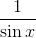有自己的名字？当我在学校研究三角学时，（在史前时期），我们面对所有六个名字，并进行了测验，并期望记住哪个没有任何线索的意思。这让我们许多人失去了三角学。

假设我们的角度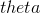，如图所示位于轴和线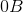之间。古人画了一条线段，它将**从点切线到单位圆延伸到点的轴。这段的长度称为角度的正切**。 （当线具有正斜率时，切线被认为是负的。）切线是拉丁词，意思是“触摸”，这就是这条线对圆圈的作用，点。

**切线与轴相交的点的坐标称为** 的割线（我们假设原点位于单位的中心）正确的是一个拉丁词，意思是“切割”，这就是这条线对圆圈的作用。

他们还将**定义为小于直角的角度的补码，使其成为直角与它之间的差值。** 这使得他们将**的余弦，余切和余割定义为原始角度的补数的正弦，正切和正割。**

对我们来说幸运的是，所有这六个函数都很容易与正弦函数相关，这意味着我们只需要真正熟悉正弦函数，然后我们就可以弄清楚其他函数是什么。

以下是这些函数之间的关系，所有这些函数都来自**相似三角形的相应角度相等的事实的定义。**

根据定义， **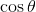** 是 **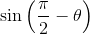。**

**从斜边是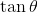的三角形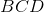和不相反的一侧是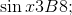，得到**

**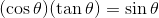**

意思是

**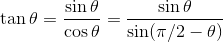**

**补充版本是：**

****

从三角形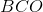

我们同样得到

**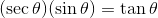**

which means

**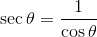**

补充版本是

**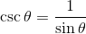**

所以这一切都解释了为什么右三角形的每个边长比例都有自己的名称。

我非常喜欢这张照片，这里再次作为一个数学小说。

&lt;iframe frameborder="0" height="760" src="../mathlets/trigonometric-functions.html" width="100%"&gt;&lt;/iframe&gt;

**练习：**

**7.21。自己画一张这张照片，而不是看这个，一个小于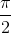的角度显示所有这些实体。**

**7.22。你看到多少个相似的三角形？请记住，除了直角三角形中的直角之外的两个角度是互补的。**

**7.23。如果你在三角形中使用正弦的定义，你会得到什么奇怪的关系？**

在上一节中，我们已经讨论过你应该知道的三角函数的三个基本定理。还有三角函数的有用“加法定理”，它描述了参数和的正弦和余弦。我们还描述了正弦和余弦的导数，以及它们与指数的关系。

**三角学的基本定理是什么？**

**1.毕达哥拉斯定理**：这个着名的结果表明**直角三角形的斜边的平方是其他两边的平方和。** 翻译成我们的定义它说，无论任何角度，我们都有

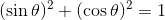

这意味着，我们有有符号

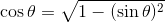

2\. **正弦定律**：这表明在任何三角形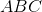中，处的角度与处的角度之比是边长的比率与相反的一侧。如果我们将这些长度分别描述为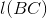和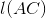，我们就有了

我们在 7.1C 节证明了这一点

3\. **余弦定律**：该陈述根据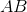和的长度及其在处的角度给出三角形边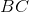的长度。

**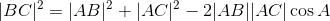**

也在 7.1C 中得到证实

**正弦和余弦的导数**

考虑单位圆上的点，该圆以点为中心。设为从线段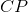到轴顺时针的角度。

然后我们有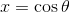和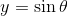。我们知道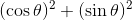对于单位圆上的任何都是，因为这是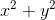对于的是的陈述，这是单位圆的定义。

这意味着当我们在单位圆周围移动时，的导数是是。这告诉我们

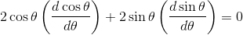

这意味着具有组分和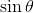的载体具有点积，其载体的成分是它们相应的导数。

幸运的是，很容易找到具有给定的点积的二维中的所有向量：反转组件，改变其中一个符号，并乘以任何常数。因此（写入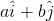的较短方式）具有的点积。

这告诉我们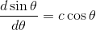和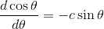，对于某些常数。

我们可以通过在的点检查这些陈述来确定常数。

如果我们的角度是以弧度为单位测量的，我们观察到在单位圆上，从角度移动距离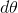会将正弦从变为几乎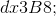。因此，上面的常数在角度处是，并且是常数，总是。

我们总结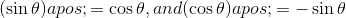。 （后者的关系实际上来自前者，因为是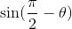。

**练习 7.25：从这些事实中推断割线的导数和切线。**

**为什么不告诉我们答案？**

**如果我们这样做，你将无法记住它们。如果你自己弄明白，你会忘记它们。**

通过查看组合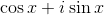得到一个有趣的结果。 （这里是的平方根。）请注意，它的导数是次。它在的价值是。我们知道这意味着什么。衍生自倍的函数，其的值为，是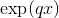。

因此我们找到：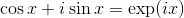。

通常我们可以将任何函数分成奇数部分和偶数部分;偶数部分是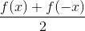，奇数部分是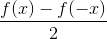。两部分的总和是。

由于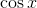是偶数且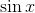是奇数，我们可以将识别为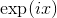的偶数部分，并将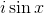识别为奇数部分。

正式表达是

**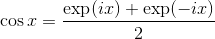**

和

**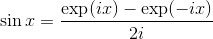**

**正弦和余弦的电源系列扩展**

我们已经看到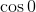是。由于正弦的导数是余弦，，当写为的幂之和时，必须在该导数中有一个项，其导数为。这必须是，因此的幂级数扩展的第一项是。余弦具有导数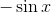，因此它必须在其幂级数展开中有一个项，其导数为，该项必须为。 同样必须有一个术语，其导数是;这迫使余弦系列中的一个术语为等。

**那我们得到了什么？**

正弦有所有奇数力量的贡献，它们的符号交替出现：

****

而余弦同样具有来自偶数幂的交替符号项：

****

顺便说一句，和是的偶数和奇数部分。它们的幂级数扩展类似于余弦和正弦的扩展，除了所有项都是正的。

所有三角函数都有幂级数表达式，但如果你想这样做，你可以自己解决它们，从它们的关系到正弦和角度的余弦

**加法定理**

**什么是加法定理？**

我们已经注意到，以度或弧度表示的角度的标准度量是相加的：这两个角度之和的度量是每个求和的相同度量的总和。这种说法不适用于正弦或余弦。两个角度之和的正弦值是**而不是**它们的正弦之和。加法定理告诉我们如何根据求和的两个角的正弦和余弦来计算两个角之和的正弦和余弦。

找到或证明正弦和余弦的加法定理的最简单方法是使用它们与指数的关系。我们已经知道指数的加法定理：

****

由于是，我们发现是

是的

****

**最后一个表达式的实部是，虚部是，这些是我们的加法定理。**

仓促：

从 7.2 节顶部图片中的三角形，我们发现最后一个是。

