# 9.1 数值微分

> 原文： [http://math.mit.edu/~djk/calculus_beginners/chapter09/section01.html](http://math.mit.edu/~djk/calculus_beginners/chapter09/section01.html)

**我们怎样才能找到函数导数的良好近似值？**

显而易见的方法是选择一个非常小的并计算，这看起来像导数的定义。实际上，这不是一个好主意。

**为什么？**

问题是你的计算方法不是无限准确的，特别是如果或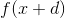是无理数。这意味着您的评估中有时会出现小错误。当很小时，和会因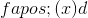之类的不同而相互不同，但是你的计算误差将大致独立于。因此，当您使变小时，您的错误与的比率会增加。将结果除以非常小的与将其乘以非常大的相同，并且放大了误差。当变得小于计算误差的大小时，你得到的导数估计将主要是计算错误，并且很少会告诉你。以这种方式出现的错误通常称为舍入错误。

这样做的结果是你真的想只使用相对较大的值来计算导数。

**这可能吗？**

答案是肯定的！这样做很有趣。

**怎么样？**

这是基本思想：假设你的函数不仅是可微分的，而且它的导数在参数中也是可微分的，它的导数也是如此。

如果是这样，的值可以用幂级数来描述，

（此处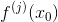表示在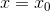评估的的导数。）为了证明这一点，计算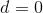 和二阶导数等两侧的导数。

我们想要，所以我们想摆脱和右边的其他条款。

如果我们形成，我们将获得并且的误差项与成比例。

另一方面，如果我们改为形成 **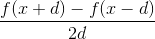** ，那么具有偶数幂的上述系列中的所有项都会消失，我们得到此表达式中的误差项与。

这已经比明显的估计有了很大的改进。这里误差减少为而不是减少。奇妙的是，我们可以做得更好，通过消除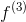术语，然后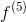术语，依此类推，就我们想要的而言。

我们怎么做？

那么，您可以将的评估与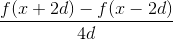中的一个结合起来。其中第二个在功率系列中具有相同的项，但项项更多。因此，如果我们形成乘以其中的第一个并减去第二个，我们将最终得到三次，根本没有术语，并且只有和更高阶的修正项。

因此，如果我们将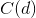定义为 **，**，组合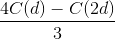将产生加上来自原始扩展中的第五个导数项而不是第三个的错误，并且该错误在我们的计算中，术语与 d &lt;sup&gt;4&lt;/sup&gt; 成正比（加上与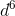，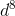等成比例的术语）。

调用此组合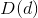;那么类似地，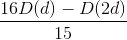（称为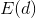）将产生加上来自七阶导数的误差，并且与成比例。并且你可以继续形成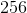次减去它的两倍的值除以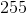得到一个表达式，其误差将与成比例。

这意味着将除以会将最后一次估计中的误差减少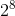因子。

**这看起来像一团糟。**

但事实并非如此。在电子表格上完成所有这些操作非常容易，你可以看到上面每个估计会发生什么，你可以连续减少因子，你可以写下任何函数，以及任何参数。

不仅如此，您可以通过仅更改一个条目来更改参数，并通过仅更改一个条目并进行一些复制来更改该函数。

**好的，怎么样？**

我们将使用函数将其设置为特定的

**预赛：**

_1.在 A1_ 中计算

_2.将您的函数名称放在 A2_ 中

_3.将 dstart 放入 A3 并将的起始值放入 B3（我将放入 B3 中）_

_4.将字母放入 A4，将的值放入 B4（我也放）_

_5.在第 5 行标记列如下：在 A5 放，在 B5 ，在 C5 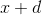，在 D5 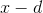，在 E5 ，F5 ，G5 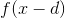，H5 ，在 I5 中，在 J5 _ 中

_**设置**_

_ 现在在 A6 中输入= B3，在 B6 中输入= B $ 4，在 C5 中输入= A6 + B6，在 D6 = B6-A6 中，在 E6 中输入= f（B6）。例如= tan（B6）_

_ 然后将 E6 复制到 F6 和 G6。在 H6 中输入=（A6-G6）/ 2 / A6_

_ 将 B6 到 H6 从列中复制到第 50 行 _

_ 现在输入 A7 = A6 / 2 并将 A7 复制到第 50 行。在 I7 中输入=（4 * H7-H6）/ 3 并将 I7 复制到第 50 行 _

_ 最后在 J8 中输入=（16 * I8-I7）/ 15 并将 J8 复制到第 50 行。_

_ 这是什么？_

A 列将包含计算中使用的差异 d。它将从除以从一行到下一行。 B 列包含的值，您可以在其中找到导数，C 和 D 包含和。 E 含有，F 和 G 含有和。 H 包含估计值，第 I 列包含通过采用 H 估计值的四倍可得到的改善，减去替换的的相似估计值，并将该差值除以。 J 包含通过类似地从乘以估计值中除去 I 中的估计值并除以而获得的改善。

**以下是的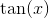函数的结果。**

&lt;button aria-controls="derivative-spreadsheet" aria-expanded="false" class="btn bg-light border-secondary" data-target="#derivative-spreadsheet" data-toggle="collapse" id="toggle-spreadsheet-table" type="button"&gt;显示表&lt;/button&gt;

Number of rows<button aria-expanded="false" aria-haspopup="true" class="btn btn-sm bg-light border-secondary dropdown-toggle" data-toggle="dropdown" id="nbr-rows-btn" type="button" value="25">25</button>[5](#) [10](#) [25](#) [50](#)Number of digits after decimal point<button aria-expanded="false" aria-haspopup="true" class="btn btn-sm bg-light border-secondary dropdown-toggle" data-toggle="dropdown" id="nbr-digits-btn" type="button" value="10">10</button>[5](#) [10](#) [15](#)

请注意，当在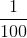附近时，E 列对的位置是准确的。

要更改，您只需要在 B4 中输入所需的值。要更改函数，请在 E6 中使用变量 B6 输入新函数，复制到 F6 和 G6，然后将 E，F 和 G 列复制到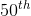行。其他列根本不需要更改。

**练习。**

9.1 自己设置。当 E 和 F 之差达到十位精度时，d 的值是多少？

9.2 尝试使用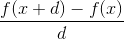而不是如上所述找到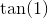。对于什么值，您是否达到十位精度的正确答案？

9.3 找到上面的 H 不能得到十位精度答案的函数和值。