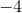
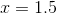

# 9.2 绘制导数图

> 原文： [http://math.mit.edu/~djk/calculus_beginners/chapter09/section02.html](http://math.mit.edu/~djk/calculus_beginners/chapter09/section02.html)

上面的电子表格结构使用户能够在一个特定参数中找到函数的导数。我们想在许多不同的参数上做同样的事情，这些参数可以变成导函数的图表或图形。

这可以通过选择的单个值，将第 9.1 节中描述的结构全部放在一行上，并将该行复制下来来实现。现在每一行将对应一个参数，该参数比前一行增加。如果我们计算 D 和 E，我们可以比较它们。 D 和 E 之间的差异是 D 估计有多糟糕的度量。如果它太大了我们想要的东西，我们可以减少我们的直到我们喜欢结果。

好吧怎么办？

以下是如何执行此操作的概述。它由列列表和列入内容组成。

假设您想要绘制函数的值和导数，例如从到的。

您可能想要输入信息：在 A1 中绘制和，在 A2 中绘制。在 A3 中：起始论点;并在 B3 中输入，在 A4 中输入结束参数;在 B4 中输入。在 A5 中输入参数数量;在 B5 中输入你最喜欢的号码，说。在 C5 中放=（B4-B3）/ B5;在 A6 中输入，在 B6 中输入。还进行以下输入：A7 ，B7 ，C7 ，D7 ，E7 ，F7 ，G7 。

我们的想法是将条目放在列中，如下所示：您真正需要输入的唯一条目是两列 A 列，以及每列中的一列，H，O，R，T，其余的是复制。更改参数只涉及更改上面段落中输入的数据。更改函数只涉及更改 H 列中的数据条目并将其复制到 I 至 N 列和行中。 （列 R，S 和 T 中的因子来自 Q 和 R 列便于复制的事实，但是是近似导数的两倍和四倍。）

在 A9 中，输入 x
在 B9 中，x + d
在 C9 中，x + 2d
在 D9 中，x + 4d
在 E9 中，xd
在 F9 中，x-2d
在 G9 中，x-4d
在 H9 中，sin（x）
在 I9 中，sin（x + d）
在 J9 中，sin（x + 2d）
在 K9 中，sin（x + 4d）
在 L9 中，sin（xd）
在 M9 中，sin（x-2d）
在 N9 中，sin（x-4d）
在 O9 中，（sin（x + d）） -sin（xd））/（2d）是近似于导数
In P9，（sin（x + 2d）-sin（x-2d）/ 2d，是倍近似
在 Q9 中，（sin（x + 4d）-sin（x-4d）/ 2d 是乘以近似
在 R9 中，（4O-P / 2）/ 3，这是与
成比例的估计在 S9 中，（4P-Q / 2）/ 3 是乘以估计误差与
在 T9 中的比较，（16R） -S / 2）/ 15 这是与误差成比例的估计至
在 U9 中，A x 数据
在 V9 中，H f（x）数据
在 W9 中，T f'（x）数据
在 X9 中，TR 精度检查，如果这样数量小，误差小

列 U，V，W 和 X 用于绘制我们的函数。如果 X 列中的最大值不可接受地大，则应减少。

以下是需要输入的条目。假设我们从第 10 行开始（记住有 A7 = 0，B7 = 1，C7 = 2，D7 = 4，E7 = -1，F7 = -2，G7 = -4）。

A10 = $ B $ 3 + A $ 7 * $ B $ 6

A11 = A10 + $ C $ 5

将 A11 复制到 A 列，直到获得 B4

将 A10 复制到 B10，...... G10，以及 A11 到 B11，... G11

只要复制了 A 列，就将 B11 复制到 G11

H10 = sin（A10）复制到 I10，J10，K10，L10，M10 和 N10

O10 =（I10-L10）/ $ B $ 6/2 复制到 P10 和 Q10

R10 =（4 * O10-P10 / 2）/ 3 复制到 S10

T10 =（16 * R10-S10 / 2）/ 15

以下是为了制作散点图而重复之前定义的列：

U10 = A10，即

V10 = H10，即

W（10）= T10 是的导数估计值

X（10）= T10-R10，这是使用 T 代替 R 的估计的改进

现在将第 10 行从 H 列向下复制到 X 列，直到 A 列为止。

从最后 4 列的插入图表菜单中创建散点图。

在 B3-B6 中输入的参数可以在那里更改。该函数可在 H10 中更改，并按上述方式复制到 I10 到 N10，然后按下这些列。

如果您已经计算了的导数，您也可以为它创建一个列，并查看该图是否（或值）与数值导数有任何不同。

**以下是从到的函数的结果。**

&lt;button aria-controls="graphing-derivative-spreadsheet" aria-expanded="false" class="btn bg-light border-secondary" data-target="#graphing-derivative-spreadsheet" data-toggle="collapse" id="toggle-spreadsheet-table" type="button"&gt;显示表&lt;/button&gt;

Number of increments<button aria-expanded="false" aria-haspopup="true" class="btn btn-sm bg-light border-secondary dropdown-toggle" data-toggle="dropdown" id="nbr-inc-btn" type="button" value="100">100</button>[5](#) [10](#) [25](#) [50](#) [75](#) [100](#)Number of digits after decimal point<button aria-expanded="false" aria-haspopup="true" class="btn btn-sm bg-light border-secondary dropdown-toggle" data-toggle="dropdown" id="nbr-digits-btn" type="button" value="5">5</button>[5](#) [10](#) [15](#)

**练习：**

设置此项并将其应用于从到的函数，如果设置上限会怎样？