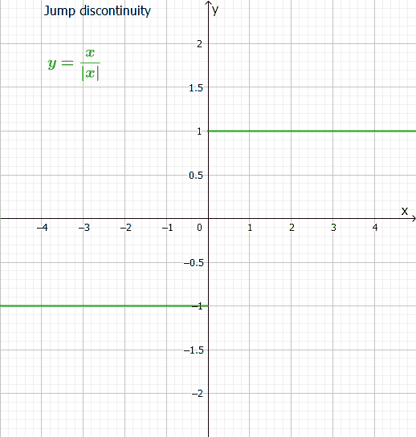
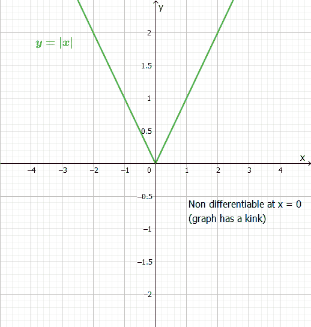
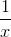
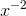
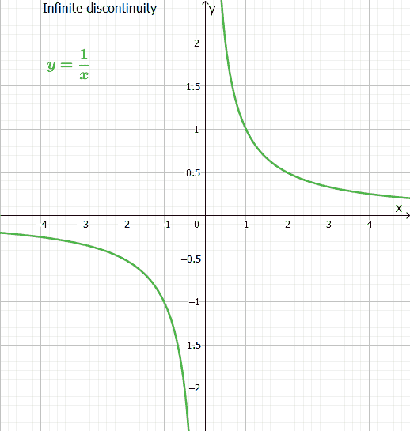
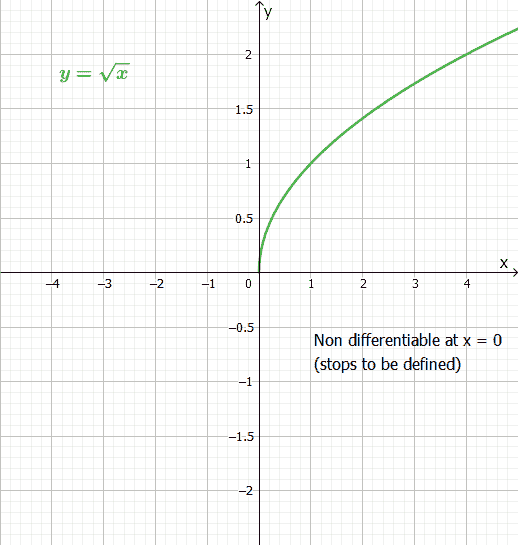
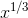
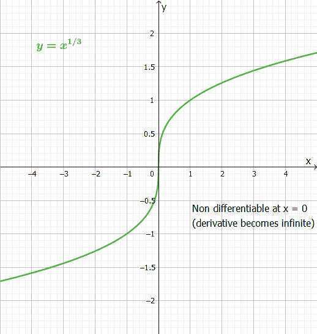
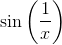
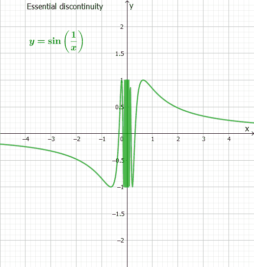

> 原文： [http://math.mit.edu/~djk/calculus_beginners/chapter09/section03.html](http://math.mit.edu/~djk/calculus_beginners/chapter09/section03.html)

## 9.3 不可微函数

**我们可以在任何地方区分任何函数吗？**

微分只能应用于图形在您想要区分的点附近看起来像直线的函数。毕竟，区分是找到它看起来的线的斜率（我们正在考虑的函数的切线）没有切线意味着没有导数。
当切线垂直时，导数也是无穷大，也不好。

**[论证]如何及何时发生不可分辨性？**

以下是一些方法：

1.函数跳转到，（不是连续的）就像在一段楼梯上发生的那样。

函数的图形有一个扭结，就像字母 V 一样。绝对值函数，为正时为，为负时为，为扭结。

这个函数是无限的，并且无限。函数和在执行此操作。请注意，在特定参数中，您必须除以以形成此函数，除以不是可接受的操作，正如我们在某处所指出的那样。

4.这个函数非常奇怪：考虑一个函数，表示无理数，表示有理数。这很奇怪。

5.无法在参数中定义该函数。当我们讨论实函数时，不能为负参数定义平方根。

6.函数可以定义和有限，但其导数可以是无限的。一个例子是的。

7.函数可以被定义并且很好，但它可以摆动到没有导数。尝试在区分。这种行为被称为 **的基本奇点。**

这些是您可以通过公式描述的函数遇到的唯一一种不可微分的行为，您可能不会遇到很多这些行为。

现在你已经看到几乎所有关于区分一个变量函数的内容。还有一点点;也就是说，当您想要找到使用幂级数定义的函数的导数或使用逆运算进行区分时，会发生什么。我们稍后会找到他们。

我们接下来想研究如何应用这个，然后如何反转微分的运作。