# 10.1 复习

> 原文： [http://math.mit.edu/~djk/calculus_beginners/chapter10/section01.html](http://math.mit.edu/~djk/calculus_beginners/chapter10/section01.html)

**10.11 我们在哪儿？**

**数字是数字。再次阅读有关它们的部分。**

**函数是一组（参数，值）数字对**。它们通常由公式描述，这些公式告诉我们如何从参数计算值。每个参数只允许一个值。您将经常遇到的公式以标识函数，指数函数和正弦函数开始，并通过以某种方式对它们应用算术运算，替换和反转来定义。

**任何参数的函数的导数是它在该参数附近的直线的斜率，如果该斜率是有限的。** 它在该参数附近的直线称为**该参数**处函数的切线，描述该线的函数称为该参数函数的**线性逼近** ]。如果函数看起来不像参数附近的直线，（在那里有扭结或跳跃或疯狂行为），那么该参数就不可区分。

存在用于计算同一性，正弦和指数函数的导数以及通过以某种方式对它们应用算术运算，替换和反转而获得的这些的组合的导数的直接规则。
因此，我们有方法获得上述类型的所有函数的导数的公式。规则如下所示。如果您对它们感到不舒服，请练习！

使用电子表格，您可以非常精确地绘制函数并在很大程度上精确地确定它们的导数。

**此时我还应该知道什么？**

首先，您应该对以数字方式计算或计算导数感到满意。

到目前为止，我们所说的关于指数函数的所有语句都是它在参数中的值是的语句，并且它在各处都是它自己的导数。并且正弦函数在参数处是并且具有导数，其是对其补充的参数的正弦。

建议您查看正弦和其他三角函数以及指数的属性。这些在 T 部分中描述。

**好的，我们能做些什么呢？**

微分的两个主要应用是建模现象和求解方程。

**我真的希望做这些事吗？**

如果你不知道怎么做，你就不可能被要求去做这些事情。同样，如果你从未学过如何走路，你很少会被要求过马路。一旦你了解了这些事情，你就可以开始处理各种各样的可能性。

一旦构建了一个现象模型，您就希望能够推断出该模型的后果。这涉及从涉及导数的导数或方程式返回到其导数的函数。

从导数回归到函数的过程有时（很少）称为**反分化**，通常称为**积分**或**正交**（也是一个罕见的名称） ）。从涉及导数的方程到原始函数被称为**求解**（或积分）**微分方程。**

在下一节中，我们将描述一种使用微分来解决涉及一个变量的非线性方程的方法，以及其他方法。然后我们将讨论集成，您将在可能的情况下，通过数字和公式学习如何进行集成。然后，我们将举例说明在实际情况建模中使用导数。最后，我们将研究如何以数字方式求解微分方程，从而发现这些模型的含义。

**关于微积分，这是我必须要知道的吗？**

答案取决于你的目标。

如果你只是寻求关于什么是微积分的定性概念，你可以在你对自己的微积分感到满意​​时辞职。在这一点上，我们只讨论了微分。采用函数导数的逆运算具有相同的意义，尚未到来。

如果你的目标是理解科学的语言，变化的模型随处可见，这是一个良好的开端，但在两个方向上还有更多。

首先，我们生活在一个世界中，它用三个数字来描述一个空间点的位置;用六个数字来描述两点的位置，依此类推;人们常常想要在太空中模拟运动。因此，当我们一次处理几个或多个变量时，我们需要能够检查变化。因此，我们需要能够将区分的概念扩展到依赖于多个变量的函数的模拟。这样做意味着将导数的概念扩展为参数和/或值的数组，而参数和/或值是数字序列而不是单个数字。对这类事物的研究称为多变量微积分。

幸运的是，可以通过一种方式进行所需的扩展，从而可以利用您在一个维度上进行区分以获得更高维度的结果。你必须学习一些新的概念，但区分的工作是一样的。该主题主要包括引入新的多维概念，以及如何通过一维微积分技术计算或计算它们的描述。

其次，随着人们研究在现实世界应用中出现的方程，多年来已经形成了关于微分方程的大量知识。在过去，数值方法，如您现在可以应用的那些，是完全不切实际的，并且发现了特殊方法来解决许多类方程。这些方法对于让人们在不实际求解它们的情况下了解更复杂方程的解决方案也是有价值的。

事实上，这些方法足以解决许多领域中非常重要的问题，并且它们提供了许多其他方程式的直觉，这意味着它们仍然是有趣的，值得研究。

也许值得追求的第一个目标是获得理解科学文献的可能性。科学和工程学的论文不断使用导数和积分的概念和符号，如果这些水牛你，你可以无处阅读文献。一旦你对微积分及其符号的概念感到满意，这种困难就会消失。

足够模糊的废话！

**10.12 用于区分的代数规则。** （以及如何推断它们）

**事实 0：**直线函数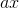的导数是它所代表的线的斜率，它是。常数函数具有导数。这意味着从原始公式中，被取代，并且省略了任何常数项。根据定义，我们有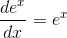，我们有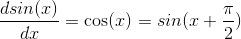。

**基本规则 1：**为了计算具有多次出现变量的函数的导数（让它为），分别取每次出现的导数贡献，将其他出现的贡献视为常数，并添加所有这些

后果：

**求和规则：** 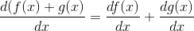

**产品规则：** 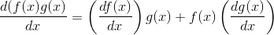

**功率规则：** 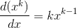（不同分别被替换并求和）

**商数规则：** 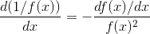。 （区分等式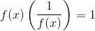的两边。）

**基本规则 2：**函数函数的导数是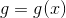和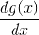评估的的产物。这被称为**链规则**，它直接来自导数的定义，当表示为变化的比率时。

Consequences:

**反向规则。** 逆定义如下：如果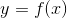则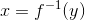，

由于，意味着（在切换变量名后），因此在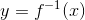进行评估。

**基本定理：关于其上限的定积分的导数是在那里评估的被积函数。**

如果你对这些事实感到满意，不要被数值计算所困扰，并努力研究你的错误，以便你有希望不再重复它们，你就是想要在一个维度上进行微分计算的地方。

**练习：想象一下，你正在教授微积分课程。列出前 10 章中关于材料最难回答的 10 个问题。我认为，提出问题比回答问题更具挑战性。**