# 11.1 求解方程

> 原文： [http://math.mit.edu/~djk/calculus_beginners/chapter11/section01.html](http://math.mit.edu/~djk/calculus_beginners/chapter11/section01.html)

如果我们有一个线性方程，例如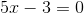，则有一个简单的解决方法。你应用“方程式的黄金法则”：向左边做你正确做的事情。你做到这一点，直到你左边的所有东西都是。

因此，在这个例子中，您可以向两侧添加，除去左侧的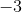，然后除以，结果为：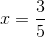。

然而，假设我们有一个更复杂的等式，例如

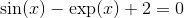

我们的任务是找到这样一个等式的解决方案或所有解决方案。 **我们假设我们方程中的函数在我们感兴趣的领域中是连续的和可微的。**

首先要注意的是，在这里绘制左侧是一个好主意，并粗略地观察它改变符号的位置或非常接近。这将告诉你它的大致位置。

在过去，这是一项非常繁琐的任务，总的来说，人们试图在没有绘图的情况下解决方程，这有点像飞行盲目。如果你能做到这没关系，但为什么不尝试呢？

有一种解决这些方程式的标准技术显然可以追溯到牛顿。在这里。

你开始猜测你寻求的解决方案，选择一个参数，称之为。然后，您可以在参数中找到函数的线性逼近，并求解表示此线性逼近为的等式。调用线性逼近为，的参数。

现在你做同样的事情，从开始：你在找到的线性近似，并求解这个线性近似是以确定的等式。只要你需要，你就继续这样做。

在过去，对于任何函数而言，这是一件非常繁琐的事情。从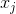中找到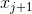非常简单，但一次又一次地执行它是一个真正的问题。

现在有了电子表格，您可以在一分钟内完成设置，并通过练习找到解决方案。您只需执行一次每个步骤，然后复制。

**怎么样？**

首先让我们看看如何从获得。

的的线性近似由下式给出

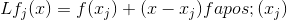

如果我们在参数将其设置为，我们得到

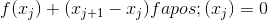

具有通过适当地从两侧分开和减去而获得的解决方案

**那我该怎么做电子表格呢？**

假设我们在框 A1 中进行了第一次猜测。我们将把它和随后的猜测放在 A 栏开头说，用 A3（只是留下标签的空间）。

然后我们可以将放在 B 列中，将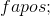放在 C 列中。

为此，我们需要进行以下输入：

在 A3 中，输入= A1（这将在 A3 中开始猜测）
在 B3​​中，= f（A3）（这计算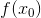）
在 C3 中，= f'（A3）（此计算） 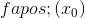）
在 A4 中，= A3-B3 / C3（这适用于获得新猜测的算法）

如果现在复制 A4（而不是 A3！）以及 A，B 和 C 列中的 B3 和 C3，则已实现该算法。

您可以通过更改 A1 来更改起始猜测，并通过适当更改 B3 和 C3 来更改您的函数，并将结果复制下来。

**这真的有用吗？**

这种方法在大多数时间内收敛得非常快。如果你从的附近开始，并且处于“好的一面”，它将始终收敛。否则它很有可能这样做，但奇怪的事情可能会发生。

**什么是“好的一面”？**

假设您从解决方案开始，调用解决方案，因此大于。那么如果和的二阶导数在和之间都是正的，那么你就是好的一面。

**为什么？**

在和之间的二阶导数是正的，意味着的一阶导数在和之间增加，这意味着的斜率是最大的，在和之间的范围内，正好在。

所有这些意味着 的线性近似将比更快地下降到，因为你靠近溶液，因此将位于和之间。 。每个连续的将位于 z 和前一个之间。随着我们接近，看起来会越来越像一条直线，这意味着它看起来会越来越像它的线性近似，所以你会越来越接近越来越快。

**假设我们想要求解方程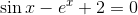，我们从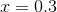开始作为猜测。** 左侧的导数是。

填写完成后，我们的电子表格说明应如下所示：

在 A1 中，输入 0.3
在 A2 中，输入 xj。在 B2 中，f（xj）。在 C2 中，f'（xj）。
在 A3 中，= A1。在 B3 中，= sin（A3）-exp（A3）+2。在 C3 中，= cos（A3）-exp（A3）
在 A4 中，= A3-B3 / C3。在 B4 中，= sin（A4）-exp（A4）+2。在 C4 中，= cos（A4）-exp（A4）
向下复制列 A，B 和 C.

&lt;button aria-controls="newtons-method-spreadsheet" aria-expanded="false" class="btn bg-light border-secondary" data-target="#newtons-method-spreadsheet" data-toggle="collapse" id="toggle-spreadsheet-table" type="button"&gt;显示表&lt;/button&gt;

Number of steps<button aria-expanded="false" aria-haspopup="true" class="btn btn-sm bg-light border-secondary dropdown-toggle" data-toggle="dropdown" id="nbr-steps-btn" type="button" value="25">25</button>[5](#) [10](#) [25](#) [50](#)Number of digits after decimal point<button aria-expanded="false" aria-haspopup="true" class="btn btn-sm bg-light border-secondary dropdown-toggle" data-toggle="dropdown" id="nbr-digits-btn" type="button" value="10">10</button>[5](#) [10](#) [15](#)

当你从而不是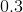开始时会发生什么？在？在？

**练习：**

**11.1 假设在为阴性且大于。 和之间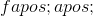的条件是什么意味着你有好的一面？  为正，但小于的条件是什么条件让你处于良好的一面？**

**11\. 2 如果的符号错误但你的猜测与之间的符号相同，会发生什么？**

尽管如此，这种方法可以做出奇怪的事情。如果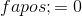在猜测时，迭代甚至没有意义，因为你将除以。如果非常靠近，那么新的猜测将与旧的猜测相距甚远，并且它可以奇怪地拉链。

以下小程序允许您只需输入函数即可绘制和查看方法。 （这比使用电子表格从头开始稍微简单一些）。

&lt;iframe frameborder="0" height="620" src="../mathlets/newtons-method.html" width="100%"&gt;&lt;/iframe&gt;

**练习：**

**11.3 如果您寻找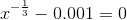的解决方案，并尝试直接使用此方法，会发生什么？ 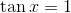怎么样？**

**11.4 查找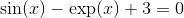正的所有解，精确到十位小数。**

我是否必须区分才能应用此算法？

**不！您可以选择相对于函数比例非常小的 d 值，并将=（f（A3 + d）-f（A3-d））/（2 * d）放在 C3 而不是= f'（ A3）。**

这几乎与常规的牛顿方法一样。

**练习 11.5 在 C3 中重做练习 11.5，=（f（A3 + B $ 1）-f（A3-B $ 1）/（2 * B $ 1）。你的答案如何受到影响？**

**可能出什么问题？**

首先，我们的等式可能没有真正的解决方案。在那种情况下，这两种方法都找不到。针对绘制将确认这一点。

当你的方程有多个解时，会出现另一个问题。那么你得到的取决于你从哪里开始。 Applet 说明了这一点。

**一般来说，如果你到达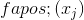接近零的点，而不接近零，将会很远，的连续值可以即使您曾经接近您正在寻找的解决方案，也可以像疯了一样轻松缩放。**

但是这种方法无论如何都很有趣，你可以很容易地判断它什么时候不起作用。

**分而治之**

还有另一种求解方程的方法，在每次迭代时通过因子更接近解，**如果你能找到参数，你的函数有相反的符号**。然后，您可以查看它们之间的中点，并用中点替换该函数与中点处具有相同符号的端点。

**练习：弄清楚如何在电子表格上实现此方法。 （提示：您可以输入= if（D5 * F5&gt; 0，C5，A5），如果 D5 和 F5 具有相同的符号则给出 C5，否则输入 A5。）**