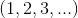
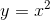
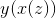
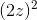

# 0.2 什么是微积分？我们为什么要研究它？

> 原文： [http://math.mit.edu/~djk/calculus_beginners/chapter00/section02.html](http://math.mit.edu/~djk/calculus_beginners/chapter00/section02.html)

微积分是对事物变化的研究。它为有变化的系统建模提供了框架，并提供了推断这些模型预测的方法。

**我已经存在了一段时间，并且知道事情的变化，或多或少。微积分可以添加什么？**

我相信你对事情的变化了解很多。你有一个定性的微积分概念。例如，运动速度的概念是直接来自微积分的概念，尽管它在微积分之前确实存在很久并且你对它有很多了解。

**那么微积分为我增添了什么？**

它为我们提供了一种构建相对简单的变化定量模型并推断其后果的方法。

**到底是什么？**

通过这种方式，您可以在正在调查的系统中找到不断变化的条件的影响。通过研究这些，您可以学习如何控制系统，让它做你想做的事。微积分，通过为工程师和您提供建模和控制系统的能力，使他们（可能还有你）在物质世界中拥有非凡的力量。

微积分的发展及其在物理和工程中的应用可能是现代科学发展中最重要的因素，超越阿基米德时代。这是工业革命的主要原因，也是随之而来的一切，包括过去几个世纪几乎所有的重大进步。

**你是否试图声称我对微积分有足够的了解模型系统并推导出足以控制它们的程度？**

如果你在 1990 年问我这个问题，我会说不。现在，对于一些非平凡的系统，使用笔记本电脑或台式电脑是可能的。

**好的，但微积分模型如何变化？什么是微积分？**

微积分的基本思想是通过研究“瞬时”变化来研究变化，我们指的是在很短的时间间隔内的变化。

**这有什么用？**

事实证明，这种变化往往比有限时间间隔内的变化简单得多。这意味着它们更容易建模。实际上微积分是由牛顿发明的，他发现加速度，即物体速度的变化可以用他相对简单的运动定律来模拟。

**等等？**

这使我们面临的问题是从关于速度或加速度的信息中推导出关于物体运动的信息。微积分的细节涉及速度和加速度所代表的概念与位置所代表的概念之间的相互关系。

**那么学习微积分的研究是什么？**

首先，您必须有一个框架来描述位置速度和加速度等概念。

单变量微积分是我们开始的，它可以处理物体沿固定路径的运动。更常见的问题是，当运动可以在表面上或在空间中发生时，可以通过多变量微积分来处理。我们通过找到使用一维思想和方法来处理更一般问题的巧妙技巧来研究后一个主题。因此单变量微积分也是一般问题的关键。

当我们处理沿着路径移动的物体时，它的位置随时间变化我们可以随时用一个数字描述它的位置，这可以是某些单位距离该路径上某个固定点的距离，称为我们的原点。坐标系。 （我们在此距离上添加一个符号，如果对象位于原点后面，则为负数。）

然后，物体的运动由相关时间点处的数值位置的集合来表征。

我们用来描述运动的位置和时间集就是我们所说的**函数**。类似的函数用于描述应用微积分的所有系统中感兴趣的量。

这里的课程首先回顾数字和函数及其属性。毫无疑问，您对此非常熟悉，因此我们尝试添加不熟悉的材料以便在查看时保持您的注意力。

**如果我读到这些东西，我会陷入困境。我必须吗？**

我很乐意让你看看它，因为我写了它，但如果你不愿意，你可以毫无疑问地通过跳过它，并在你需要的时候或者如果你需要这样做的时候再回过头来。但是你会错过这些新信息，这样做可能会让你永远陷入困境。 （虽然我对此表示怀疑。）

**数字和函数之后会出现什么？**

微积分的典型课程包括以下主题：

1.如何找到各种函数的瞬时变化（称为“导数”）。 （这样做的过程称为**“分化”**。）

2.如何使用导数来解决各种问题。

3.如何从函数的导数返回到函数本身。 （此过程称为**“积分”**。）

4.研究积分某些函数的详细方法。

5.如何使用积分来解决各种几何问题，例如某些区域的面积和体积的计算。

在这样的课程中还有一些其他标准主题。这些包括功率系列函数的描述，以及无限级数何时“收敛”到数字的研究。

**那么这又能让我做什么呢？**

它并没有真正这样做。问题在于这些课程最初是在几个世纪前设计的，它们的目的不是赋予权力（当时完全不可能），而是让观众熟悉能够理解更高级工作的想法和概念以及符号。数学家，科学家和工程师在各种情境中使用微积分概念，并使用行话和符号，在没有学习微积分的情况下，对你来说是完全不可理解的。对微积分的研究通常旨在为您提供与这种更高级工作相关的“数学复杂性”。

**为什么这个关于赋权的废话呢？**

本课程将尝试与众不同，旨在赋予权力以及其他通常的目标。它可能不会成功，但至少会尝试。

**它将如何尝试执行这个奇迹？**

传统的微积分课程强调用于进行微分和积分的代数方法。我们将描述这些方法，但也展示了如何在计算机电子表格上进行微分和积分（以及常微分方程的解法），并且需要付出额外的努力。我们还将提供小程序自动执行相同操作的小程序。使用这些小程序或电子表格，您可以比以前更轻松，更灵活地应用微积分工具。

（还有更多高级程序，例如 MAPLE 和 Mathematica，它们可以让您以类似的方式轻松完成。通过它们，您可以在各种环境中推断出各种模型的后果。一旦理解了微积分可以使它的使用变得更加容易，但它们提供了输入的答案，而这些答案并不能理解它们是如何做到的。）

此外，我们将更加重视建模系统。通过建模和解决它们导致的微分方程的方法，您可以实现我们所宣称的赋权。

**我能用这个值得结束吗？**

好吧，可能不是。但你可能会。此外，您可能会被激怒以了解有关您想要学习的系统或数学的更多信息，以提高您这样做的机会。此外，您可能能够比现在更好地理解模型的可能后果。您也可以喜欢微积分的概念和想法。

**嗯，关于数字的介绍章节是什么？**

我们从自然数开始，并注意减法，除法和取平方根的操作如何引导我们扩展我们的数字系统以包括负数，分数（称为有理数）和复数。我们还描述了十进制扩展（描述“实数”）并检查可数性的概念。我们也会对复数进行嘀咕。

**在关于函数的章节中？**

我们从函数的抽象定义（作为一组参数 - 值对）开始，然后描述标准函数。这些是通过以身份函数（value = argument）和指数函数开始并对它们使用各种操作而获得的那些。

**运营，什么运营？**

这些是加法，减法，乘法，除法，替换和反演。

**但是什么是指数函数，什么是替换和反转？**

这里有一句话答案：如果你想了解更多阅读本章！

指数函数是使用微积分神秘定义的：它是函数，它是自己的导数，定义为在参数 0 处具有值 1.然而，事实证明，这是你以前见过的东西。事实证明它与三角函数的正弦函数有着密切的关系。

**将一个函数 f 替换为另一个函数 f** 会产生一个新函数，该函数定义为在参数 x 处具有参数 f 的值 f，该参数是参数 x 处的 g 的值。这比听起来简单。假设，例如和，则是。

**函数的反函数**是通过用其参数切换其值而获得的函数。例如，通常写为的平方函数具有平方根函数作为反函数。

在威廉神父对他的侄子的不朽言论中，由数学家刘易斯卡罗尔写道：

我已回答了三个问题，这就够了，

圣人说，不要给自己吹气。

你觉得我可以整天听这些东西吗？

关闭或者我会把你踢到楼下！