# 12.1 反导数

> 原文： [http://math.mit.edu/~djk/calculus_beginners/chapter12/section01.html](http://math.mit.edu/~djk/calculus_beginners/chapter12/section01.html)

antiderivative 是我们有时会（很少）给出从函数的导数向函数本身倒退的操作的名称。由于导数不能完全确定函数（您可以为函数添加任何常量，并且导数将是相同的），您必须添加其他信息以返回显式函数作为反导数。

因此，我们有时会说函数的反导数是一个函数加上一个任意常数。因此的抗导数是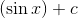。

反导数更常见的名称是不定积分。这是相同的概念，只是一个不同的名称。

波浪线用作它的符号。因此，句子“的反导数是”通常表示为：的不定积分为，这通常写为

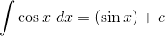

实际上这是不好的表示法。右边出现的变量是一个变量，表示正弦函数的自变量。左边的符号只是说我们正在寻找的反导数的函数是余弦函数。如果你使用一个完全不同的符号（比如说）来表示这一点，你就会避免混淆。那么写这个的正确方法

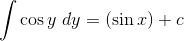

**为什么要使用这种奇特而丑陋的符号？**

我们这样做是出于对传统的尊重。这是几个世纪以来人们使用的符号。我们将在下一节中看到他们为什么会这样做。

我们要解决的第一个问题是：如果你给我一个函数，说，并让我找到它的无限积分，我该怎么做？

这个问题的基本答案是：没有新的噱头可以做到这一点。您可以从差异规则向后工作，并获得一些集成规则，这基本上就是您可以做的一切。但是，这允许您集成（找到反导数）许多有用的函数。

几个项之和的反导数是它们的反导数的总和。这是因为和的导数是项的导数之和。同样地，将函数乘以常数将其反导数乘以相同的常数。

使用这些事实，我们可以找到任何多项式的反导数。

**怎么样？**

的导数是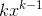的事实等同于的抗导数是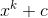的说法。这意味着的抗导数是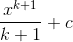。

**这个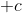的东西是什么？**

需要注意的是，常数的导数是，因此不能完全确定作为导数的逆运算的反导数。您可以向反导数添加任何常量并获得另一个常数。有些人认为它是由学生发明的，通过惩罚他们偶尔忽视这个无聊的事实来折磨学生。

我们可以将它应用于多项式中的每个项，并找到它的反导数。

因此，反导数

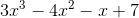

是

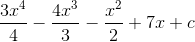

学生们通常会发现这很容易，当他们被迫在考试中找到这样的反导数时，他们的思想往往已经集中在下一个问题上了，他们心不在焉地忘记和区分而不是反辨别一个或者所有术语。请避免此错误。

**练习：**

**查找以下各项函数的反导数：**

**12.1 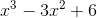**

**12.2 **

**12.3 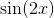**

**12.4 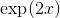**

**12.5 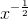**

**（通过区分来检查你的答案。）**