# 13.1 区域：定义，名称和符号

> 原文： [http://math.mit.edu/~djk/calculus_beginners/chapter13/section01.html](http://math.mit.edu/~djk/calculus_beginners/chapter13/section01.html)

我们从边长为和的矩形区域开始。如您所知，这个区域是。我们的首要任务是利用这一事实提供一种寻找不规则数字区域的方法。

要做到这一点，我们必须首先准确定义我们要做的事情。

假设我们有一些函数，例如正弦函数，并且在轴上有一个间隔，例如从到。然后我们可以绘制定义的曲线

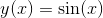

并询问区域中边界为：线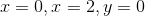和给定曲线的区域。

该区域被称为**函数的定积分，从下限到上限。** 单词确定有时被省略，然后该区域被称为从到的积分。

它的标准符号是：

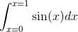

**为什么这个丑陋的符号？为什么奇怪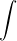的事情？**

我们使用这种表示法，因为其他人都这样。开心点！您将能够识别和阅读涉及这些符号的语句。它们不是威胁。想象一下，它是一个奇怪的 S，代表 Sum。积分是一种奇怪的总和。

**什么是？**

它表明，如果我们将积分的端点之间的间隔划分为长度为的微小条，则包含值的条子对区域的贡献几乎是一个矩形，该矩形的面积将是是它的两端之间的差异，即乘以 s 差异，每个条子是; 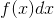，因此是那个条子中的区域，其中所有条子的总和是我们寻找的区域。如果是，那么的平均值乘以就是我们在所有条子上求和得到指示的积分。

在描述你的积分时，你经常可以在描述它的端点时忽略，把它写成

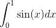

有时你想通过给出除值以外的值来描述端点，

（有时您可能希望通过某些其他函数的值来描述区间的下端点和上端点，您可以通过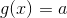和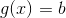指示端点来实现。例如，这里的积分可以和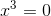到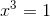的积分一样描述。）

我们将其称为正弦函数的到的积分。

**是四个边界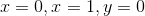和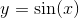之间的区域，计算轴下方的任何区域为负。**

一般来说，[被子] 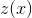乘以的到的面积或积分是由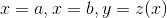和界定的区域。 以下的区域被计算为负值。

**如果“下限”大于“上限”会怎样？**

**和之间的区域加上和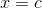之间的区域，当小于且小于时，仅为两者之间的区域和。**

这是一个非常好的属性，我们在你提到的情况下定义积分，使其适用于所有和。这意味着从到的区域加上回到的区域必须是从到的区域，这一点都没有。为了实现这一点，我们将面积从大到小定义为减小从小到大的面积。根据这个定义，到的积分加上从到的积分是到的积分，无论数字和的数字顺序如何。

**这一切有什么好处？**

我们的关键任务是弄清楚如何确定这些领域是什么。我们有一个强大的工具来做到这一点。

**嗯？**

**首先注意这里积分的概念为我们提供了一种定义函数**的新方法。我们可以使我们的积分上限变化，称之为，并将得到的积分视为的函数。

例如，我们可以写

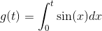

现在我们可以问，作为的函数，函数以这种方式定义的导数是什么？