# 13.2 微积分和确定区域的基本定理

> 原文： [http://math.mit.edu/~djk/calculus_beginners/chapter13/section02.html](http://math.mit.edu/~djk/calculus_beginners/chapter13/section02.html)

我们对积分的导数感兴趣

相对于上限，。

我们可以通过评估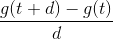非常小的来粗略计算这个导数。

但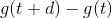只是

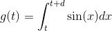

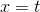和之间的区域只是一个条子，其中非常接近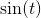。所以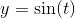和之间的这个区域的区域只是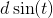，其中是条子的宽度，是它的高度，到第一个近似值。

这告诉我们的导数，即参数中正弦函数积分的导数，是这个区域除以，即。

**完全相同的结果适用于任何函数，其参数值足够接近，它与的值尽可能接近。 （这些被称为连续函数）适用于所有之间的集成限制。**

这个结果是**被称为微积分的基本定理**。它说：**如果你区分一个函数的积分，那么在包含积分**的闭合区间中的参数处是连续的（这是条件，如果值非常接近）如果你想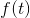足够接近）**，你可以在论证中找回被积函数的值。**

另一种说法是：**上限为变量的积分，**是我们刚刚定义的一个区域，**是其被积函数的反导数，当该被积函数是连续的时。**

这意味着**积分函数然后将结果与上限区分开来，返回函数。**

**我们也可以以相反的顺序做出相同的声明。**

假设我们从可微分函数开始，并形成其导数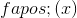，并将此导数积分到某处，比如和。

换句话说，假设我们形成

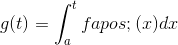

然后基本定理告诉我们：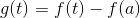。

为了看到这一点，请记住，如果在参数中是可微分的，那么足够小，我们可以达到任何所需的精度：

如果我们将之间的间隔切割成适合于每个值的给出的宽度切片，我们可以总结方程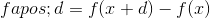任何一侧对所有切片的贡献。我们对每个切片使用相同的值

上面最后一个等式中正负项的总和将给出小切片中面积的总和。这笔钱将“望远镜”。来自一个切片的左项将是具有相反符号的前一切片的右项;这两个将相互抵消，我们将只从第一个和最后一个切片获得贡献。这意味着：

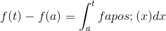

这是基本定理的标准形式。

**这个“基本定理”有什么用？**

这个定理及其类似物在更高维度上的使用在历史上是如此重要，以至于它们不能被夸大。我们将在这里忽略这些。出于我们的目的，这个定理的主要用途是允许我们**评估积分，即曲线**下的区域，用于大量的被积函数。

**什么被积分** **？**

对于初学者，我们可以积分**我们可以识别为导数的任何被积函数。**

例如，正弦是减去余弦的导数。将上面的最后一个等式应用于这个事实，我们得到了

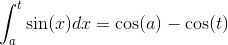

我们用作例子的原始区域是到的正弦积分。这是\（\ cos（0） - \ cos（1）\）或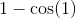。

**我们还能识别出什么？**

1\. 的任何幂，例如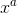，因此任何多项式或幂的总和。

2.任何的指数函数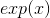和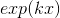。

3.反正切，正切和反正弦的导数，以及更多。

**练习：计算如下定义的积分：**

**13.1 从到的整数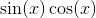。**

**13.2 从到的整数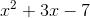。**

**13.3 从到的整数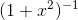。**

**13.4 从到的整数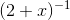。**

**13.5 写下一些可怕的函数。区分它。现在请一位朋友（前朋友？）积分你的结果。你会知道答案！**

**13.6 记住这个单独的出现规则。区分（相对于 t）：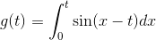。**