# 13.3 积分的诀窍

> 原文： [http://math.mit.edu/~djk/calculus_beginners/chapter13/section03.html](http://math.mit.edu/~djk/calculus_beginners/chapter13/section03.html)

积分技术基本上是向后看的微分技术。

区分和的规则：**它是求和**的导数之和，对积分产生相同的事实：**积分之和的积分是它们积分的总和。**

**13.3.1 产品规则倒退**

产品规则说，产品的**导数是通过区分每个因素得到的总和，好像另一个因素是不变的，并将结果加起来。**

当我们知道如何处理被积函数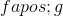时，我们可以向后看这个作为处理形式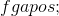的被积函数的方法。因为，我们可以将产品规则写为

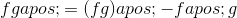

积分双方告诉我们

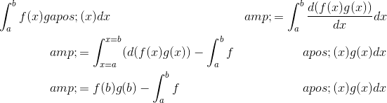

该陈述称为**“按部分积分”**，对于或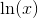或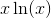等整数有用。

例如，要集成，请设置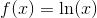和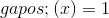。然后我们有和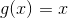。因此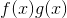是而是。

我们可以得出结论，从到的积分是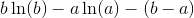。这个答案通常写成

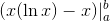

**练习 13.7 上面提到的其他积分：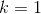和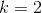以及的积分。**

**13.3.2 反向链条规则**

链规则告诉我们如何区分，答案是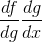。

这告诉我们，如果我们能够将一个被积函数识别为具有形式，我们可以将它积分到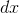上，以便在评估，而不是在进行评估。

我们能用这种方式认识什么？

以下是您应该考虑的例子：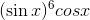和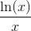。尝试猜测在每种情况下为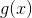选择什么，看看你是否可以让它工作。如果失败，请再试一次。

向后使用链规则有时被称为**替代方法**。

我们不会详述这个话题。要真正学会使用这些方法中的任何一种，你必须每次练习它们十几次。对于替换规则来说，这是非常宝贵的经验，比如解决谜题。它可能很有趣，但起初它看起来像是苦差事。

我们注意到，通过适当的魔法替换，你可以将正弦和余弦的任何有理函数转化为一个合理的函数，你可以用足够的努力实际积分它。在过去，可积函数表及其积分表非常有用。这些东西现在可以在网上找到。

**有什么我们无法积分的吗？**

当然是。积分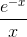和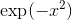是实例，对于这些实例，没有可以用从同一性函数，正弦和指数获得的组合表达的解。实际上，现代电子表格通常将其积分作为非标准但电子表格可用函数包含在内。

（错误函数，或 erf，例如，

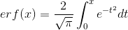

是 Excel 7 在其工程公式中可用的函数，它可以作为电子表格中任何位置内容的一部分输入。）

如今，您可以查阅许多可用程序中的任何一个，例如 Maple，Mathematica 和 Matlab，它们将为您提供任何可行积分的正式解决方案，以及针对那些无法精确集成在函数方面的任意精度的解决方案我们定义了。

我们现在转向这样一个问题：积分是否可行，即在数值上确定曲线下面积？第 2 章对此进行了微小的讨论。