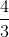
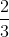
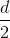

# 14.2 积分的“规则”

> 原文： [http://math.mit.edu/~djk/calculus_beginners/chapter14/section02.html](http://math.mit.edu/~djk/calculus_beginners/chapter14/section02.html)

任何积分方案的目标是准确地估计给定宽度的每个区间中的区域。如果被积函数在该区间内基本上是常数，那么这样做是没有问题的，但如果不是，我们需要一个进行估算的计划。任何此类计划称为**规则**，用于数值积分。

**这是最简单的规则，从最不明智的规则开始。**

1.通过区间**最左侧**点处的被积函数值估算区间的高度。这被称为**左手规则**。

2.通过最**最右边**点的被积函数值估算区间的高度。这是**右手规则**。

3.通过**估计间隔的高度，即前两个的平均值。** 这被称为**梯形规则**。

4.通过**中间的被积函数的值估计区间的高度。** 这样做的缺点是你需要在间隔的中间而不是在结束时找到它。它有时被称为**中点规则**。

5.选择二次函数完全满足的前两个**的组合。这被称为 **Simpson 的规则**。**

**够了！还有更多规则吗？**

是的，你可以做得更好。

**好吗？这些规则的表现如何？**

好吧，前两个规则中的错误随着线性下降。因此，如果将除以 2，则误差也会减少。

接下来的两个误差在中是二次的;这意味着当降低因子时，它们会下降因子。

辛普森的规则在中有一个四分之一的错误;当降低因子时，它下降因子;如果你愿意，你可以通过因子实现下降，甚至更多。

梯形规则使用每个间隔的高度作为每端的值的一半。这给出了到积分端点的权重，到每个中间点，（从它每一侧的间隔）。

辛普森一家规则相当于将奇数点的贡献加倍，然后使用作为分母而不是;所以第一个和最后一个点（最后一个必然是偶数）得到重量，奇数得到重量而其他偶数得到重量。

**这些规则很难适用吗？**

不，前三个很容易，你可以通过第三个聪明的伎俩得到辛普森的。使用另一个类似的技巧，您可以获得超级 Simpson 规则，每次降低时，因子误差下降。

**那么这种集成有多准确？**

对于大多数积分，在有限的时间间隔内，如果需要，您应该能够获得十位精度，这远远超过您遇到的任何问题。

**好的，你让我很好奇。为什么梯形规则比前两个更好？为什么辛普森的规则仍然更好？**

&lt;iframe frameborder="0" height="620" src="../mathlets/numerical-integration.html" width="100%"&gt;&lt;/iframe&gt;