# 14.3 为什么这些规则有效？

> 原文： [http://math.mit.edu/~djk/calculus_beginners/chapter14/section03.html](http://math.mit.edu/~djk/calculus_beginners/chapter14/section03.html)

假设你的被积函数是，有一个关于点的幂级数展开，其系数不会变得狂野。然后我们可以为附近的写

其中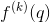是在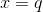评估的的导数。

当的范围从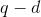到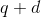时，我们希望找到下的区域，长度的间隔。

请注意，如果我们形成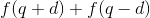，那么右边第二个词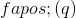的贡献将被取消。事实上，所有涉及奇数导数的条款都将取消：

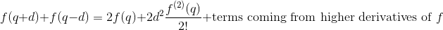

我们可以通过积分这个等式的两个方面得出结论：

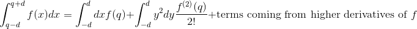

右边的第一个词是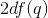，下一个是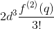，其余的术语与的更高权力成比例。

前一个等式的的第一项与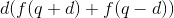的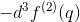和中的较高功率项不同。

这个论点的结果是， 的区间内的的积分近似产生与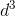成比例的误差以及的更高奇数幂的项。 中没有线性误差，中没有二次误差。事实上，中的误差项立方是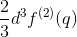。

如果我们将减少因子，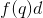减少因子，但这可以通过现在有两倍的间隔这一事实来补偿，每个间隔的一半大小。在减少之前出现。因此，第一项对整体积分的贡献通常不会有太大变化。 （当发生变化时，唯一的变化将来自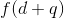等术语的评估变化。）另一方面，立方误差项的贡献将大约减少的因子，并且，因为那里将是两倍的间隔，它们对整体误差的贡献将大约减少的因数。

**那么？**

**这意味着如果我们在分割之后将估计值取四倍并在分割之前减去估计值，我们将（几乎）消除第一个误差项，并且得到的下一个误差项将在分裂时减少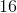 ]。我们得到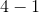或的估计值，因此我们除以以得到积分的估计值。**

所以这是我们的计划：

首先，我们使用左手规则计算从起点到任何后续点的积分。正如我们将要看到的，这很容易做到。

**怎么样？**

**我们可以通过创建两列来实现：列和整数列。**

**列（比如 A 列）以积分的下端开始（比如在 A5 中）。然后，对于大于，我们将 Ak 设定为 A（k-1）+ d。**

**在左规则积分列中，我们将 Ck 设置为 C（k-1）+ d * f（Bk）。**

**从 A5 的内容到 Ak 的内容的左手规则积分将是 C（k-1）。**

实际上，当你想要改变你正在积分的函数时，如果函数的所有评估都在一列中，那么你最好关闭。因此你可能想要将 Bk 设置为 d * f（Ak），将 Ck 设置为 C（k- 1）+ Bk。

接下来，我们将 C 列中的左手规则积分转换为 D 列中的梯形规则积分。

**How?**

在 D 中，我们向 Ck 添加了一个术语，它除去了一半的 A5 * d 和一半的 d * Ak。明确地，我们将 Dk 设置为 Ck - （A $ 5 + Ak）* d / 2。

从 B5 到 Bk 的梯形规则现在出现在 Dk 中。

接下来我们将其转换为 E 列中的 Simpson 规则。

**How?**

**让我们使用端点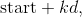 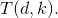** 调用间隔大小为的梯形规则结果

**我们要做的是重复间隔大小的梯形计算，然后形成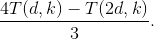** 结果的错误表现为。这个估计称为辛普森规则。

为什么我们以这种方式计算辛普森的规则？因为很容易应用左手规则，所以很容易让 Trapezoid 规则从中得到一列，并且容易将另一列中的间隔大小加倍。完成后，根据上面最后一段中的表达式，在第三列中，很容易从电子表格中的旧规则中形成新规则。

当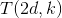与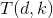位于同一行时，最容易实现此目的。回想一下，行对左手规则的贡献是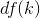，它被添加到对应于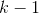的行中的结果中。对于，此贡献加倍并添加到前一个加倍行的结果，该行是高于它的。

使左手规则成为从开始到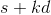的积分的梯形规则的校正是从包括初始值和总和的部分和减去第一个和最后一个贡献的一半 。

事实证明，将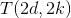放在与相同的行中没有太大困难，这使得形成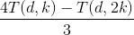变得容易。

**嗯，你到底做了什么？**

将间隔尺寸放在某个框中，比如 A1。

在 A 栏中，将起点设为 A5，在每一步从 A6 开始，将值增加。因此，在 A6 中，您可以放置​​= A5 + A $ 1，并且可以根据需要将 A6 复制到 A 列。

在 B 列中，将被积函数的值置于相应的参数：B5 put = A $ 1 * f（A5），并将其复制到 B 列。

在 C 列中，放置 B 列的部分和：这意味着，在 C5 put = C4 + B5 中，并向下复制 C 列。

在 D 栏中，输入 D5：= - （B5 + B $ 5）/ 2 并将其复制到 D 列。

从您的开始（在 B5 中）到 Bk 中的值的梯形回答将是 Ck + Dk，您可以将 Ek 放入框 Ek，将 E5 设置为= C5 + D5 并将其复制到列 E 中。

在 F 中，设置 F5 = 2 * B5 + F3 并向下复制 F（这将使左手规则导致 F 的奇数行超出第 5 行。偶数行包含无用的垃圾。）

在 G5 中，设置= 2 * D5 + F5 并向下复制 G，这将给出列 G 的奇数项中的区间梯形结果的积分。

在 H5 中，设置=（4 * E5-G5）/ 3 并复制。从 B5 的含量到 B 的含量（2k + 1）的积分的 Simpson 规则将出现在 H（2k + 1）中，对于至少。

接下来，我们为函数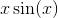做一个明确的例子。

预备：
设置 A1 积分 f（x），B1 设置为 f（x）= xsin（x）
设置 A2 设为 d，B2 设置为 0.01
设置 A3 为起点，B3 为 1

创建列：将 A5 设置为= B3，将 A6 设置为= A5 + B $ 2，将 A6 复制到 A 列。

设置列 B 到 H 的行，如下所示：

在 B5 中，输入= B $ 2 * A5 * sin（A5）;在 C5 中，= C4 + B5;在 D5 中，= - （B5 + B $ 5）/ 2;在 E5 中，= C5 + D5;在 F5 中，= 2 * B5 + F3;在 G5 中，= 2 * D5 + F5;在 H5 中，=（4 * E5-G5）/ 3。将所有这些复制到列中。

H（5 + 2j）等中的条目给出了 Simpson 的规则，从 A5 中的值到 A（5 + 2j）中的值进行积分。

A 列包含变量，B 包含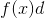，它是被设备乘以间隔宽度，C 包含其部分和，D 包含校正，使其成为 E 中的梯形规则，F 由跳过取值和加倍对应于加倍的宽度，G 校正端点以为创建适当中间端点的梯形规则，并且 H 根据和梯形规则答案创建 Simpson 规则。

完成此操作后，您可以通过更改 A1 和 B1 的内容来更改和起点。要更改被积函数，您只需要更改 B 列。

您应该使用您知道的积分测试您的答案，以便在电子表格中找到任何错误。您可以尝试加倍以查看是否会更改您的答案。如果没有，你已经很好地计算了你的积分。

**这总能奏效吗？**

不，如果你想融入无限，你显然不能这样做。如果你的被积函数在某个中间点变为无穷大，你也会遇到麻烦。或者如果它疯狂地摇摆。

你可能能够从中减去你所知道的并且具有相同的单一行为的东西，然后能够处理其余的事情。

**练习：尝试找到一个这个程序失败的函数（一个不会爆炸的函数）。** 附近的平方根可能就是这样。

如果添加按跳转的列并对它们执行类似操作，则可以将的梯形规则替换为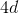。有了它，你可以得到和的两个辛普森规则计算。将乘以第一个减去第二个，并除以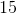，你将获得一个超级的辛普森规则，当减少因子时，它会提高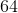因子。

**以下是从到** 的积分结果

&lt;button aria-controls="integral-simpsons-spreadsheet" aria-expanded="false" class="btn bg-light border-secondary" data-target="#integral-simpsons-spreadsheet" data-toggle="collapse" id="toggle-spreadsheet-table" type="button"&gt;显示表&lt;/button&gt;

Number of increments<button aria-expanded="false" aria-haspopup="true" class="btn btn-sm bg-light border-secondary dropdown-toggle" data-toggle="dropdown" id="nbr-inc-btn" type="button" value="25">25</button>[5](#) [10](#) [25](#) [50](#) [100](#)Number of digits after decimal point<button aria-expanded="false" aria-haspopup="true" class="btn btn-sm bg-light border-secondary dropdown-toggle" data-toggle="dropdown" id="nbr-digits-btn" type="button" value="10">10</button>[5](#) [10](#) [15](#)

在第 I 栏中给出的确切答案是（区分并看到）。

要获得第 I 列，只需在 I5 中输入= SIN（A5）-A5 * COS（A5）-SIN（A $ 5）+ A $ 5 * COS（5 澳元）并复印。

这里的辛普森统治对于有效数字是准确的。红色的值是我们辛普森的规则答案。其右边的值是的计算机评估，它是该积分的值。

请注意，您只需更改列 B 即可切换到集成其他一些被积函数。这涉及 B5 中的新条目并将其复制到该列。

可以通过更改 B3 来更改起点（称为积分下限）。

在上面的计算中，的位置精度发生在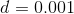。