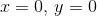
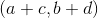
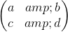
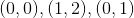
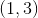
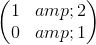
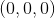
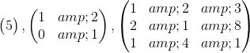
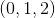

# 15.2 表示平行边的图形

> 原文： [http://math.mit.edu/~djk/calculus_beginners/chapter15/section02.html](http://math.mit.edu/~djk/calculus_beginners/chapter15/section02.html)

我们需要的第一件事是描述平行边形图的方法。

这是一种方式。想象一下，我们在平面上有 x 和 y 坐标，我们将图的一个角放在原点，我们指的是，。

然后假设位于包含原点的边的另一端的平行四边形的“角”位于点和。最后一个角落位于，因为两侧是平行的。 **（选择和的值并自己画一个图来验证这个陈述。）**

然后，描述平行四边形的一种方法是给出由数字和组成的正方形数组，排列如下：

**（这里的行是由满足原点的平行四边形边缘定义的向量。）**

例如，具有角和的平行四边形可以由数组表示

在三维空间中，我们可以通过将与原点共享边缘的三个角的坐标作为数组的的三行来描述在原点处具有一个角的平行六面体。

在一个维度上，我们可以表示一个线段，它从原点开始并通过单个条目转到点。

因此，三个矩阵

可分别代表线段，平行四边形和平行六面体。

我们给线段的（带符号）**长度**，平行四边形的面积和平行六面体的**体积**给出一个统一的名称，所有这些都带有一些适当的符号。

每个被称为给定阵列的**行列式**。我们也可以为较大的方形数组定义具有相似含义的行列式。

有时通过在数组的任一侧放置平行线或通过写 det（{array}）来表示数组的行列式。

**好的，你已经定义了这些有符号面积等等，但这有什么用呢？**

所有维度中的所有这些量都具有一些奇妙的属性，我们可以将其转换为行列式的属性，并且我们将能够使用它们来计算所有这些。不仅如此，我们还可以在电子表格中以任何方式计算它们，只需要一条非平凡的指令和一些复制。

（在 Excel 电子表格中，有一个名为 mdeterm（）的命令，其参数是一个数组，它计算行列式，因此面积和体积等等。我们可以不使用此命令执行相同的操作。）

**练习：**

**15.1 以两种不同的方式表示平行六面体在和相邻角的\（（1,2,3），（1,0,1）\）和处的角。**

**15.2 你能算出这个平行六面体的体积吗？**

**15.3 三角形的面积与三角形的两边作为边的平行四边形的面积有什么关系？**

**15.4 如果上面阵列的描述的平行六面体的一个角落在原点，那么“对面”角落的位置是什么。 （弄清楚自己在这里有什么相反的意思。）**

**这些“精彩”属性是什么？**