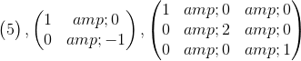
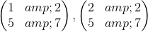
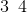
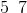

# 15.3 行列式的属性

> 原文： [http://math.mit.edu/~djk/calculus_beginners/chapter15/section03.html](http://math.mit.edu/~djk/calculus_beginners/chapter15/section03.html)

第一个属性，我们从行列式的定义和我们已经知道的面积和体积中推断出来的，是一个数组的行列式的值，其中**所有**是主对角线上的非零项。这样的阵列描述了一个矩形或长方体的图形，其边与和和以及任何轴平行。我们已经知道这个行列式的大小必须是其对角线条目的乘积。我们定义的标志是该产品的标志。

因此，上述三个阵列的决定因子分别是，和。

**这太棒了？**

还没有。我们真的希望能够评估更多的一般行列式。给定行**的行列式符号取决于您选择列出代表图形边缘的行的顺序，我们将会看到。**

我们感兴趣的是倾斜的平行四边形面积，使得侧面彼此不垂直或者旋转，使得侧面不平行于轴。

这是一个很好的事实：如果你固定平行四边形的底边（它的一边），那么它的面积就是平行四边形顶部高于该底边的高度乘以底边的长度。平行四边形倾斜多少并不重要，它只是顶部和底部之间垂直的距离。

类似的属性保持在任何维度：n 维图形的大小是其维度基础的大小，乘以图形顶部垂直于其基础的高度。

这告诉我们：**我们可以将数组中一行的任意倍数添加到任何其他行，而不更改其行列式。** 这是因为在任何方面我们都可以选择**包含原点**的任何面作为基础，**以及从原点到其邻居的所有线条之外的所有线条，它们定义行阵列，位于那个基地**。通过面部中的任何矢量更改不在脸部的线条将不会改变图形的高度;它只能改变人物倾斜的方式。

（顺便说一下，这表明了计算行列式的通常方法。我们将行的多个行添加到其他行以消除所有倾斜，以便行列式是其对角元素的乘积。这称为行减少。）

从前两个开始的另一个奇妙事实是：行列式在其数组的任何行（或列）中是**线性的。** 这意味着如果将某行乘以，则行列式的值会增加。这也意味着如果你采用两个不同的**一行**的数组，就像下面的两个，它们的第一行不同：

然后通过在不同的行中求和并保持其他行相同来得到数组的行列式（第一行和第二行）是两个数组的行列式之和开始于。

该陈述表示这样一个事实，即基数上方的总和数字的高度是两个加数数字的高度之和。

**练习 17.5 通过适当地相互添加行来显示交换两行数组会改变其行列式的符号。 （提示向另一行添加一行，减去另一种方式并添加第一种方式;或类似的东西）**

**这一切有什么好处？**