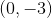
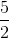
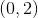
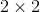
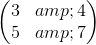
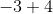
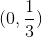
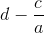
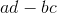

# 15.4 求解行列式

> 原文： [http://math.mit.edu/~djk/calculus_beginners/chapter15/section04.html](http://math.mit.edu/~djk/calculus_beginners/chapter15/section04.html)

那么，从前两个事实来看，我们可以计算任何行列式的值，从而计算任何平行边图的面积或体积或任何值。

**怎么样？**

好吧，我们可以将多个行相加，以摆脱对角线元素。当我们完成时，我们可以推断出行列式的值是对角元素的乘积。

实际上，我们只需要将对角线一侧的元素设为，并取对角线元素的乘积。摆脱其他人有时是一件好事，但根本不会影响对角元素。

让我们评估以下数组的行列式：

如果我们从第一个矩阵中的第二行中减去乘以第一行，我们得到第二行的，因此行列式为。在第二个数组中，我们从第二个数组中减去乘以第一行，并将作为新的第二行。因此，第二基质的行列式是或。

这通过线性告诉我们这两个矩阵之和的行列式，

是或。我们可以通过从第二行中减去第一行的来验证这一点，将第二行转换为，并且对角元素的乘积是。当两个数组具有相同的基数时，您可以以这种方式应用行列式的线性，并且仅在非基数行中不同。

用于评估两个矩阵上使用的行列式（有时称为“行减少”，有时称为“高斯消除”）的这个过程可以应用于任何大小的正方形阵列。 阵列很容易为做，但即使这样也很容易出错。对于而言仍然相当容易，但是大多数人会在这个过程中犯下一些愚蠢的错误，因为这样做的步骤太无聊了，而且大部分时间都会出错。即使你和我可以期望行列式在大多数情况下通过这种方法手动完成时也会错误，因为这些步骤非常简单且无趣。你的思想会一路走来，你很有可能搞砸了。

**这是评估行列式的唯一方法吗？**

不，至少还有其他两种方式，其中一种方式同样无聊，容易出错。另一个是神奇而有趣的，但令人惊讶的是它从未被教过，很少有人听说过它。

一种标准方法是为刚刚描述的方法的结果编写公式。如果从行和开始。要将转换为，请从第二行减去的第一行。得到的对角元素是和，它们的产物是 **** 。这是一般二乘二阵列的行列式的公式。计算三乘三个行列式的标准方法是在三个向下倾斜的对角线上取条目的乘积，并从它们的总和中减去三个向上倾斜的对角线中的每一个上的条目乘积的总和。

**练习 15.6 通过上述任何方法评估以下行列式。**

**那么神奇的方法是什么？**