# 15.5 用于求解电子表格中的行列式的爱丽丝梦游仙境方法

> 原文： [http://math.mit.edu/~djk/calculus_beginners/chapter15/section05.html](http://math.mit.edu/~djk/calculus_beginners/chapter15/section05.html)

你可能知道，爱丽丝梦游仙境的作者刘易斯卡罗尔是一位数学家，我们的方法使用他着名的行列式定理。该定理如下：

假设我们有一个方阵，其顶行和底行称为和，其左右列是和。我们定义了以下附加数组。 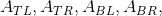和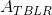，通过删除顶部的行和左侧的列，右侧的行和右侧的列获得的数组，左边的行，左边的，右边的，最后，位于顶部，位于底部，左边是，右边是。

如果是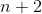阵列的那么接下来的四个是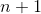阵列的，最后一个是阵列的。

那么下面的等式成立：

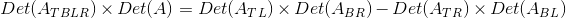

**这意味着阵列的行列式可以写成一个较小的数组的行列式的乘积除以两个较小的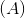的数组的行列式。 ** 

**这一切有什么好处？**

我们将数组的任何的行列式定义为，并且由数字组成的逐个数组是它自己的行列式。我们的两个两个块由四个一个一个阵列组成，（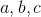和）在每个角落\（\ begin {pmatrix} a＆amp; b \\ c＆amp; d \ end {pmatrix} \ ）

将该定理应用于这种情况，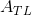是，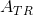是，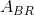是，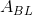是。 什么都没有，我们定义为具有行列式。

因此阵列的刘易斯卡罗尔定理表明 **A 的行列式，即** ，可以写成相同的东西除以 1.这是我们已经观察到的。

现在假设我们从一个三乘三的数组开始：

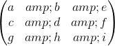

该阵列有四个二乘二子阵列，相邻的行和列，一个满足每个角，这些是，，和。该定理告诉我们，数组的行列式由这些数组的左上角和右下角的行列式的乘积给出，减去它们的右上角和左下角的行列式的乘积，全部除以中间元素是 d。这里是从左上角开始到顺时针方向绕，，和。

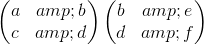 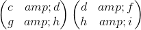

计算这些对于左上角的条目的每个行列式，给出了一个二乘二的数组，其元素是这四个数组的两个两个行列式。这里的第一件好事是，所有四个都可以通过复制第一个的计算，一个向右然后向下复制来计算。

在这种情况下，是原始阵列的中间元素，而，，和是紧靠上方的阵列的四个，顺时针方向从左上角的那个开始。

如果我们用行列式将这四个写成

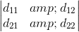

我们可以通过刘易斯卡罗尔方法计算决定因子。

更好的是，我们可以进行设置，以便我们可以计算这个数组的两个行列式除以，使用相同的指令来计算这些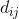只复制了一个地方到右边，四个地方。通过刘易斯卡罗尔的定理，结果是我们原来的三乘三阵列的三乘三的行列式。

甚至更好的是，如果我们开始使用更大的初始方阵，比如 ，首先适当地复制会使我们通过 的阵列产生  ]行列式，更多的复制由由  决定因子产生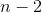，直到我们通过数组得到单个，其条目为通过原始数组的行列式。 （我们也在这些之间产生一排垃圾）

我们很快就会看到您必须输入的一条指令是什么，以及如何设置它。

关于这个还有另外两个好处。首先，一旦设置为任何大小，您可以以任何方式更改初始数组，电子表格将立即为您提供新数组的行列式。

其次，使用 Cramer 的规则，您可以使用相同的方法通过线性方程立即求解系统，同样能够随意更改方程并立即获得解。 （我们稍后会讨论这个问题。）

我不确定你能做多大并且确实有效。但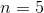或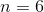绝对可以。

但是有一个问题。这个过程涉及一个分工。为了处理三个三个数组，我们将数组的中间元素除以上面的。为了处理四个四分之一，沿着我们划分原始数组的四个中间元素中的每一个，然后通过这四个元素形成的数组的行列式，其中任何一个可能是。除以是否定的。我们将会看到这个问题很容易处理。

**好的，你怎么能做到这一切？**

我们将通过为四乘四阵列设置行列式查找器来说明这一点。

假设我们有一个四乘四阵列，你想要它的行列式，我们将它定位在 A6 B6 C6 D6 到 A9 B9 C9 D9 的位置。

然后将放在 B3 位置，从 B3 到 B5 向下填充到 D3 到 D5，将放在所有这些位置。这些线在这里代表阵列的每个平凡的行列式，我们将除以。

现在这是关键的一步。 **将=（A6 * B7-A7 * B6）/ B3 放入 A10。** 将其复制到 B 列和 C 列中，C 中的结果为=（C6 * D7-C7 * D6）/ D3。然后将第 10 行复制到第 18 行。

**你得到了什么？**

A10 B10 C10 包含原始阵列的决定子的数组的第一行。

A11 B11 C11 包含第二行相同。

A12 B12 C12 包含第三排相同。

第 13 行是垃圾。

A14 B14 包含原始阵列的决定簇的阵列的的第一行。

A15 B15 包含第二行相同的行（其余的行 14 和 15 都是垃圾）。

第 16 和第 17 行都是垃圾。

**A18 包含原始数组的四乘四行列式，除非沿着除以 0 的方式（该行中的所有其他条目都是垃圾）。**

**如果数组条目 A22 或 B22 或 A23 或 B23 是，或者它们的二乘二矩阵是，则此电子表格将除以，您将无法获得评估。要解决这个问题，只需将 _ 的原始条目 _ 替换为微小和正数的，（当条目为整数时，如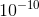）。如果你也看到 A22 * B23 - B22 * A23 不是，A18 将是阵列的的行列式。**

**一旦四个中心阵列条目不为零，如果你有 A22 * B23 - B22 * A23 = 0，那么几乎任何更小的东西添加到这四个条目中的任何一个将使该组合非零，因此 A18 将是行列式。除非行列式实际上是，否则可以通过答案中无法看到的方式轻松删除零。**

**注意：如果有任何划分，则通过更改原始阵列使所有更改消除相同。永远不要在计算的后期阶段进行更改！**

以下是电子表格输出的外观。可以修改第 6 行到第 9 行的条目，并自动计算 A18 中的行列式。如果使用非数字，则单元格的边框将变为红色，计算将中止。蓝色条目必须为非零。

&lt;button aria-controls="determinant-spreadsheet" aria-expanded="false" class="btn bg-light border-secondary" data-target="#determinant-spreadsheet" data-toggle="collapse" id="toggle-spreadsheet-table" type="button"&gt;显示表&lt;/button&gt;

|  | 一个 | 乙 | C | d |
| --- | --- | --- | --- | --- |
| 1 | 行列式计算 |  |  |  |
| --- | --- | --- | --- | --- |
| 2 |  |  |  |  |
| --- | --- | --- | --- | --- |
| 3 |  | 1 | 1 | 1 |
| --- | --- | --- | --- | --- |
| 4 |  | 1 | 1 | 1 |
| --- | --- | --- | --- | --- |
| 五 |  | 1 | 1 | 1 |
| --- | --- | --- | --- | --- |
| 6 | &lt;input aria-label="a11" class="form-control" id="a00" placeholder="a11" type="text"&gt; | &lt;input aria-label="a12" class="form-control" id="a01" placeholder="a12" type="text"&gt; | &lt;input aria-label="a13" class="form-control" id="a02" placeholder="a13" type="text"&gt; | &lt;input aria-label="a14" class="form-control" id="a03" placeholder="a14" type="text"&gt; |
| --- | --- | --- | --- | --- |
| 7 | &lt;input aria-label="a21" class="form-control" id="a10" placeholder="a21" type="text"&gt; | &lt;input aria-label="a22" class="form-control" id="a11" placeholder="a22" type="text"&gt; | &lt;input aria-label="a23" class="form-control" id="a12" placeholder="a23" type="text"&gt; | &lt;input aria-label="a24" class="form-control" id="a13" placeholder="a24" type="text"&gt; |
| --- | --- | --- | --- | --- |
| 8 | &lt;input aria-label="a31" class="form-control" id="a20" placeholder="a31" type="text"&gt; | &lt;input aria-label="a32" class="form-control" id="a21" placeholder="a32" type="text"&gt; | &lt;input aria-label="a33" class="form-control" id="a22" placeholder="a33" type="text"&gt; | &lt;input aria-label="a34" class="form-control" id="a23" placeholder="a34" type="text"&gt; |
| --- | --- | --- | --- | --- |
| 9 | &lt;input aria-label="a41" class="form-control" id="a30" placeholder="a41" type="text"&gt; | &lt;input aria-label="a42" class="form-control" id="a31" placeholder="a42" type="text"&gt; | &lt;input aria-label="a43" class="form-control" id="a32" placeholder="a43" type="text"&gt; | &lt;input aria-label="a44" class="form-control" id="a33" placeholder="a44" type="text"&gt; |
| --- | --- | --- | --- | --- |
| 10 |  |  |  |  |
| --- | --- | --- | --- | --- |
| 11 |  |  |  |  |
| --- | --- | --- | --- | --- |
| 12 |  |  |  |  |
| --- | --- | --- | --- | --- |
| 13 |  |  |  |  |
| --- | --- | --- | --- | --- |
| 14 |  |  |  |  |
| --- | --- | --- | --- | --- |
| 15 |  |  |  |  |
| --- | --- | --- | --- | --- |
| 16 |  |  |  |  |
| --- | --- | --- | --- | --- |
| 17 |  |  |  |  |
| --- | --- | --- | --- | --- |
| 18 |  |  |  |  |
| --- | --- | --- | --- | --- |

**练习：**

**15.7 为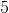行列式评估设置相同的东西。 （不同之处在于顶部的数组必须是，你的输入数据将是。你除以顶部通过行列式左上方，并将其复制到第一个列中。如果左上角在 B3 中，那么 行列式在哪里？ HTG15]**

Cramer 的规则给出了一组线性方程中变量解的公式。它表示通过用方程中的常数代替包含方程中变量系数的列，除以系数原始数组的行列式得到的数组的行列式是的解。

如果在系数数组之后添加常量列，则可以通过此方法与行列式一起计算这些行列式中的每一个，并在它们之后复制系数数组。从第二列开始的数组将是那些参与 Cramer 规则分子的数组，除了符号。这意味着线性方程的解将是包含行列式的行中的条目的适当比率，具有适当的符号。 （的行必须向右扩展，你必须进一步复制到右边。）

**如果此过程导致划分，我该怎么办？**

仅当 A22 或 A33 或 A23 或 A32 为或具有行（A22 A23）和（A32 A33）的阵列的行列式是时才会发生这种情况。您可以在开始之前检查这一点，如果发生任何这些事情，请为每个添加类似的东西;如果没有将添加到其中任何一个;如果都将添加到其中三个，将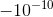添加到另一个。如果数组的的一行或一列是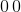且其他行或列条目相同，则添加到一个并从另一个中减去相同的内容。这将始终导致程序避免除以。