# 16.1 极限和点集拓扑简介

> 原文： [http://math.mit.edu/~djk/calculus_beginners/chapter16/section01.html](http://math.mit.edu/~djk/calculus_beginners/chapter16/section01.html)

数学家，特别是自 19 世纪世纪以来，想要使微积分的主题严格，这意味着完全逻辑上定义。如果在这一点上它的图形“看起来像一条直线”，我们已经调用了一个可微分的函数。这可能是直观的，但肯定比严谨更直观。

为了引入严格，我们定义了序列的**限制**的概念。

无数的数字序列被称为**收敛**，如果对于任何标准，（比如说数万亿，无论这意味着什么），超出序列中的某一点，任何两个条目之间的差异小于该标准。

序列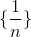收敛，因为超过第十亿个术语，任何两个条目之间的差异小于万亿分之一。

给定集合**中的数字序列收敛到极限** ，如果它收敛并且任何条目和之间的差异小于该标准，超过某一点。

序列收敛于。

我们说函数在参数中是**连续**，如果**它的值在收敛到的任何数字序列上，收敛到它在的值。我们把它写成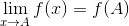** 。

我们说 ****在是可分化的，如果对于任何数字序列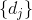它们都没有收敛到，的极限接近  ]即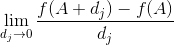存在，我们将的导数称为 ，我们将其写为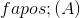和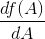。****

一旦定义了限制，就可以制定许多精彩的概念和定义。

如果的元素的每个会聚序列收敛于中的数字，则称的数量为**。**

集合的**极限点是那些集合的成员序列的极限数。**

如果一个集合包含其所有限制点，则**关闭**。

请注意，根据定义，不是正数，因此有正数的序列不会收敛到正数，因为它们会聚到。因此**正数不会被关闭。**

请记住，**有理数是超出某些点无休止地重复某些十进制数字序列的数字。**

考虑一个数字，在小数点之后，以开始并且具有一系列零和，在出现之后具有正好连续零。这个数字在某些点之后不会重复，因此它不合理。但它是通过零替换之外的所有条目（因为转到）得到的序列的极限，所有这些都是有理的，每个都以重复结束。

因此，**有理数不是封闭的。**

实数的集合的**边界点是和不在中的实数集的极限点。** 因此，如果是包含端点和的和之间的点间隔，则和是其边界点。此已关闭，因为它包含所有可能的限制点。

**开集**是**不包含边界点的集合。** 和之间不包括其端点的点间隔是开放的。如果定义的间隔仅包含其中一个端点，则它既不是打开也不是关闭。

**封闭式套装是开放式套装的补充。** 由于闭集包含其所有边界点，因此它们的补充包含不在其中的所有空间点，不包含它们。

**什么无限序列不会收敛？**

当一系列实数无界时，总会发生非收敛：例如，序列

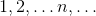，不收敛。

此外，具有多个极限点的有界序列不会收敛。例如

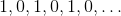具有极限点和，并且不会收敛，因为连续项之间的差异总是，并且永远不会低于。

**其中每个元素序列在其内部具有至少一个限制点的集合被称为顺序紧凑。** 为了顺序紧凑，必须关闭集合，否则，根据定义，其元素的收敛序列不会收敛到的成员。 必须是有界的，否则就会有一个无限增长的序列，没有有限的极限点。 （例如，选择序列的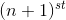成员，其元素中最小的元素至少比其成员大一个。）

另一方面，**如果实数的集合是闭合的，则的每个元素序列在中具有至少一个极限点。**

本声明来自两个我们将证明的观察结果。 **首先，如果有界，其成员增加的元素序列，使成员至少与一样大，必须收敛。**

如果关闭，增加的序列必须收敛到其成员的最小上限，这将是的一个元素，这将是一个限制点。对于递减序列也是如此。

其次，**每个无限序列必须包含一个正在增加的无限子序列，或者一个正在减小的子序列或两者都包含。**

**这些陈述一起表示任何无限的实数序列都是有界的，并且因此是一个极限点。**

我们证明了第一个：**数字集的最小上界是至少与的每个元素一样大的最小数。** 如果由递增序列的成员组成，则该最小上限必须是序列的限制点。它肯定不能少于序列中的任何成员。如果它比所有成员都高出数万亿，那么它不是最低限度的上限。这证明了第一次观察。

通过考虑有限的数字序列（例如长度）得到第二次观察的优雅证明。我们证明每个这样的序列至少具有的平方根的长度增加或减少的子序列。由于无穷数的平方根仍然是无穷大，因此该结果告诉我们任何无限序列必须具有无限增加或减少的子序列，其中任何一个必须具有极限点。

为了说明这一点，从序列的开头开始，跟踪在每个成员处结束的最长增长和最长减少序列的长度。第一个这样的对将是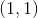，然后是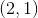或，取决于第二个成员是大于还是小于第一个成员（如果它与我们得到的第一个成员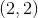相同）。

奇妙的事实是没有两个成员可以拥有相同的数字对。如果说某个成员，有一对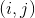，那么任何后续成员将至少获得对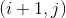或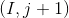，因为通过将添加到如果大于，则在结束的旧增加序列，并且如果小于，则类似地通过添加获得减少序列。

我们的主张是这样一个事实，即不同有序的正整数对的数量都小于是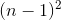。表达这一事实的另一种方式是在任何序列的第一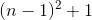成员中必须存在至少的“单调”序列长度。

这两个主张一起告诉我们**任何有界闭合的实数集都是紧凑的。**

**练习：类似​​的结果适用于实数的有序对（或有序元组）的集合，其对应于二维空间（或维空间）中的点。推广上面的定义以应用于这样的集合，并证明这些对的任何有界闭合集合是顺序紧凑的。**