# 16.2 紧集

> 原文： [http://math.mit.edu/~djk/calculus_beginners/chapter16/section02.html](http://math.mit.edu/~djk/calculus_beginners/chapter16/section02.html)

一组实数被称为**由开集**的集合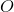覆盖，当 **的每个元素包含在的至少一个成员中时。** （的成员可以包含以外的数字以及中的数字。）

被称为 **compact** ，如果**对于的通过开集，被的一些有限成员覆盖。** 关于开放区间覆盖的一个重要事实是：**如果一个点位于一个开集中，它位于的开放区间内并且距离边界点是正距离那个间隔。**

我们现在将证明，**有限闭合的实数是紧凑的。** 参数不依赖于实数之间的距离定义，只要它作为距离有意义。

打开的实数组是实线上不相交的开放区间的每个联合。我们可以考虑通过开集来覆盖的作为它们的开放区间的覆盖。包含数字的覆盖物中的每个开放集合在其中具有包含的开放间隔。因此，通过开放区域覆盖实际上也是通过开放区间的覆盖。

覆盖的任何间隔都包含在中其他区间的并集中，在中是多余的，可以从中删除，的其余部分仍然是覆盖。

每组封闭的实数都是不相交的闭区间的集合。例如，对于所有正和数字，区间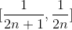和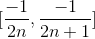的集合是闭集。 中的最小数量是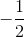，最大值是。这里的数字必须在其中，因为它是其他数字序列的极限点。

我们可以通过以下无限的开放区间集合为提供明确的封面：

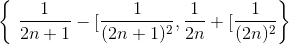 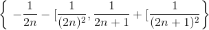 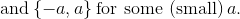

为证明这一说法，我们使用了几个事实：首先，_ 如果中的数字序列是无穷大，则必须至少有一个限制点，因为是关闭的，界。_ 第二，_ 如果数字被开集覆盖，那么包含的数字都小于和大于。_ 最后，_ 包含一系列不同数字的限制点的开放集必须包含无限数量的这些数字。_

我们可以通过实际构建一组覆盖的有限开放区间来证明这一结果。为此，我们将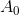设置为中的最小数字，让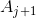为中最小的数字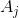，该不包含的成员。

可以是的下边界点（对于除上述示例中遇到的一个之外的所有情况都会发生），或者它可以位于[的闭合区间的上边界的中间或上方。 HTG3]。

我们将定义一个包含的开放区间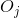，从的最大值开始归纳，如下所示：

如果是中其间隔中的最小数字，则让成为中小于的最大数字，让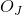为中包含两者的中的任何开放区间 HTG7]和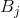。

否则，让为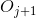中小于（且不等于）的任何数字。根据的定义，中含有和的开放区间，任何这样的开放区间都是。

通过构造，仅包含中的一个，即。因此，根据我们上面的第三个事实，它不能包含的限制点。这意味着和的数量是有限的。还有的封面。因此，是通过开放区间覆盖的有限大小。

在上面的例子中。 是来自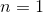的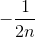形式的数字，直到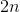的值约为，具有相似数量的阳性，用于大致 共计。

**练习：
1.证明上述声明定义的封面。
2.表明通过上述结构从成员中选择的有限开放区间集包含覆盖中可能的最小开放区间。**

我们提供上面的示例和构造，让您直观了解此结果的含义。通常的简单证据包括将任何闭合集分成两半，选择 S 中的数字，并在的一半上重复这些动作，这需要覆盖无限数量的成员。在每个阶段，新的大小是旧的一半，并且如果那么，至少有一半必须覆盖无限数量的成员。选择的数字序列，如果无限，则必须具有限制点，并且对于任何覆盖的开放区间，将包含我们序列中的所有点，其间隔长度小于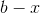和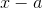;并且这将大于我们在某个阶段的间隔的长度，并且我们序列的所有后续成员将在内并被它覆盖。 （这正是示例中所发生的情况。）这意味着后来的只需要覆盖的一个成员。一个是非常有限的。这个证明的一个优点是它对于维空间也是有效的，其元素是 - 实数的元组，正如它对实数一样。 （这个论点在下面详细重复。）

我们一直在实数的背景下讨论这些不同的概念，但它们也可以在许多其他环境中定义。限制的定义需要定义距离，但是给定这样的定义，还定义了闭合，开放，顺序紧凑，完整和紧凑的概念。定义任何一对之间的距离的点集称为度量。

当没有度量时，通过指定整个集合的哪些子集是开放的，也可以定义这里提到的闭合和紧凑的概念。

在任何距离 d 的度量空间中，我们定义点的 d 邻域由的所有元素组成，其与的距离严格小于。 中的任何开集是其元素的邻域的并集，每个邻域与相交。

假设有限维空间 S 的闭合有界子集被开集覆盖。然后它也包含在这些集合中的邻域中。我们将争辩说，它必须被这些社区的有限集合覆盖，因此有限数量的那些开放集合。

如果是维度，我们可以将切割成 n 个立方体的有限大小网格（我们指的是在任何方向上的长度最多都是常数的点集合，如果是必须无限的成员需要覆盖至少一个立方体也必须是无限的。我们在任何这样的立方体中选择一个点，减少对的注意-cube 并重复这些切割并选择步骤。由此产生的元素序列必须收敛到某个点，其封面必须仍然需要无限数量的邻域。但是单个点可以被一个邻域覆盖，由此论证告诉我们，从来没有需要无数的社区。

这样的论证证明中的闭合和有界集合对于在实数上定义的任何有限维空间都是紧凑的。

当没有指标时，奇怪的事情就会发生。假设我们有整数，或有理数或实数（没有它们之间的距离定义），而闭集包括所有有限集。这意味着开放集是所有元素集，只缺少有限数量的元素。

在任何这样的空间点和开放集的定义，所有集合都是紧凑的！

给定任何集，以及的任何封面，通过开集，以及该封面中的任何开集，只能错过一个封闭集，这意味着有限集，比如， 的要素。这些可以被封面中的大多数开放式套装覆盖，这意味着原始封面中最多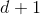开放式套件的封面。

因此，紧凑的集合通常不需要用这些定义来封闭或界定。

一组点中的开集的定义称为拓扑。

上面考虑的主题，称为点集拓扑，在世纪被广泛研究，以使微积分严格。它包含许多有趣的结果，其中上面是一个微小的随机样本。