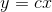

# 16.3 杂注

> 原文： [http://math.mit.edu/~djk/calculus_beginners/chapter16/section03.html](http://math.mit.edu/~djk/calculus_beginners/chapter16/section03.html)

限制的概念允许在不参考比例的情况下讨论微积分。也就是说，如果我们对函数感兴趣，那么我们可以用将改为，的结果函数具有与相同的可微分性质，只有不同的导数。

在现实世界中，我们可以在不是这样的情境中使用微积分。这里有些例子。对于适合于讨论太阳系的尺度，地球具有光滑且可微分的表面，并且大致为球形。对于我们可怜的凡人而言，这是非常不真实的：有山，高楼，地上的洞，树木，建筑物的屋檐和生物，这些在任何特定时刻由它们定义的表面根本不可分辨。 。厨房桌子的顶部可能看起来平坦，它的表面是可区分的，但在原子尺度上它充满了洞和诸如此类的东西，并且在亚原子尺度上我们不知道它看起来像什么。当我们在计算机上存储函数的值时，当这些值实际上是不合理的时，存储的内容因实际值中看似随机的量而不同，并且数据点之间的差异在这些差异的大小范围内是无意义的。

这些事实并没有消除使微积分严格和规模独立的尝试的价值。如果我们必须描述函数连续或可微的比例，那对我们来说会很尴尬和烦恼。更公平地说，我们定义的函数在任何尺度上都是可微分的，但我们用来描述现实的模型仅在适当的尺度上与这些函数一致，当我们选择时，我们可以看到这些现象。

它们还意味着我们可以在函数上使用微积分来表示与我们所关注的尺度“看起来像一条直线”的数量，即使它们没有以无穷小的尺度这样做。它也证明了我们试图从数据中得出结论，尽可能地从小的的限制中得出结论，这是我们用数值计算做的事情。