# 16.4 Lebesgue 积分

> 原文： [http://math.mit.edu/~djk/calculus_beginners/chapter16/section04.html](http://math.mit.edu/~djk/calculus_beginners/chapter16/section04.html)

在给定间隔内具有被积函数的黎曼积分被定义为当接近的大小的子区间的总和，乘以的值时的极限。该子区间中的任意点，当该限制存在时，并且对于所有区间中的每个点选择都是相同的。否则，该函数被称为在该间隔内不可积。

所有有理数上的和所有其他数上的的函数在这个意义上显然不可积，因为任何非零大小的每个区间都包含有理数和无理数，因此这两个函数的值都是和。有许多非有理数而不是有理数，这表明我们可能忘记有理数，并说积分是。另一方面，如果我们在计算机上执行数值计算，由于计算机将每个点都舍入到理性点，我们会找到每个区间的值。

还有另一种方法来定义函数的积分，刚才描述的函数是可积的。

我们可以通过平行于轴的切片分割成碎片，而不是通过平行于轴的切片来分割由积分计算的面积。

假设，为方便起见，被积函数是非负的，我们在有限的区间内进行积分。然后，对于每个切片，我们将发现对于域内的某些点，切片在被积函数之下，对于某些切片在其上方，并且对于一些而言，被积函数位于切片内。随着切片的大小减小，来自最后一个的贡献变得可以忽略不计，并且积分将是切片低于被积函数的贡献的总和。

对于连续的被积函数，对于每个切片，它下面的点将在实线上形成一些区间集。我们很快就会注意到有很多种积分。在每一个中，我们为切片低于被积函数的点集的每个切片定义“度量”，并且所有切片上的这些度量的总和必须收敛到积分。

什么构成措施？主要必要条件是不相交集的度量之和（这些是没有共同点的集合）是它们并集的度量（并集是任何一个中的点集）。这必须适用于任何有限数量的相互不相交的集合的联合：它们的联合必须具有与其度量的总和相等的度量。由于可数列表中的任何点都位于可数列表的有限初始段中，因此任何可数数量的集合的并集度量必须是其度量的总和才有意义。

在通常的积分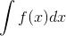的情况下，间隔的度量是其长度。单个点是长度的间隔，并且具有度量。

这告诉我们，任何可计数的点集的度量必须是的可数和，因此必须是以及此度量（和它们一样的度量。）

我们可以得出结论，对于通常的积分，有理数上的和其余实数上的的奇怪函数是可积的。有理数的数字是可数的，它是的可数和，因此是。因此，其余部分的度量是积分的区间的长度，并且这个奇怪的函数确实是可积的。

**还有哪些措施？**

我们已经遇到了一些其他措施;如果我们处理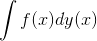，即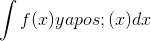，我们使用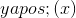定义的度量来积分。例如，如果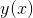是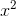，则间隔的度量不是其长度，而是在间隔的端点处其值之间的的差异。

此外，普通总和，例如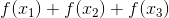，也可以写成 Lebesgue 积分，在这种情况下使用点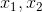上的，以及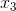和其他地方的量度。

自物理学家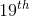世纪以来一直使用这种积分，并且有一段时间被数学家所厌恶。物理学家引入了“δ函数”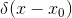，它是，除非是，但其积分是。然后可以将表示前一段总和的积分写为

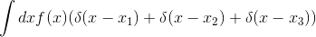

delta 函数的明显问题是当为时它必须是无限的。幸运的是，允许它作为的函数在周围具有不可测量的小宽度的后果，在这种情况下它可以保持有限，对于所有用途都是不可检测的，在最终应用时，它被集成过度。从勒贝格积分的角度来看，这只是另一种衡量标准。

如果您发现任何这些东西很有趣，请了解更多信息！