# 1.1 什么是数字？有理数

> 原文： [http://math.mit.edu/~djk/calculus_beginners/chapter01/section01.html](http://math.mit.edu/~djk/calculus_beginners/chapter01/section01.html)

我们有很多种数字，但它们都以**自然数**开头，它们是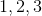，依此类推。

如果算上你的数字和脚趾，你会来（大多数人会），这是一个自然数。在我们的想象中，我们可以认为这些自然数字会永远持续，超过一百万，十亿，万亿等等。

在小学，你不仅研究了这些数字，还研究了如何对它们进行操作。

**什么操作？**

有**加法，减法，乘法**和**分裂**。

你可以**将**两个自然数加在一起，你总会得到另一个自然数，就像着名的事实那样，一个和一个是两个。

另一方面，减法比较棘手。如果你从一个数字中减去一个数字，例如数字，你会得到一些新东西，这根本不是一个自然数。我们称它为或**零**。如果你减去一个数字，再说，从较小的数字，比如说，那么你得到的是新的东西，即负整数，在这种情况下是，称为 **“减二”**。

您可以使用数字来计算口袋里的便士数量。因此，你的口袋里可能有五便士。如果你的口袋里有一个洞，你就会得到便士的数量，你所放入的所有东西都会立即掉出来。

现在假设你去商店，店主很傻到可以给你信用。进一步假设你有五便士，你买了一些价值 11 便士的昂贵物品。然后负整数表示这样一个事实，你不仅没有便士，而且如果你还有六个，你将有义务交出它们来支付这个项目。这里六是你欠你的债权人的便士数，如果你付给他你的便士并且他给了你这个对象，并借给你剩下的钱。

因此，为了适应减法，并且能够用数字表示“欠款”，我们扩展自然数以包括数字和自然数的负数。这整组数字，正自然数，它们的负数和 0 被称为**整数**的集合，并由字母 **表示。** 

我们可以接受 **** 的任何两个成员并加上它们或减去它们，并且在任何一种情况下都得到 **的另一个成员。** 

**我知道这一切，但我对实际的加法和减法都非常生疏。我尝试做的时候很多时候都弄错了。**

大多数人在他们执行的任何十次加法或减法中大致会犯一次错误。这意味着如果他们添加或减去具有多个数字的数字，如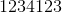和，他们很有可能得到错误的答案。

幸运的是，今天没有意义。您可以在计算器或电子表格上轻松检查添加和减少，看看您是否在几个不同的时间得到相同的答案。不幸的是，我通常会在输入或减去数字时键入错误，或者添加而不是减去或做其他同样荒谬的事情。今天所有这一切意味着我必须至少进行三次计算，以便有正确的合理机会。确实，我的努力量是它可能的三倍，但是三次努力仍然很少。

如果您遇到此问题，最好在电子表格中添加或减少。然后你可以看看你的计算，并判断它是否有意义。以下是检查感觉的一些规则。

当你添加正数时，结果应该大于你添加的两个**“加法器”**。如果其中一个数字是正数而一个数字是负数，则总和的大小（如果忽略任何减号的值）应该小于两者中较大者的大小，并且符号应该是加数的符号。更大的幅度。

此外，如果忽略其余数字，则数字的最低有效数字应正确加或减。例如，如果从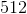中减去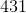，那么答案的最后一位数最好是，即减去。

如果您的检查产生了可疑的东西，请再次尝试计算，更加小心，尤其是输入数据。

从另一个数字中减去 5 的操作，**撤销**将添加到另一个数字的操作。因此，如果您同时执行这两项操作，请添加五项，然后减去五项，反之亦然，您将回到起点：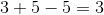。

添加和减去被认为是彼此的**反**操作，因为这个属性：**一个接一个地执行它们相当于什么都不做。**

**那么，为什么不是自然数？**

我不知道。这就是人们很久以前定义自然数的方式，没有人关心改变这个定义。

回到小学你也遇到了**乘法的概念。** 这是你可以对两个整数做的事情，它会产生第三个叫做**产品的整数。** 你（我希望）你被迫学习一个乘法表，它给出了每对单位数的乘积，然后学会了如何使用这个表来乘以更多的数字。

**我从来都不擅长** **。**

在过去，你必须能够做这些事情，增加和增加，如果只是为了能够处理钱和进行普通购买而不被欺骗。

现在，您可以使用计算器或计算机电子表格来执行这些操作，如果您知道如何输入整数并按下或或和=按钮。

（_ 不幸的是，这一事实导致教师们相信他们不必强迫学生经历学习乘法表的苦差事。_

_ 由于我们的大脑运作方式，这对那些不愿意这样做的人有很大的伤害。事实证明，我们花在儿童身上的任何活动的时间越多，甚至作为成年人，大脑的面积越大，专门用于该活动，并且越大，我们就越好地参与该活动。_

_ 因此，花费更少的时间学习乘法表可以减少用于计算的大脑区域，从而阻碍您进一步的数学发展。_

_ 你的数学技能将与你选择投入思考它的时间成正比。这取决于你。_ ）

一旦我们熟悉乘法，一个自然的问题是：我们如何才能解除乘法？什么是逆操作，比如乘以，这样乘法然后再做什么就像什么都不做？该操作称为**除法。** 所以你学会了如何划分整数。乘以的**逆操作除以** ，（除非是）。

现在出现了一个问题：如果我们尝试将除以，我们就不会得到一个整数。所以，就像我们必须将自然数扩展到整数以适应减法操作一样，**我们必须从整数扩展我们的数字以包括整数比率**，如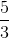，如果我们想要为每对非零整数定义明确的划分。我们希望能够在任何可能的地方定义分工。

整数的比率称为有理数，只要第二个整数（称为分母）不为零，就可以获得任意一对整数。 之间的比率本身不是整数，称为**分数。**

一旦我们引入了分数，我们就想提供添加和减去它们以及乘以和除以它们的规则。这些开始变得复杂，但幸运的是，对于我们来说，我们有计算器和电子表格可以做这些事情而不用抱怨，如果我们有智慧进入我们想做的事情。

我们的有理数有一件事我们无法做到，那就是除以。毕竟，分裂是撤消乘法的动作。但是将任何数字乘以 0 都会得到结果。没有办法从这个产品中取回你乘以来得到它。

当然，添加和乘法（以及减去和除法）分数比对整数这样做更复杂。比如说乘以，新分子是旧分子的产物（即），新分母是旧分子的产物（），所以产品是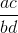 ]：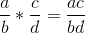。

乘以的逆运算乘以，并且该逆定义为除以的运算。任何数字及其倒数的乘积总是。这意味着对于以外的任何总是。

因此除以是乘以的倒数，即乘以。答案是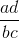。

添加有点棘手。在以下意义上，添加的概念可以应用于对象以及数字。例如，我们知道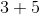是。这意味着如果我们有 3 个萝卜并且更多地挖掘，我们将有萝卜（假设没有人吃过第一个）。对于代替萝卜的任何其他物体也是如此。这告诉我们如何添加具有相同分母的分数。因此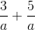是，其中已经取代了萝卜。我们正在应用一般规则来添加类似的东西到对象。

要添加具有不同分母的分数，您必须先更改分数以使分母相同，然后添加分子，就像添加数字一样。最简单的方法是使新分母成为旧分母的产物。因此，要找到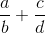，首先将第一项乘以，将第二项乘以，得到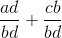，答案为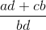。你可以为减法做同样的事情。

您可能被迫在学校的答案中分析分子和分母中的常用术语，但在电子表格中输入答案时不必这样做，这使得在使用电子表格时更容易添加分数。