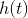
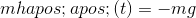
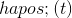
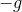
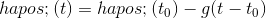
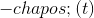
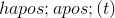
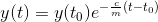
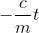

# 17.1 垂直运动建模

> 原文： [http://math.mit.edu/~djk/calculus_beginners/chapter17/section01.html](http://math.mit.edu/~djk/calculus_beginners/chapter17/section01.html)

我们在 [**第 4 章**](../chapter04/contents.html) 中观察到，区分有理函数的规则都可以从一个主规则推导出来：要区分的函数中每个变量的出现都可以被替换为，忽略其他人，导数是结果的总和。该陈述表示导数是函数的线性近似的斜率并且在变量中是线性的，并且线性贡献可以逐个评估并添加。

基本上这个相同的属性意味着在构建真实现象的导数行为模型时，可以分别输入不同来源的导数的影响，一次一个，忽略其他来源，总影响将是这些影响的总和。 。

现在考虑一个物体的垂直运动。牛顿观察到，如果一个物体独自存在，它将继续做它正在做的事情，这样它的速度就会保持不变。这种速度如何变化，可以用它的导数来描述，然后与他所谓的“力量”迫使其改变成比例。

苹果从树上掉下来，随着它们的下落速度越来越快。他将这种行为归因于引力，而他对这种力量的模型是物体在地面上经历了不断向地球的负重力。

很明显，较重的物体需要更大的力才能移动它们。因此，他的模型是物体的重量（质量）乘以其高度的二阶导数，由作用在其上的重力给出。注意到物体的速度与其重量无关，他的模型是，是一个普遍常数。

那时他的落物模型就是

我们可以解决这个等式。速度必须具有导数，这是一个常数。对此的一般解决方案是。这告诉我们的导数是的线性函数，这意味着是二次函数：

现在让我们考虑空气阻力。物体的空气阻力取决于它们的形状和大小。对于任何物体，当它处于静止状态时没有空气阻力，因此最简单的模型是空气的力在其速度和与其相反的方向上是线性的：比如说。

然后的等式变为

请注意，当时，此等式的右侧为。这意味着从静止开始的坠落物体将越来越快地下降，直到其向下的速度达到该值，此时它的速度将变为恒定。因此，物体（想象一个带降落伞的人）将达到这种“终极速度”，而不是越来越快地撞到某物。

我们可以通过将定义为来解决这个等式; 与具有相同的导数，因此它的等式为。这个等式的解是，这意味着根据该模型，落下的物体以指数以指数方式快速逼近其终端速度。

您会注意到，在的模型中，重力和空气阻力的贡献是单独添加的术语，这些贡献完全混合在的解决方案中。

这种更有趣的问题涉及普通三维空间中物体的行为。

牛顿发明了微积分来解决从他的模型中得出的方程式。特别是他用它来描述行星的运动，这些行星被重力吸引到彼此和太阳上，每一对分别用两个质量的力相互吸引，两者的质量除以它们的距离的平方。同样，任何星球上的力量都是来自其他星球的力量的总和。对于第一近似，来自太阳的吸引力占主导地位，并且他能够解决一个行星围绕太阳的行星运动的方程。解决方案是轨道是椭圆形，太阳位于其焦点之一。具有许多变量的微积分允许这些方程的公式化和求解。