# 17.2 弹簧建模（谐波振荡器）

> 原文： [http://math.mit.edu/~djk/calculus_beginners/chapter17/section02.html](http://math.mit.edu/~djk/calculus_beginners/chapter17/section02.html)

弹簧是一种可以展开或收缩的装置，但是当你这样做时它会试图回到平衡位置。假设一个重量的物体附着在重量可忽略不计的弹簧末端，其平衡位置为。然后当重量位于时弹簧上的力是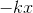，其中是所谓的装置的“弹簧常数”。

然后系统的运动方程为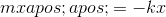或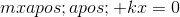。

我们知道这个等式的一般解，因为我们可以将它识别为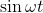和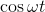时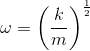满足的等式。这里振荡的“频率”是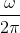，因为正弦和余弦作为其周期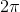的参数的函数重复。 （我们使用弧度作为我们的角度测量。）

**练习 17.1：区分下面的函数，并证明它是无摩擦弹簧方程的一般解：**

这个通用解决方案也可以写成指数的总和; （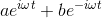），适用于和。

这种解决方案让弹簧永远振荡。

实际上，在运动中也存在摩擦，如前一部分中的摩擦可以通过在形式的力中添加一个术语来建模。

然后运动方程变为

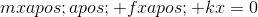

我们可以通过寻找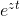形式的解来解决这个等式。将此形式代入的等式，我们得到：

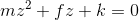

的二次函数具有解。 的两个解决方案取代了无摩擦问题中出现的两个指数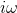和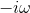。这些解决方案中的第一项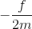在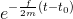的解决方案中产生指数阻尼因子

只要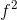小于，的这些解决方案中的第二项就是虚数，因此与相比，它们会产生频率降低的正弦行为。因此，根据前一段中讨论的因素以指数方式消失，并且根据这个因素进行振荡。

当为或更高时，的解是实数，弹簧被认为是临界阻尼。完全没有振荡，只有平衡位移的指数衰减，作为时间的函数。

上述模型很有用，但并不十分令人兴奋。当我们考虑受外部刺激影响的弹簧时，可以获得更有趣的结果。