# 17.3 受迫振荡

> 原文： [http://math.mit.edu/~djk/calculus_beginners/chapter17/section03.html](http://math.mit.edu/~djk/calculus_beginners/chapter17/section03.html)

当弹簧上的物体受到外力时，即某种函数，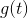，我们一直在考虑的模型

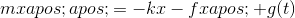

强迫可以是任何形式。我们通过查看对任何给定频率的正弦强制响应来处理。我们这样做的原因有三个。

首先，我们可以求解得到的方程，并且解决方案具有本身有趣的属性。

其次，在许多其他环境中出现了相同的方程，例如在电路的研究中，这些特性非常重要。

第三，解决方案可用于解决一般问题。任何刺激都可以写成正弦函数的和或积分，然后这些解可以用来获得描述解的相应和或积分。

然后我们的模型由等式描述

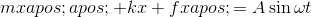

给定这个方程的任何解，我们可以用作为右边的术语来添加任何方程式，我们仍然会有一个解决方案。正如我们在上一节中看到的那样，只要非零，这种解决方案就会在中呈指数衰减。由于这种衰减，“均匀”方程（右侧为零）的解被称为瞬态解。因此，我们将注意力集中在稳态解决方案上，这种解决方案会持续存在，因为强制函数仍然存在。

这些解决方案将具有与强制函数相同的频率和周期性，因此我们查看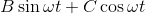形式的解决方案。我们发现

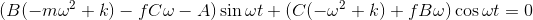

从这些我们推断出这里的两个系数都必须消失，这告诉我们：

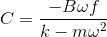

和

导致

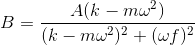

and

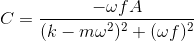

对强迫的响应幅度为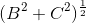而变为

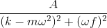

非强制和无阻尼弹簧具有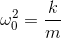给出的“固有频率”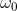。刚才描述的幅度可以用ω &lt;sub&gt;0&lt;/sub&gt; 表示为

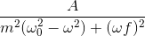

当与相比相当小时，该反应表现出称为**共振**的现象。也就是说，当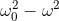非常小，并且与相比较小时，分母变得非常小并且响应变得非常大。