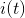
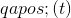
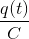
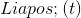
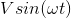
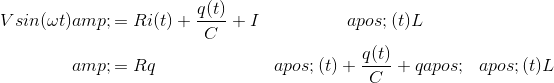

# 17.4 简单电路

> 原文： [http://math.mit.edu/~djk/calculus_beginners/chapter17/section04.html](http://math.mit.edu/~djk/calculus_beginners/chapter17/section04.html)

如果我们使用电线将简单设备连接在一起，我们就可以形成电路。这种电路可用于各种目的。一百年前，他们的研究开始了无线电的发展。

一个简单的电路由以下四个元件组成：有一个电源，它在两个端子之间产生电位差;线圈，由线圈，线材中的间隙和可能阻止电子流动的装置组成。电子流过电路并堆积在间隙的一侧。如果我们表示的总电荷，在某些单位中，电路中流动的电流为。根据欧姆定律，电路的电阻产生的电位差，跨越间隙的电位差为，其中被称为​​间隙的容量。根据法拉第定律，电流的变化导致线圈的电位差，对于某些常数，因此如果电源产生电位差，我们发现该系统服从方程式

这与强迫谐振子的方程式完全相同，并且具有相同的结果。

&lt;iframe frameborder="0" height="620" src="../mathlets/series-rlc-circuit.html" width="100%"&gt;&lt;/iframe&gt;