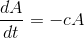
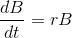
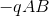
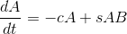
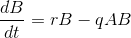
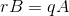
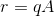
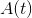
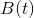
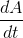

# 18.1 捕食者猎物模型

> 原文： [http://math.mit.edu/~djk/calculus_beginners/chapter18/section01.html](http://math.mit.edu/~djk/calculus_beginners/chapter18/section01.html)

假设我们有两种动物。 型动物吃型。我们认为，在没有类型的动物的情况下，类型的动物将无法进食，并会死亡或离开以避免这样做。另一方面，我们假设在没有类动物的情况下，类型将有更好的生存机会，并将经历人口增长。

设代表我们型动物区域的种群。在没有类型生物的情况下，最简单的模型是种群的变化是本身的负数倍：

同样，在没有生物的情况下，对于某些，类型的群体行为的简单模型将显示增加和服从，

如果或为，和之间的相互作用必须是。最简单的相互作用模型是中每单位时间的变化对某些的的贡献，对某些的影响 HTG12]。

对于这种情况，我们最简单的模型就是这种形式

和

那么我们可以对这个模型中这些人群的行为说些什么呢？

我们可以先寻找稳态解决方案。当两个导数都是时会发生这些情况。当发生这种情况时，两个物种的种群保持不变。这种解决方案称为方程的固定点。

这种情况发生在和 和时。

如果或中的小偏差趋于消失并且至少不向外螺旋，则认为定点解是稳定的。您可以通过数字“积分”这些方程式来研究此固定点的稳定性，对于您选择的，，和的值。从和的值开始，从固定点略微偏离并向前移动，发现和完全像在积分中一样（在[第 14 章](../chapter14/contents.html)中讨论过） ]），使用左手规则。

在平面中往往会发生的是，解决方案通常会向固定点螺旋式上升。

如果在这个平面上有一个轨道，没有其他轨道可以越过它，因为在一个共同点上，两者的导数是相同的，这意味着轨道在之后是相同的。

**练习：使用电子表格进行设置，并检查此结论。**

例如，如果人口突然从其固定点值减少，你可以定性地看到会发生什么。这导致从其固定点处的值减少，从而群体减少。这反过来导致的增加。因此，如果是用于绘制轨道的垂直坐标，从固定点下方开始，轨道绕其逆时针移动。

您甚至不需要电子表格来查看解决方案的行为方式。给定起点，您可以从中绘制一个箭头，指向其切线为该点处导数与导数之比的方向。然后沿该箭头选择一个小距离的点，并重复这些步骤。您将在平面中生成系统的近似轨道。

如何发挥作用在很大程度上取决于两个人口从减少中恢复的速度。

一个有趣的案例是苍蝇是猎物，鸟类是食用它们的捕食者。如上所述，如果减少飞行种群，也会减少鸟类数量。然而，苍蝇种群恢复相对较快，大约几周，而鸟类种群恢复数年。因此，鸟类种群往往会在短时间内下降，但只能缓慢地再次上升到它们的固定点值。这意味着苍蝇种群会在相当长的时间内增加，并且大部分时间都会花在远高于固定点值的水平上。因此，除非非常短暂，否则杀死苍蝇的活动并不是减少苍蝇种群的有效方法。