# 19.2 一阶微分方程

> 原文： [http://math.mit.edu/~djk/calculus_beginners/chapter19/section02.html](http://math.mit.edu/~djk/calculus_beginners/chapter19/section02.html)

我们将首先处理一阶微分方程，我们的意思是，对于某些函数，具体地说，形式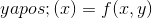的方程。进一步假设我们在某个时候知道解决方案。

这告诉我们，在的区间开始，到的区间为非常小的，我们大约有

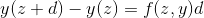

我们可以使用这个“线性近似”来计算，然后继续从中计算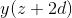，依此类推。

这种方法就像做积分的左手规则;唯一的区别是本身出现在中。

为了实现这一点，你让从的起始值开始从一行增加到另一行，并使增加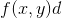。

**练习 19.1 为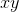给出的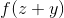设置此项并绘制与的关系曲线。 （这代表微分方程：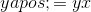，它有解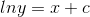。从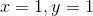开始，从数字上精确地找到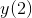并进行比较。**

产生右手规则的类似物，或梯形或辛普森规则要困难一些，因为它们需要评估，因此超出，我们只从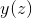和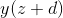开始]是我们想要发现的。如果我们将放在我们计算的公式中，计算机将正确地指责我们使用循环引用。

有很多方法可以解决这个问题，并且已知整个公式序列用于评估，因为我们的方程式符合中的任何顺序。这些被称为 Runge-Kutta 规则，非常有效。您可以在随附的小程序中看到它们的作用。

&lt;iframe frameborder="0" height="620" src="../mathlets/first-order-ode.html" width="100%"&gt;&lt;/iframe&gt;

我们只会描述最简单的校正，即近似

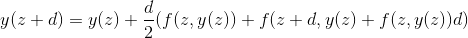

这意味着我们在和之间的整个区间内使用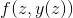作为的导数，其近似于上一个术语中的值。

这仍然很容易做，并且或多或少类似于梯形规则，区别仅在于我们估计参数的导数而不是知道它。

**如果您根本不了解，该怎么办？**

您可以通过在二维空间中绘制图来了解所有解决方案，一维是，另一维是。如果您在此图中选择点网格，则在每个点处您都知道导数。如果您绘制一个指向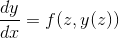方向的箭头。然后，您可以连接箭头（如连接点），形成路径，这些路径每个都代表微分方程的解。

这些路径不能交叉。

**练习 19.2：弄清楚为什么路径不能交叉。**

但他们可以有一些有趣的函数。固定点就是这样一个特征，也是我们在[第 18 章](../chapter18/contents.html)中看到的。一个固定点是方程式意味着你留在那里的固定点。一个稳定的固定点是这样的，如果你在它附近，你旋转或螺旋形进入它。还有一些称为吸引子的东西，它们是过去或未来的曲线（当自变量是时间时），许多路径都聚集在这里。稳定的固定点是一种吸引子。

**您告诉我，我可以实现您在电子表格中描述的集成吗？**

是。将第一个订单 ODE 放入 A1; A2 中的 xstart; ystart 进入 A3; d 进入 A4。将您的数据（包括和的起始值）以及您在 B2，B3 和 B4 中选择的数据组成。

然后在 A6，B6，C6 开始列，分别包含和。在 A6 中，放 x;在 B6 中，放 y（梯形法则）;在 C6 中，放 y（左手规则）。

因此，您可以将= B2 放入 A7，将 B3 放入 B7，将= A7 + $ B $ 4 放入 A8 并将其复制到 A 列。

在 B8 中，put = B7 + $ B $ 4/2 *（f（A7，B7）+ f（A7 + $ B $ 4，B7 + f（A7，B7）* d）并将其复制到 B 列。就是这样。

您可以将结果与左手规则计算进行比较，方法是设置 C 列并从= B7 开始进入 C7，但将= C7 + $ B $ 4 * f（A7，C7）放入 C8 并将其复制下来。然后你可以制作所有三列的散点图，看看会发生什么。两个计算之间的差异让您对简单的计算有多糟糕。

您可以看到更改函数需要更多的工作，但很容易改变初始条件。这是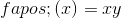 的结果和，的起点。

&lt;button aria-controls="first-order-ode-spreadsheet" aria-expanded="false" class="btn bg-light border-secondary" data-target="#first-order-ode-spreadsheet" data-toggle="collapse" id="toggle-spreadsheet-table" type="button"&gt;显示表&lt;/button&gt;

Number of steps<button aria-expanded="false" aria-haspopup="true" class="btn btn-sm bg-light border-secondary dropdown-toggle" data-toggle="dropdown" id="nbr-steps-btn" type="button" value="25">25</button>[10](#) [25](#) [50](#) [100](#)Number of digits after decimal point<button aria-expanded="false" aria-haspopup="true" class="btn btn-sm bg-light border-secondary dropdown-toggle" data-toggle="dropdown" id="nbr-digits-btn" type="button" value="10">10</button>[5](#) [10](#) [15](#)

**练习 19.3 为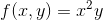和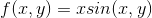设置此项，从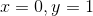开始。**

**这总能奏效吗？**

不。对于很多有趣的方程式来说很好。但是，有时您的变量可能会变为无穷大，然后计算变得非常不准确。

这可能发生，因为我们允许的任何等式，因此允许的任何等式。这意味着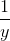有时可能是。如果应该通过，那么将无任何特殊原因进入无限。

大多数时候你可以通过求解的微分方程来避免这个困难，同时解决的问题。当变为无穷大时，非常温和并且接近（记住是，所以如果我们让成为，那么服从 HTG10]）。如果你这样做，你可以使用从和中较小的一个中获得的值。

无论如何，以这种方式积分微分方程很容易，值得一试。