# 1.2 小数和实数

> 原文： [http://math.mit.edu/~djk/calculus_beginners/chapter01/section02.html](http://math.mit.edu/~djk/calculus_beginners/chapter01/section02.html)

我们有一种很好的方式来表示包括分数在内的数字，这就是十进制扩展。假设我们考虑的数字如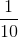，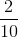，（与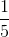相同），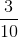等等。

我们把它们写成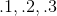，依此类推。小数点是一个代码，告诉我们超出它的数字除以 10。

我们可以通过在小数点后添加第二个数字将其扩展为除以 100 的整数。因此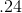表示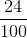。我们可以继续保持正确的状态，用小数点后的较长和较长的整数串来描述整数除以千或百万等等。

但是，如果我们停下来，我们就不会以这种方式得到所有有理数我们只会得到分数为十的幂的有理数。像 1/3 这样的数字将成为，三分球将永远存在。 （这通常被写为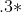，这个星形表示它前面的东西是无休止地重复）

为了使用这种十进制表示法得到所有有理数，你必须愿意永远继续下去。如果你这样做，你会得到比有理数更多的东西。以小数点开头的所有数字序列的集合为您提供 0 到 1 之间的所有有理数，甚至更多。你得到的被称为**实数**在 0 和 1 之间。有理数的结果是无穷无尽的，如，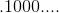，或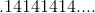，（又名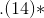 ]）。

现在你和我以及任何计算机都没有真正继续写下一个数字，所以对于这个实数的概念存在一种不真实的感觉，但那又是什么呢？在你的想象中，你可以直观地看到一连串的数字。这将代表一个实数。

如果在有限位数后停止实数，则会得到一个有理数（因为在停止之后的所有条目都是零）。因此，对有理数起作用的加法，减法，乘法和除法的规则也可用于对实数进行相同的处理。幸运的是，当数字非常接近小数点的非零数字时，数字中小数点右侧的数字对计算几乎没有影响。

既然我们不能在现实生活中继续描述一个非理性的实数，那么我们必须以其他方式描述它。以下是描述数字的不同方式的示例。
我们定义了具有十进制扩展的数字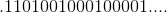;在**每个连续的对之间，有一些比前一个连续的 1 对更多。** 这个数字不合理;它不会重演。

我们不必，但只是为了它的乐趣，我们将更进一步，再次扩展我们的数字，复杂的数字。如果要定义一个数字平方操作的反转，则需要这样做。 （复数是形式的实体，其中和是实数，平方是。）