# 19.3 二阶微分方程

> 原文： [http://math.mit.edu/~djk/calculus_beginners/chapter19/section03.html](http://math.mit.edu/~djk/calculus_beginners/chapter19/section03.html)

二阶微分方程是表示因变量的二阶导数作为变量及其一阶导数的函数的方程。 （更一般地说，它是涉及该变量及其二阶导数的方程式，也许是它的一阶导数。）

也许处理这种方程的最简单方法是给出一阶导数的名称。然后原始方程变为因变量及其导数的一对耦合方程。你这样做的是一对一阶微分方程，如 [Predator Prey](../chapter18/section01.html) 问题中的耦合方程对。

给定方程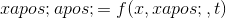，我们设置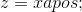并得到两个方程式：

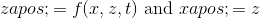

从和的初始值开始，我们可以通过跟踪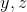和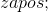 增加一些小的增量来产生这些方程的左手规则近似解。我们可以用三种方式绘制解决方案，例如使用和作为轴的“轨道”，或将和/或绘制为的函数。

强制谐波运动的例子：

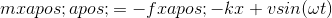

产生耦合方程;

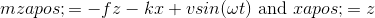

牛顿运动定律产生物体位置的二阶微分方程。每个粒子有三个运动维度。它们通常被重新表示为一阶微分方程的两倍，几乎以相同的方式。我们将在一个维度上描述这种重新制定。可以用任意数量的维度来完成同样的事情。

在许多有趣的情况下，能量得以保存。能量不会出现在牛顿方程中。我们首先要定义它。

质量以一定速度移动的物体的动能为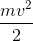。它的动力是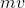。 而不是是将方程式简化为一阶导入的第二个变量。

那么动能是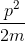。粒子上的力被定义为势能相对于因变量的导数的负值（保持所有其他因变量和力矩固定）。因此，在地球表面上的重力的情况下，由地球施加的重物上的力是，并且势能是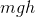。

能量也称为系统的哈密顿量，写为，是动能和势能的总和。 （顺便提一下，符号最初是希腊首都 eta，因为能量以 E 开头而被选中）

因此，对于地球表面的引力，哈密顿量由下式给出。

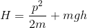

相当于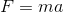的运动方程式变为：

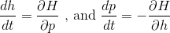

这里出现的古怪符号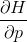意味着你将的导数与相对应，将另一个因变量视为常数。这种导数被称为相对于的偏导数。 （在复杂的情况下，当有几个可能的其他因变量时，它的含义取决于你保持不变的那些。这里定义得很好。）

**练习 19.4 无阻尼和非受迫谐振子的哈密顿量是什么（力是？**

&lt;iframe frameborder="0" height="620" src="../mathlets/second-order-ode.html" width="100%"&gt;&lt;/iframe&gt;