# 19.4 行星运动

> 原文： [http://math.mit.edu/~djk/calculus_beginners/chapter19/section04.html](http://math.mit.edu/~djk/calculus_beginners/chapter19/section04.html)

行星和太阳之间的引力相互作用由反平方中心力定律描述。

为方便起见，我们将太阳置于坐标的原点，并在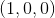点开始我们的行星，其位置的初始一阶导数由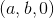给出。

我们将假设行星比太阳轻得多（因为地球与太阳相比），太阳不会移动。 （实际上，行星运动中固定的是系统的质心。木星和土星足够大，当它们在我们天空的同一部分时，所有行星的质心都不在太阳内，这样太阳就会移动，但不是很多。）

利用这些坐标和这个假设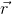的运动方程，行星的位置矢量服从方程

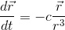

由于行星上的力指向太阳，我们在平面上开始行星，我们的坐标将始终为，我们可以忽略它。

这是一个二阶微分方程，有两个因变量，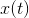和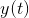。我们可以在一个电子表格上设置它，每个列都有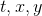和和的导数。在坐标方面，运动方程是

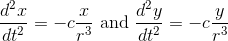

由于出现在这两个方程中且为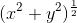，因此也可以方便地将列专用于。设置定义的比例，但不定义。这意味着我们可以选择我们的时间单位，以便为。

有了这个选择，我们可以按如下方式设置电子表格：

我们将时间变量放在 A 列中，并从第 7 行开始，A7 设置为 0.我们必须为选择一个增量，您可以确定最喜欢的那个。它必须足够小，以便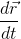很小，但足够大，你可以绘制轨道。您可以从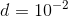开始，如果不能正常工作则更改它。我们可以将字母 d 放在 A2 中，将其值放在 B2 中。我们需要指定的其他参数是和的导数的初始值。因此，在 A3 中输入“初始 x 速度”，在 B3 中输入其值（比如 0），在 A4 中输入“初始 y 速度”，在 B4 中输入其值（比如 1）。

把 t 放在 A6 中，x 放在 B6 中，y 放在 C6 中，r 放在 D6 中，x'放在 E6 中，y'放在 F6 中。我们将和放在 B 和 C 列中，因此在 B7 中放置 1，在 C7 中放置 0。我们将放在 D 列中，将 D7 设置为=（B7 ^ 2 + C7 ^ 2）^ 0.5。我们将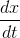（称之为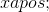）放在 E 列中，将 E7 设置为= B3 并将（称之为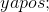）放入 F 列 F7 设置为= B4。

我们接下来将 A8 设置为= A7 + $ B $ 2

B8 到= B7 + $ B $ 2 * E7

C8 到= C7 + B $ 2 * F7（你可以将 B8 复制到 C8）

将 D7 复制到 D8

将 E8 设为= E7- $ B $ 2 * B7 / $ D7 ^ 3

将 E8 复制到 F8

现在从列中复制 A8 到 F8

这将为您的参数值提供最粗略的解决方案。

**完成后，列 B 和 C 的图将给出空间轨道。根据需要调整参数。**

&lt;button aria-controls="planetary-motion-spreadsheet" aria-expanded="false" class="btn bg-light border-secondary" data-target="#planetary-motion-spreadsheet" data-toggle="collapse" id="toggle-spreadsheet-table" type="button"&gt;显示表&lt;/button&gt;

Number of steps<button aria-expanded="false" aria-haspopup="true" class="btn btn-sm bg-light border-secondary dropdown-toggle" data-toggle="dropdown" id="nbr-steps-btn" type="button" value="25">25</button>[10](#) [25](#) [50](#) [100](#)Number of digits after decimal point<button aria-expanded="false" aria-haspopup="true" class="btn btn-sm bg-light border-secondary dropdown-toggle" data-toggle="dropdown" id="nbr-digits-btn" type="button" value="10">10</button>[5](#) [10](#) [15](#)

**练习 19.5：设置它。 和的哪些值在这些坐标中给出圆周运动？**

在过去，以数字方式处理这些方程式是非常可怕的。相反，来自牛顿的物理学家通过引入数量来解决方程式，即能量和角动量，这些量不会随着这种运动而改变，并且通过推理而不是数值计算推导出轨道。

几个世纪以来，天文学家一直在仔细观察行星的实际行为，并在开普勒的三个定律中进行了清晰的总结，如下：

**1.受相同力量影响的行星和其他物体的运动位于“圆锥截面”的轨道上：椭圆或双曲线或非常特殊的抛物线（全部以太阳为焦点）或直线。**

**2.在任何轨道上每单位时间扫出的面积是不变的。**

3.椭圆轨道的周期与其半径的度量之间存在某种特定的关系，我们不再进一步讨论这种关系。

**最后注释：**最后几章包含许多未包含在任何正常单变量微积分课程中的材料。这些材料的目的是为了您的享受而不是恐吓您。问题在于，这里的 applet 和方法可以让你比定期的微积分课程更快地学习微积分。但是你学到和保留的东西很大程度上取决于你花多少时间去做。如果最终的结果是你花了很少的时间学习微积分，那对你来说就不好了。因此，您可能花费相同的时间，并了解更多！