# 8.1 反函数

> 原文： [http://math.mit.edu/~djk/calculus_beginners/chapter08/section01.html](http://math.mit.edu/~djk/calculus_beginners/chapter08/section01.html)

函数的反函数是另一个定义的函数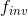，因此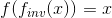和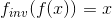都成立。

换句话说，作用于的反函数产生同一性函数。 作用于其反函数也是同一性函数。

我们之前遇到过这个概念。反演的典型例子是平方根。平方根函数是平方函数的倒数。

这个概念有三个必须学会处理的复杂函数。首先，是符号问题。我们很想使用符号作为的反函数，我们经常这样做。但是我们不应该且经常不使用这种表示法，因为它有时用于表示倒数函数，其参数的值为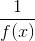。

最常见的反函数是，**反转像** 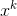那样被称为**根**并表示为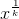并且与**指数函数相反， ，**，其被称为  的自然对数，表示为 **。**

**反正弦函数**被称为**反正弦**并表示为 **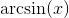。** 在大多数电子表格中，它被写为= asin（B6），（如果你想要方框 B6 中的反正弦。）类似地，，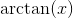等等。

第二个复杂因素是**反函数一般不在任何地方定义。** 像指数，或平方，**这样的函数，其值总是非负的，**，在交换值和参数时，**只能定义非否定论点。** 到目前为止我们一直在考虑的所有其他函数，几乎可以在任何地方定义;但是，反函数通常具有受限域，除非我们想扩展我们的数字系统。

最后的复杂因素是**，我们想要反转的许多函数对于多个参数都采用相同的值。** 函数，与，正方形，将带到，就是一个很好的例子。

和具有相同的平方。哪个应该被称为的平方根？

正弦函数是周期性的，当你围绕一个圆周围时，它会无限重复，周期为（以弧度为单位测量角度）。正弦值具有相同值的众多参数中的哪一个应该作为正弦函数的反函数的值？

这些问题的答案是，在反转函数不止一次采用相同的值时，我们必须**首先限制的域，这样就不会发生这种情况，**所以**如果我们希望它的逆是单值函数，那么在这个受限域中最多只取一次值。** 平方函数可以限制为非负数，也可以限制为非正数（或适当的混合）。 **在这种限制之后，这个问题消失了，**，因为在受限域中是单值的。

对于根，我们通常将被反转的幂的域限制为非负数，这意味着我们写为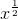的平方根总是正的。原则上我们可以选择为负值，或者对其部分域进行否定，对其余部分为正。我们不这样做有两个原因：首先，这是不自然的事情;第二，正平方根具有很好的性质，即产品的平方根，例如是它们的平方根的乘积;对于负平方根，这不是正确的，因为它们中的两个的乘积是正的，并且从不是负平方根。

一般来说，我们所说的意味着当不是单值时，的反函数需要一个明确定义的附加条件。要获得唯一的反函数，必须将的域限制为为单值的域。

关于逆函数有三个观察结果，两个很好，另一个不太好。

第一个不错的是，**非常容易找到原始函数**的反函数图，因此决定的域（它成为的范围在电子表格上绘制同样容易。

找到反函数图形的一种方法是在主对角线周围以弧度（度）旋转纸张（其上有图形）（以角度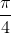通过原点的线或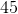从轴逆时针旋转。）

然后你会发现你必须在函数中查看你的论文，但这通常可以完成，如果你从的图表开始，你正在查看的反函数图。

对于电子表格，您可以设置用于绘制函数图形的电子表格，并将参数列复制到值列之外，然后突出显示并执行旧的 xy 散点图和新的专栏。您将看到与函数相反的图形。

**练习：**

**8.1 设置一个电子表格，绘制从到的域中的指数函数。将参数列复制到其值列之后，突出显示值列和复制的列，并将反函数绘制为指数，这是自然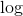函数。 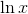 的论点是什么？它的论点是什么？ ？**

**8\. 2 下面的数学运算允许您输入函数并绘制它们的反转以及它们自己。通过使用 mathlet 查找给定域中的反转来检查的答案。**

&lt;iframe frameborder="0" height="620" src="../mathlets/operations-on-functions.html" width="100%"&gt;&lt;/iframe&gt;

不太好的观察结果是，在特定的参数中找不到反函数的值没有标准的明显方法。我们讨论过的所有其他函数都可以通过执行简单的标准操作来找到，例如添加，除法，乘法，减法和替换。但逆转没有这样的程序。

一般来说，不可能有一个。这是因为通常你必须为原始函数选择域以使其成为单值，并且计算逆的方法必须事先知道你将做出什么决定，如果要得到相应的逆。这是一般不能做的事情。

当然，您可能会遇到的大多数反函数，也许所有反函数都可以作为电子表格或计算器上的函数来访问。您可以通过按下按钮来计算它们。这是因为您的机器及其程序的制造商已经决定了您为原始函数选择哪个域，以及因此对其使用反函数的范围，并使用了一些偷偷摸摸的程序来计算它它已经确定。