# 8.2 微分反函数

> 原文： [http://math.mit.edu/~djk/calculus_beginners/chapter08/section02.html](http://math.mit.edu/~djk/calculus_beginners/chapter08/section02.html)

第一个好消息是，即使没有通用的方法来计算给定参数的函数反函数的**值**，也有一个简单的公式**导数**的根据本身的导数，的倒数。

实际上， **的导数是导数的倒数，其参数和值相反。**

这在几何上或多或少是显而易见的。函数的导数是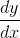，而的任何反函数的导数是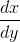，如果在值处进行评估，它将是值的前者的倒数。

让我们用代数来证明这一点。我们所要做的就是将链规则应用于的定义属性，即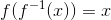。根据链规则，我们在评估了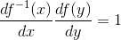。

这意味着反函数的导数是函数本身的导数的倒数，在反函数的值处进行计算。

**这个论点似乎很简单，但令人困惑。您是否可以使用此规则实际找到反转的导数而不必疯狂？**

让我们看看这对指数函数及其反函数意味着什么。指数函数的导数本身就是。那么对数函数的导数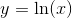是指数的倒数，在评估;这是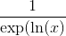，即。后一种说法来自于逆的定义，它告诉我们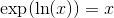。

类似地，对于正弦函数，由于其在参数处的导数是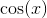，的导数是其余弦的倒数，或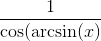。

你可以把它留在那，但我们通常把它减少到稍微不那么丑的东西。电子表格与我们在下一段中最终得到的结果一样满意。顺便说一下，无论我输入= acos（A6），我的电子表格都会给出参数 A6 的 arcccosine 函数。

正如我们在第 7 章中所见，是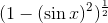，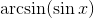是，我们发现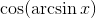是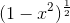，其倒数是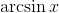的导数。

类似地，的导数是。这因此告诉的导数是在参数处评估的导数。这是

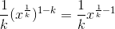

这是完全相同的结果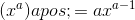，它适用于整数幂，

事实上，对于任何理性的力量，，正面或负面，我们都有

我们已经提到**关于反函数的另一条好消息。** 即使没有明显的方法来计算一个特定的值，在一个特定的参数，有一个简单的方法来计算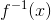的值，你可以在一分钟左右实际执行一次电子表格你知道怎么做，假设你知道如何计算。您所要做的就是在执行散点图时反转和列的顺序。通过这样做，您可以看到结果给出了“多值函数”而不是普通函数，并且可以为逆向选择您喜欢的单值范围。

**练习：**

**8.3 使用上面证明的事实，找到。 （您可以使用多重出现规则或产品规则）**

**8.4 角度的正切，表示为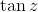，是由正弦除以余弦给出的比率：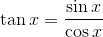。 的导数是什么？从中找到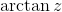的导数（称为的反正切），的反函数，（当的域被限制为从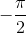到时）。**