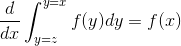
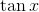
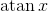
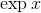

# 8.3 更多规则

> 原文： [http://math.mit.edu/~djk/calculus_beginners/chapter08/section03.html](http://math.mit.edu/~djk/calculus_beginners/chapter08/section03.html)

到目前为止讨论的区分规则允许我们找到您将遇到的大多数函数的导数的公式。

然而，实际上还有其他的区分规则，我们最终会讨论。我们在这里没有这样做，因为定义要区分的函数涉及我们尚未讨论的概念。

特别是，我们尚未考虑其导数的函数是：**无限和**，以及函数图和两个给定值之间的 x 轴之间的**区域。** 后面这类东西被称为**定积分。如果给定的 x 值都是有限的并且函数是从上方和下方限定的，那么它被称为适当的积分。**

这些规则在工作时非常简单，因此关于它们的唯一有趣的事情是确定它们的工作时间。

**对于无限和，你可以应用求和规则，只需对所有项的导数求和，得到和的导数**，除非总和在某种程度上变为无穷大。

**对于区分函数的适当积分与该函数**中出现的参数相同也是如此。您可以根据该参数区分函数，并找到结果的积分，如果有意义的话，并且问题中没有潜在的无穷大。

**您还可以将变量区分为变量，该变量是定义它的区域的端点之一。** 对于上端点，答案是**被积函数，它是定义积分的函数，本身在**中进行评估，我们很快就会看到。 （顺便说一下，这个陈述是微积分基本定理的一个方向，很容易证明，我们很快就会看到。这是声明：

**练习 8.5 使用反转的[小程序](../chapter08/section01.html#OperationsOnFunctions)绘制和。**

**我厌倦了这些东西。**

好吧，我们真的已经完成了传统上如何区分函数的内容。多重出现规则，链规则和反向规则告诉我们如何区分我们可以构造的任何东西，从我们知道的三个函数，和开始。当你找到导数时很容易出错，所以有办法检查你的答案是明智的。

**怎么样？**

一种简单的方法是将它们与数值区分的结果进行比较，我们接下来将对此进行描述。