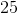
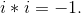

# 1.3 复数

> 原文： [http://math.mit.edu/~djk/calculus_beginners/chapter01/section03.html](http://math.mit.edu/~djk/calculus_beginners/chapter01/section03.html)

乘法运算中的一个是平方数。这是将数字乘以其自身的运算。因此乘是。我们可以要求这个平方操作的反转。这是一个作用于的操作应该回馈。此操作有一个名称：它被称为**平方根。 ** 的平方根是。

这里有两个很棒的复杂函数。第一个是次也是，因此有两个平方根，和。任何积极的实数都是一样的。任何正实数都有两个平方根。

第二个复杂因素是：负数的平方根究竟是什么？

那么没有实数的正方形是或或减去任何正数。

当我们在自然数中发现减法（这是加法的逆运算）导致非自然数时，我们通过定义**整数**来扩展自然数以包括自然数和它们的负数也是零。

当我们考虑除法，这是乘法的逆运算时，我们再次扩展我们的数字以包括**分数。**

好吧，为了适应逆操作以平方数，我们还可以扩展我们的数字以包括新实体，其中我们可以找到负数的平方根。

事实证明，我们只需要引入一个新的数字，通常指定为 **i** ，它被定义为由给出的平方。换句话说，我们定义新的数字 i 来服从方程式我们可以得到正方形是任何其他负数的数字，比如，通过将乘以适当的实数，这里是平方根。数字 **** 绝对不是实数，所以我们称它为**一个虚数;** 这个术语实际上是愚蠢的。虚构的数字在我们的想象中与真实数字一样存在。当然，它们不是自然数或整数甚至分数，或实数。

事实证明，如果我们看一下 和是实数的形式的数字，我们得到所谓的**复数，**我们可以定义加法，减法乘法，正如我们可以为理性或实数而划分这些。

如果你想看看这些规则是什么， [**请点击这里。**](complement01.html)

因此，通过数字我们将意味着**有理数，实数或复数，**，其中加法，减法乘法和除法的运算被定义并具有所有标准属性。

顺便说一下，我们经常用平面上的点来表示复数。实数对应于 x 轴上的点，虚数可以被认为是 y 轴上的点。数字是 y 轴上原点上方的距离。一般的复数具有由其组分描述的实部和由其组分描述的复杂部分。