> 原文： [http://math.mit.edu/~djk/calculus_beginners/chapter01/complement01.html](http://math.mit.edu/~djk/calculus_beginners/chapter01/complement01.html)

## 复数运算

要添加或减去复数（形式为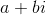的实体），请分别对实部（）和虚部（）进行适当的处​​理。

例如，我们有

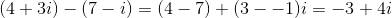

要将两个复数相乘，可以将两个因子中的项相乘（使用乘法的线性（也称为分配律），并使用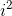为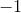的事实。

例如，我们得到

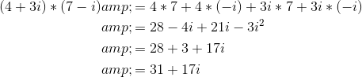

划分稍微复杂一点，因为我们希望我们的答案具有形式而不是这种形式的比例（尽管和可以是比率）。

为了得到这个，我们使用了一个奇妙的事实，即任何复数乘以其复共轭（通过反转其的符号得到的）是一个实数。

在符号中，这是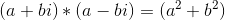。

**怎么样？**

使用分配法将其乘以看出来。

**这有什么用？**

我们将这个等式重写为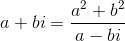，它告诉我们**乘以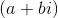** 与**乘以实数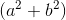相同，然后除以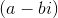。**

这意味着**除以** 是相反的操作，即**乘以** 并除以实数 **** 。

因此除以复数，比如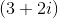与乘以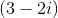并将结果除以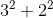即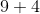或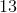相同。

因此，例如， **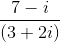** 是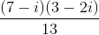，其是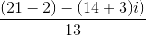或 **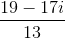。**

**因此，我们有复数加法，减法，乘法和除法的规则**。

顺便说一下，数量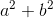被称为**复数的幅度**的平方。

## 复数的几何表示

复数，（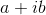与和实数）可以用平面上的点表示，坐标和坐标。

这定义了所谓的“复杂平面”。 **它与普通飞机的不同之处仅在于我们知道如何将复数乘以和除以得到另一个复数**这一事实，我们通常不知道如何对平面中的点做。

这张照片表明还有另一种描述复数的方法。而不是使用它的和坐标来描述它的实部和虚部。我们可以使用从复平面中的点到原点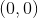的距离，以及**从原点到该点的线段形成的角度，以及轴**的正半径。到原点的**距离通常表示为** ，该角度通常称为（θ）。 被称为**“阶段”**，有时称为**“参数”**“的复数。**到原点的距离称为”幅度“，也称为“绝对价值”。**

**这些参数和如何与和相关？**

我们使用欧几里德对距离的定义，毕达哥拉斯定理就是这样定义的。这告诉我们

**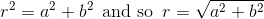**

至于，我们使用正弦和余弦的标准三角定义。角度的正弦定义为其 y 坐标与长度的比率，余弦是其 x 坐标与的比率。因此是正弦为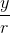的角度，其余弦为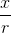。

这给了我们关系

**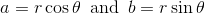**

**What good is this?**

我们最终会看到很多好处。但是现在我们可以注意到以下奇怪的事实：

根据和，称为复数的实部和虚部，加法和减法很容易描述，（分别加上或减去每个部分，好像其他部分不存在一样：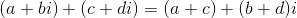，但乘法和除法有点难看。

就和而言，复数的大小和相位，情况正好相反。也就是说，乘法和除法很容易描述，而加法和减法有点难看。

**怎么样？**

那么，**你可以将两个复数乘以它们的大小，并加上它们的相位**。您可以相应地除以幅度，然后从分子的相位中减去分母的相位。

明确地，我们**是具有幅度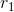和相的复数的乘积，具有幅度和相位的复数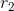和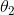，是具有幅度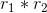的复数，并且阶段。**

（关于幅度和相位的加法和减法的规则可以从实部和虚部的规则中推导出来，但不是特别有启发性，因为它们很混乱。）

你可以在下面的 mathlet 上看到这一切。您可以通过在适当的头上单击鼠标左键并在移动时按住它来移动复数和。它允许您在更改时检查产品差异和复数比率的行为。要查看使用此 mathlet 可以执行的操作，请单击右上角的“+ about”。

&lt;iframe frameborder="0" height="620" src="../mathlets/complex-numbers.html" width="100%"&gt;&lt;/iframe&gt;