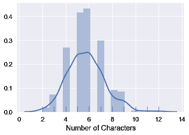
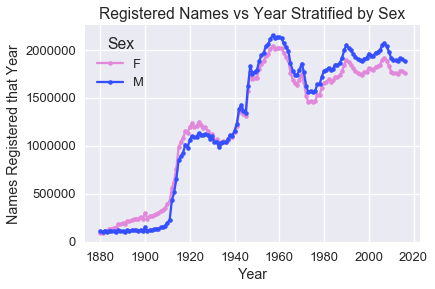
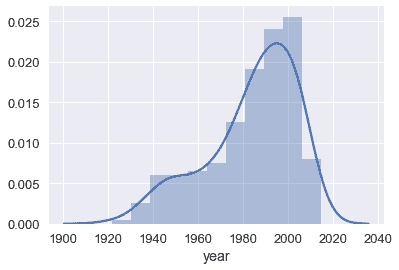
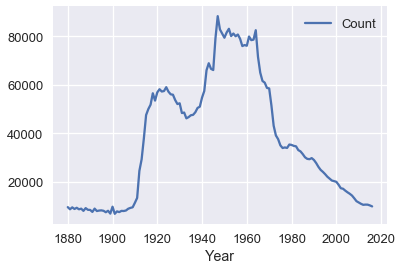

# 一、数据科学的生命周期

> 原文：[DS-100/textbook/notebooks/ch01](https://nbviewer.jupyter.org/github/DS-100/textbook/tree/master/notebooks/ch01/)
> 
> 校验：[飞龙](https://github.com/wizardforcel)
> 
> 自豪地采用[谷歌翻译](https://translate.google.cn/)

在数据科学中，我们使用大量不同的数据集来对世界做出结论。在这个课程中，我们将通过计算和推理思维的双重视角，来讨论数据科学的关键原理和技术。实际上，这涉及以下过程：

+   提出一个问题
+   获取和清理数据
+   进行探索性数据分析
+   用预测和推理得出结论

在这个过程的最后一步之后，通常出现更多的问题，因此我们可以反复地执行这个过程，来发现我们的世界的新特征。这个正反馈的循环对我们的工作至关重要，我们称之为数据科学生命周期。

如果数据科学的生命周期与它说的一样容易进行，那么就不需要该主题的教科书了。幸运的是，生命周期中的每个步骤都包含众多挑战，这些挑战揭示了强大和通常令人惊讶的见解，它们构成了使用数据在思考后进行决策的基础。

和 Data8 一样，我们将以一个例子开始。

> 译者注：Data8 是 DS100 是先修课。我之前翻译了它的课本，[《计算与推断思维 中文版》](https://github.com/Kivy-CN/data8-textbook-zh)。

## 关于本书

在我们继续之前，重要的是说出我们对读者的假设。

在本书中，我们将当作你已经上完了 Data8 或者其他一些类似的东西。 特别是，我们假定你对以下主题有一定了解（同时给出 Data8 课本的页面链接）。

+   [表格数据处理：选择，过滤，分组，连接](https://github.com/Kivy-CN/data8-textbook-zh/blob/master/5.md)
+   [抽样，统计的经验分布](https://github.com/Kivy-CN/data8-textbook-zh/blob/master/9.md)
+   [使用自举重采样的假设检验](https://github.com/Kivy-CN/data8-textbook-zh/blob/master/10.md)
+   [最小二乘回归和回归推断](https://github.com/Kivy-CN/data8-textbook-zh/blob/master/14.md)
+   [分类](https://github.com/Kivy-CN/data8-textbook-zh/blob/master/15.md)

另外，我们假设你已经上完了 CS61A 或者其他类似的东西，因此除了特殊情况外，不会解释 Python 的语法。

> 译者注：CS61A（SICP Python）是计算机科学的第一门课，中文版讲义请见[《SICP Python 中文版》](https://github.com/Kivy-CN/sicp-py-zh)。

## DS100 的学生

回想一下，数据科学生命周期涉及以下大致的步骤：

+   问题表述：
    +   我们想知道什么，或者我们想要解决什么问题？
    +   我们的假设是什么？
    +   我们的成功指标是什么？
+   数据采集和清洗：
    +   我们有什么数据以及需要哪些数据？
    +   我们将如何收集更多数据？
    +   我们如何组织数据来分析？
+   探索性数据分析：
    +   我们是否有了相关数据？
    +   数据有哪些偏差，异常或其他问题？
    +   我们如何转换数据来实现有效的分析？
+   预测和推断：
    +   这些数据说了世界的什么事情？
    +   它回答我们的问题，还是准确地解决问题？
    +   我们的结论有多健壮？

### 问题表述

我们想知道 DS100 中的学生姓名的数据，是否向我们提供了学生本身的其他信息。 虽然这是一个模糊的问题，但这足以让我们处理我们的数据，我们当然可以在问题变得更加精确的时候提出问题。

### 数据采集和清洗

在 DS100 中，我们将研究收集数据的各种方法。

我们首先看看我们的数据，这是我们从以前的 DS100 课程中下载的学生姓名的名单。

如果你现在不了解代码，请不要担心；我们稍后会更深入地介绍这些库。 相反，请关注我们展示的流程和图表。

```py
import pandas as pd

students = pd.read_csv('roster.csv')
students
```

|  | Name | Role |
| --- | --- | --- |
| 0 | Keeley | Student |
| 1 | John | Student |
| 2 | BRYAN | Student |
| ... | ... | ... |
| 276 | Ernesto | Waitlist Student |
| 277 | Athan | Waitlist Student |
| 278 | Michael | Waitlist Student |

279 行 × 2 列

我们很快可以看到，数据中有一些奇怪的东西。 例如，其中一个学生的姓名全部是大写字母。 另外，`Role`列的作用并不明显。

在 DS100 中，我们将研究如何识别数据中的异常并执行修正。 大写字母的差异将导致我们的程序认为`'BRYAN'`和`'Bryan'`是不同的名称，但他们对于我们的目标是相同的。 我们将所有名称转换为小写来避免这种情况。

```py
students['Name'] = students['Name'].str.lower()
students
```


| | Name | Role |
| --- | --- | --- |
| 0 | keeley | Student |
| 1 | john | Student |
| 2 | bryan | Student |
| ... | ... | ... |
| 276 | ernesto | Waitlist Student |
| 277 | athan | Waitlist Student |
| 278 | michael | Waitlist Student |

279 行 × 2 列

现在我们的数据有了更容易处理的格式，我们继续进行探索性数据分析。

## 探索性数据分析（EDA）

术语探索性数据分析（简称 EDA）是指发现我们的数据特征的过程，这些特征为未来的分析提供信息。

这是上一页的`students`表：

```py
students
```

| | Name | Role |
| --- | --- | --- |
| 0 | keeley | Student |
| 1 | john | Student |
| 2 | bryan | Student |
| ... | ... | ... |
| 276 | ernesto | Waitlist Student |
| 277 | athan | Waitlist Student |
| 278 | michael | Waitlist Student |

279 行 × 2 列

我们留下了许多问题。 这个名单中有多少名学生？ `Role`列是什么意思？ 我们进行 EDA 来更全面地了解我们的数据。

在 DS100 中，我们将研究探索性数据分析和实践，来分析新数据集。

通常，我们通过重复提出简单问题，他们有关我们想知道的数据，来探索数据。 我们将以这种方式构建我们的分析。

我们的数据集中有多少学生？

```py
print("There are", len(students), "students on the roster.")
# There are 279 students on the roster.
```

一个自然的后续问题是，这是否是完整的学生名单。 在这种情况下，我们碰巧知道这个列表包含班级中的所有学生。

`Role`字段的含义是什么？

理解字段的含义，通常可以通过查看字段数据的唯一值来实现：

```py
students['Role'].value_counts().to_frame()
```


| | Role |
| --- | --- |
| Student | 237 |
| Waitlist Student | 42 |

我们可以在这里看到，我们的数据不仅包含当时注册了课程的学生，还包含等候名单上的学生。 `Role`列告诉我们每个学生是否注册。

那名称呢？ 我们如何总结这个字段？

在 DS100 中，我们将处理许多不同类型的数据（不仅仅是数字），而且我们将研究面向不同类型的数据的技术。

好的起点可能是检查字符串的长度。

```py
sns.distplot(students['Name'].str.len(), rug=True, axlabel="Number of Characters")
# <matplotlib.axes._subplots.AxesSubplot at 0x10e6fd0b8>
```



这种可视化向我们展示了，大多数名称的长度在 3 到 9 个字符之间。 这给了我们一个机会，来检查我们的数据是否合理 - 如果有很多名称长度为 1 个字符，我们就有充分的理由重新检查我们的数据。

### 名称里面有什么？

虽然这个数据集非常简单，但我们很快就会看到，仅仅是名称就可以揭示我们班级的相当多的信息。

## 名称里面有什么

到目前为止，我们已经对我们的数据提出了一个大致的问题：“DS100 中的学生名称是否告诉我们该课程的任何信息？”

通过将所有名称转换为小写字母，我们完成一些数据清理工作。 在我们的探索性数据分析过程中，我们发现，我们的名单包含班级和候补名单中的大约 270 个学生姓名，而大部分名称长度在 4 到 8 个字符之间。

根据名称，我们还能发现班级的什么其他信息？ 我们可能会考虑数据集中的单个名称：

```py
students['Name'][5]
# 'jerry'
```

从这个名称中我们可以推断出，这个学生可能是一个男生。我们也可以猜测学生的年龄。例如，如果我们知道，杰里在 1998 年是一个非常受欢迎的婴儿名称，那么我们可能会猜测这个学生大约二十岁。

这个想法给了我们两个需要调查的新问题：

+   “DS100 中的学生名称，是否告诉了我们课堂上的性别分布？”
+   “DS100 中的第一批学生，是否告诉了我们课堂上的年龄分布？”

为了调查这些问题，我们需要一个数据集，它将姓名与性别和年份相关联。方便的是，美国社会保障部门在线提供这样一个数据集：<https://www.ssa.gov/oact/babynames/index.html>。他们的数据集记录了婴儿出生时的名称，因此通常称为婴儿名称数据集。

我们将从下载开始，然后将数据集加载到 Python 中。再次，不要担心理解第一章中的代码。理解整个过程更重要。

```py
import urllib.request
import os.path

data_url = "https://www.ssa.gov/oact/babynames/names.zip"
local_filename = "babynames.zip"
if not os.path.exists(local_filename): # if the data exists don't download again
    with urllib.request.urlopen(data_url) as resp, open(local_filename, 'wb') as f:
        f.write(resp.read())
        
import zipfile
babynames = [] 
with zipfile.ZipFile(local_filename, "r") as zf:
    data_files = [f for f in zf.filelist if f.filename[-3:] == "txt"]
    def extract_year_from_filename(fn):
        return int(fn[3:7])
    for f in data_files:
        year = extract_year_from_filename(f.filename)
        with zf.open(f) as fp:
            df = pd.read_csv(fp, names=["Name", "Sex", "Count"])
            df["Year"] = year
            babynames.append(df)
babynames = pd.concat(babynames)
babynames
```


| | Name | Sex | Count | Year |
| --- | --- | --- | --- | --- |
| 0 | Mary | F | 9217 | 1884 |
| 1 | Anna | F | 3860 | 1884 |
| 2 | Emma | F | 2587 | 1884 |
| ... | ... | ... | ... | ... |
| 2081 | Verna | M | 5 | 1883 |
| 2082 | Winnie | M | 5 | 1883 |
| 2083 | Winthrop | M | 5 | 1883 |

1891894 行 × 4 列

```
ls -alh babynames.csv
# -rw-r--r--  1 sam  staff    30M Jan 22 15:31 babynames.csv
```

看起来，数据集包含名称，婴儿性别，具有该名称的婴儿数量以及这些婴儿的出生年份。 为了确认，我们从检查来自 SSN 的数据集描述：<https://www.ssa.gov/oact/babynames/background.html>。

> 所有名称均来自 1879 年后美国出生人口的社保卡申请。请注意，很多 1937 年以前出生的人从未申请过社保卡，所以他们的名字不包含在我们的数据中。 对于其他申请人，我们的记录可能不会显示出生地点，并且他们的姓名也不会包含在我们的数据中。
> 
> 所有数据均来自截至我们的 2017 年 3 月社保卡申请记录的 100% 样本。

这个数据的一个有用的可视化，是绘制每年出生的男性和女性婴儿的数量：

```py
pivot_year_name_count = pd.pivot_table(
    babynames, index='Year', columns='Sex',
    values='Count', aggfunc=np.sum)

pink_blue = ["#E188DB", "#334FFF"]
with sns.color_palette(sns.color_palette(pink_blue)):
    pivot_year_name_count.plot(marker=".")
    plt.title("Registered Names vs Year Stratified by Sex")
    plt.ylabel('Names Registered that Year')
```



这个绘图让我们质疑，1880 年的美国是否有婴儿。上面引用的一句话有助于解释：

> 请注意，很多 1937 年以前出生的人从未申请过社保卡，所以他们的名字不包含在我们的数据中。 对于其他申请人，我们的记录可能不会显示出生地点，并且他们的姓名也不会包含在我们的数据中。

我们还可以在上图中清楚地看到婴儿潮的时期。

### 从名字推断性别

我们使用这个数据集来估计我们班的男女生人数。 与我们班的名单一样，我们先将名称小写：

```py
babynames['Name'] = babynames['Name'].str.lower()
babynames
```

|  | Name | Sex | Count | Year |
| --- | --- | --- | --- | --- |
| 0 | mary | F | 9217 | 1884 |
| 1 | anna | F | 3860 | 1884 |
| 2 | emma | F | 2587 | 1884 |
| ... | ... | ... | ... | ... |
| 2081 | verna | M | 5 | 1883 |
| 2082 | winnie | M | 5 | 1883 |
| 2083 | winthrop | M | 5 | 1883 |

1891894 行 × 4 列

然后，我们计算对于每个名字，共有多少个男婴和女婴出生：

```py
sex_counts = pd.pivot_table(babynames, index='Name', columns='Sex', values='Count',
                            aggfunc='sum', fill_value=0., margins=True)
sex_counts
```


| Sex | F | M | All |
| ---| --- | --- | --- |
| Name |  |  |  |
| aaban | 0 | 96 | 96 |
| aabha | 35 | 0 | 35 |
| aabid | 0 | 10 | 10 |
| ... | ... | ... | ... |
| zyyon | 0 | 6 | 6 |
| zzyzx | 0 | 5 | 5 |
| All | 170639571 | 173894326 | 344533897 |

96175 行 × 3 列

为了决定一个名字是男性还是女性，我们可以计算出这个名字给女性婴儿的次数比例。

```py
prop_female = sex_counts['F'] / sex_counts['All']
sex_counts['prop_female'] = prop_female
sex_counts
```


| Sex | F | M | All | prop_female |
| ---| --- | --- | --- | --- |
| Name |  |  |  |  |
| aaban | 0 | 96 | 96 | 0.000000 |
| aabha | 35 | 0 | 35 | 1.000000 |
| aabid | 0 | 10 | 10 | 0.000000 |
| ... | ... | ... | ... | ... |
| zyyon | 0 | 6 | 6 | 0.000000 |
| zzyzx | 0 | 5 | 5 | 0.000000 |
| All | 170639571 | 173894326 | 344533897 | 0.495277 |

96175 行 × 4 列

然后，我们可以定义一个函数，查找给定名称的女性比例。

```py
def sex_from_name(name):
    if name in sex_counts.index:
        prop = sex_counts.loc[name, 'prop_female']
        return 'F' if prop > 0.5 else 'M'
    else:
        return None
sex_from_name('sam')
# 'M'
```

尝试在这个框中输入一些名称，来查看这个函数是否输出你期望的内容：

```py
interact(sex_from_name, name='sam');
```

我们在班级名单中，使用最可能的性别标记每个名称。

```py
students['sex'] = students['Name'].apply(sex_from_name)
students
```

|  | Name | Role | sex |
| --- | --- | --- | --- |
| 0 | keeley | Student | F |
| 1 | john | Student | M |
| 2 | bryan | Student | M |
| ... | ... | ... | ... |
| 276 | ernesto | Waitlist Student | M |
| 277 | athan | Waitlist Student | M |
| 278 | michael | Waitlist Student | M |

279 行 × 3 列

现在，估计我们有多少男女学生就很容易了：

```py
students['sex'].value_counts()
'''
M    144
F     92
Name: sex, dtype: int64
'''
```

### 从名称推断年龄

我们可以采用类似的方法来估计班级的年龄分布，将每个姓名映射到数据集中的平均年龄。

```py
def avg_year(group):
    return np.average(group['Year'], weights=group['Count'])

avg_years = (
    babynames
    .groupby('Name')
    .apply(avg_year)
    .rename('avg_year')
    .to_frame()
)
avg_years
```

|  | avg_year |
| --- | --- |
| Name |  |
| aaban | 2012.572917 |
| aabha | 2013.714286 |
| aabid | 2009.500000 |
| ... | ... |
| zyyanna | 2010.000000 |
| zyyon | 2014.000000 |
| zzyzx | 2010.000000 |

96174 行 × 1 列

```py
def year_from_name(name):
    return (avg_years.loc[name, 'avg_year']
            if name in avg_years.index
            else None)

# Generate input box for you to try some names out:
interact(year_from_name, name='fernando');

students['year'] = students['Name'].apply(year_from_name)
students
```


| | Name | Role | sex | year |
| --- | --- | --- | --- | --- |
| 0 | keeley | Student | F | 1998.147952 |
| 1 | john | Student | M | 1951.084937 |
| 2 | bryan | Student | M | 1983.565113 |
| ... | ... | ... | ... | ... |
| 276 | ernesto | Waitlist Student | M | 1981.439873 |
| 277 | athan | Waitlist Student | M | 2004.397863 |
| 278 | michael | Waitlist Student | M | 1971.179231 |

279 行 × 4 列

之后，绘制年份的分布情况很容易：

```py
sns.distplot(students['year'].dropna());
```



为了计算平均年份：

```py
students['year'].mean()
# 1983.846741800525
```

这使得它看起来像是，学生平均是 35 岁。 这是一个大学本科课程，所以我们预计平均年龄在 20 岁左右。为什么我们的估计会如此之远？

作为数据科学家，我们经常遇到不符合我们预期的结果，并且必须做出判断，我们的结果是由我们的数据，我们的流程还是不正确的假设造成的。 不可能定义适用于所有情况的规则。 相反，我们将为你提供工具来重新检查数据分析的每一步，并告诉你如何使用它们。

在这种情况下，我们意想不到的结果，最可能是因为大多数名字都是旧的。 例如，在我们的数据记录中，约翰这个名字在整个历史中都相当流行，这意味着我们可能会猜测约翰出生于 1950 年左右。我们可以通过查看数据来确认：

```py
names = babynames.set_index('Name').sort_values('Year')
john = names.loc['john']
john[john['Sex'] == 'M'].plot('Year', 'Count');
```



如果我们相信，我们班没有人超过 40 岁或低于 10 岁（我们可以通过在课上观察我们的教室发现），我们可以通过仅检查 1978 年之间的数据，将其纳入我们的分析中。我们将很快讨论数据操作，并且你可能会重新分析这个示例，来确定纳入这一先验是否会提供更明智的结果。
