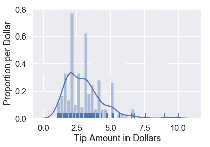
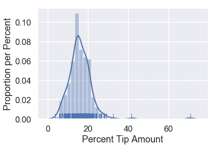
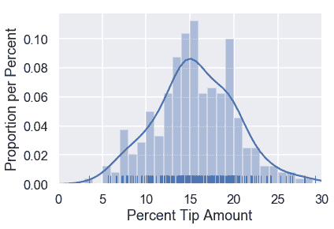
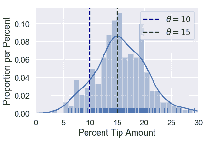

# 模型

> 原文：[https://www.bookbookmark.ds100.org/ch/10/modeling_simple.html](https://www.bookbookmark.ds100.org/ch/10/modeling_simple.html)

```
# HIDDEN
# Clear previously defined variables
%reset -f

# Set directory for data loading to work properly
import os
os.chdir(os.path.expanduser('~/notebooks/10'))

```

```
# HIDDEN
import warnings
# Ignore numpy dtype warnings. These warnings are caused by an interaction
# between numpy and Cython and can be safely ignored.
# Reference: https://stackoverflow.com/a/40846742
warnings.filterwarnings("ignore", message="numpy.dtype size changed")
warnings.filterwarnings("ignore", message="numpy.ufunc size changed")

import numpy as np
import matplotlib.pyplot as plt
import pandas as pd
import seaborn as sns
%matplotlib inline
import ipywidgets as widgets
from ipywidgets import interact, interactive, fixed, interact_manual
import nbinteract as nbi

sns.set()
sns.set_context('talk')
np.set_printoptions(threshold=20, precision=2, suppress=True)
pd.options.display.max_rows = 7
pd.options.display.max_columns = 8
pd.set_option('precision', 2)
# This option stops scientific notation for pandas
# pd.set_option('display.float_format', '{:.2f}'.format)

```

在美国，许多用餐者会在用餐者付钱时给他们的服务员留下小费。尽管美国习惯于提供 15%的小费，但也许有些餐馆的顾客比其他餐馆更慷慨。

一个特别的服务员对他能得到多少小费非常感兴趣，他收集了他在一个月工作期间提供的所有桌子的信息。

```
# HIDDEN
tips = sns.load_dataset('tips')
tips

```

|  | 账单合计 | 提示 | 性别 | 吸烟者 | 白天 | 时间 | 大小 |
| --- | --- | --- | --- | --- | --- | --- | --- |
| 零 | 十六点九九 | 1.01 年 | 女性 | 不 | 太阳 | 晚餐 | 二 |
| --- | --- | --- | --- | --- | --- | --- | --- |
| 1 个 | 十点三四 | 一点六六 | 男性 | No | Sun | Dinner | 三 |
| --- | --- | --- | --- | --- | --- | --- | --- |
| 二 | 二十一点零一 | 3.50 美元 | Male | No | Sun | Dinner | 3 |
| --- | --- | --- | --- | --- | --- | --- | --- |
| …… | …… | ... | ... | ... | ... | ... | ... |
| --- | --- | --- | --- | --- | --- | --- | --- |
| 241 个 | 二十二点六七 | 2.00 美元 | Male | 是的 | 坐 | Dinner | 2 |
| --- | --- | --- | --- | --- | --- | --- | --- |
| 二百四十二 | 十七点八二 | 1.75 美元 | Male | No | Sat | Dinner | 2 |
| --- | --- | --- | --- | --- | --- | --- | --- |
| 二百四十三 | 十八点七八 | 3 点 | Female | No | 周四 | Dinner | 2 |
| --- | --- | --- | --- | --- | --- | --- | --- |

244 行×7 列

我们可以绘制尖端数量的柱状图：

```
# HIDDEN
sns.distplot(tips['tip'], bins=np.arange(0, 10.1, 0.25), rug=True)
plt.xlabel('Tip Amount in Dollars')
plt.ylabel('Proportion per Dollar');

```



数据中已经有一些有趣的模式。例如，有一个清晰的模式是 2 美元，大多数提示似乎是 0.50 美元的倍数。

目前，我们对小费百分比最感兴趣：小费金额除以账单金额。我们可以在数据框架中为这个变量创建一个列并显示它的分布。

```
# HIDDEN
tips['pcttip'] = tips['tip'] / tips['total_bill'] * 100
sns.distplot(tips['pcttip'], rug=True)
plt.xlabel('Percent Tip Amount')
plt.ylabel('Proportion per Percent');

```



看起来有一张桌子给了我们的服务员 70 美元的小费！然而，大部分小费百分比低于 30 美元。让我们放大分布的那部分。

```
# HIDDEN
sns.distplot(tips['pcttip'], bins=np.arange(30), rug=True)
plt.xlim(0, 30)
plt.xlabel('Percent Tip Amount')
plt.ylabel('Proportion per Percent');

```


我们可以看到分布大致集中在$15\%$和另一个潜在模式$20\%$之间。假设我们的服务员有兴趣预测他从一张给定的桌子上能得到多少小费。为了解决这个问题，我们可以创建一个服务生能得到多少小费的模型。

### 一个简单的模型

一个简单的模型是完全忽略数据，并声明由于美国的惯例是给 15%的小费，服务员总是从他的桌子上得到 15%的小费。虽然非常简单，但我们将使用这个模型来定义一些稍后将使用的变量。

这个模型假设有一个正确的百分比提示，所有的表，过去和未来，都将给服务员。这是百分比提示的 _ 填充参数 _，我们将用$\theta^*$表示。

在做出这个假设之后，我们的模型说我们对$\theta^*$的猜测是$15\%$。我们将使用$\theta$来表示当前的猜测。

在数学符号中，我们的模型指出：

$$\theta=15$$

如果模型是真的，那么这个模型显然是有问题的，我们数据集中的每个表都应该给服务员 15%的小费。尽管如此，这个模型将对许多场景做出合理的猜测。事实上，如果我们没有其他信息，除了服务员受雇于美国之外，这个模型可能是最有用的选择。

但是，由于我们的服务生收集了数据，我们可以使用他的提示历史来创建模型，而不是仅根据惯例选择 15%。

### 损失函数直觉

为了方便起见，下面复制了数据集中提示百分比的分布。

```
# HIDDEN
sns.distplot(tips['pcttip'], bins=np.arange(30), rug=True)
plt.xlim(0, 30)
plt.xlabel('Percent Tip Amount')
plt.ylabel('Proportion per Percent');

```



假设我们正在比较两个选项，分别是：$10\%$和$15\%$。我们可以在发行版上标记这两种选择：

```
# HIDDEN
sns.distplot(tips['pcttip'], bins=np.arange(30), rug=True)

plt.axvline(x=10, c='darkblue', linestyle='--', label=r'$ \theta = 10$')
plt.axvline(x=15, c='darkgreen', linestyle='--', label=r'$ \theta = 15$')
plt.legend()

plt.xlim(0, 30)
plt.xlabel('Percent Tip Amount')
plt.ylabel('Proportion per Percent');

```



直观地说，在给定数据集的情况下，选择$\theta=15$比选择$\theta=10$更有意义。这是为什么？当我们查看数据中的点时，我们可以看到更多的点接近 15 美元，而不是 10 美元。

虽然看起来很明显，$\theta=15$比$\theta=10$是更好的选择，但还不太清楚，$\theta=15$是否比$\theta=16$更好。为了在不同的$\theta$值之间做出精确的选择，我们要为每个$\theta$值分配一个数字，该数字测量数据的“好”程度。也就是说，我们需要一个函数，它将输入一个$\theta$值和数据集中的点，输出一个单一的数字，我们将使用它来选择我们可以选择的最佳值$\theta$。

我们称此函数为**损失函数**。