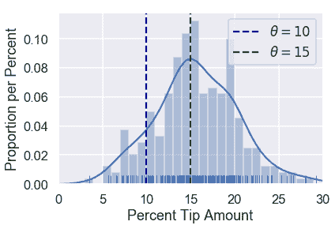
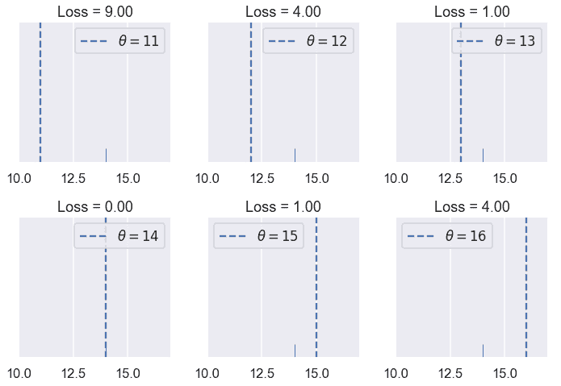
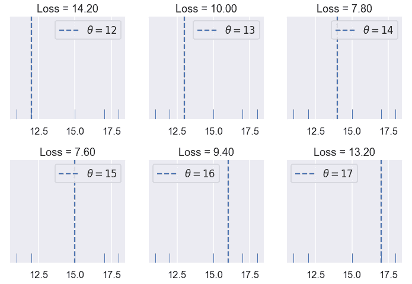
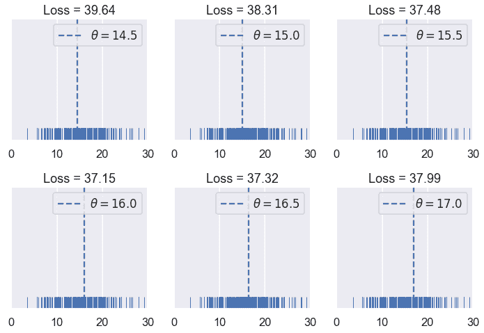
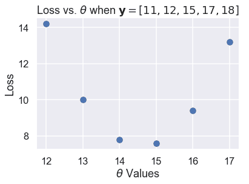
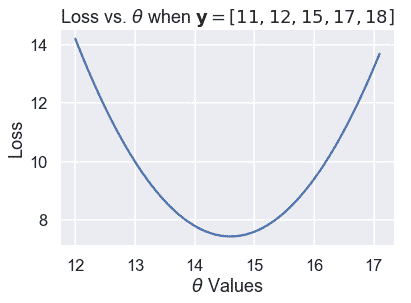
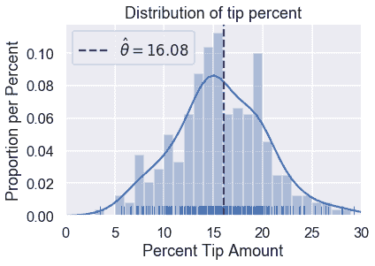

# 损失函数

> 原文：[https://www.bookbookmark.ds100.org/ch/10/modeling_loss_functions.html](https://www.bookbookmark.ds100.org/ch/10/modeling_loss_functions.html)

```
# HIDDEN
# Clear previously defined variables
%reset -f

# Set directory for data loading to work properly
import os
os.chdir(os.path.expanduser('~/notebooks/10'))

```

```
# HIDDEN
import warnings
# Ignore numpy dtype warnings. These warnings are caused by an interaction
# between numpy and Cython and can be safely ignored.
# Reference: https://stackoverflow.com/a/40846742
warnings.filterwarnings("ignore", message="numpy.dtype size changed")
warnings.filterwarnings("ignore", message="numpy.ufunc size changed")

import numpy as np
import matplotlib.pyplot as plt
import pandas as pd
import seaborn as sns
%matplotlib inline
import ipywidgets as widgets
from ipywidgets import interact, interactive, fixed, interact_manual
import nbinteract as nbi

sns.set()
sns.set_context('talk')
np.set_printoptions(threshold=20, precision=2, suppress=True)
pd.options.display.max_rows = 7
pd.options.display.max_columns = 8
pd.set_option('precision', 2)
# This option stops scientific notation for pandas
# pd.set_option('display.float_format', '{:.2f}'.format)

```

```
# HIDDEN
tips = sns.load_dataset('tips')
tips['pcttip'] = tips['tip'] / tips['total_bill'] * 100

```

回想到目前为止我们的假设：我们假设有一个单一的总体提示百分比$\theta^*$。我们的模型估计这个参数；我们使用变量$\theta$来表示我们的估计。我们希望使用收集到的 Tips 数据来确定$\theta$应该具有的值，

为了精确地确定哪一个$theta$值是最好的，我们定义了一个**损失函数**。损失函数是一个数学函数，它接受一个估计值$\theta$和数据集$y_1，y_2，ldots，y_n$中的点。它输出一个单独的数字，即**损失**，用来衡量$\theta$是否适合我们的数据。在数学符号中，我们要创建函数：

$$ L(\theta, y_1, y_2, \ldots, y_n) =\ \ldots $$

按照惯例，损失函数输出的值越低，值越大，值越高，值越低，值越大，值越低。为了适应我们的模型，我们选择了产生比其他所有选择的损失都要低的$theta$的值，即$theta$的值，它是**将损失最小化的$theta$的值**。我们使用符号$\hat \theta$表示将指定损失函数最小化的$\theta$值。

再次考虑两个可能的值：$\theta$：$\theta=10$和$\theta=15$。

```
# HIDDEN
sns.distplot(tips['pcttip'], bins=np.arange(30), rug=True)

plt.axvline(x=10, c='darkblue', linestyle='--', label=r'$ \theta = 10$')
plt.axvline(x=15, c='darkgreen', linestyle='--', label=r'$ \theta = 15$')
plt.legend()

plt.xlim(0, 30)
plt.xlabel('Percent Tip Amount')
plt.ylabel('Proportion per Percent');

```



由于$\theta=15$接近大多数点，我们的损失函数应该输出一个小的值为$\theta=15$和一个大的值为$\theta=10$。

让我们用这个直觉来创建一个损失函数。

### 我们的第一个损失函数：均方误差[¶](#Our-First-Loss-Function:-Mean-Squared-Error)

我们希望选择的$\theta$接近数据集中的点。因此，我们可以定义一个损失函数，它输出一个更大的值，因为$\theta$远离数据集中的点。我们从一个叫做 _ 均方误差 _ 的简单损失函数开始。这里的想法是：

1.  我们选择的值是$\theta$。
2.  对于数据集中的每个值，取值和 theta 之间的平方差：$（y_i-\theta）^2$。用一种简单的方法将差异平方化，将负差异转化为正差异。我们之所以要这样做，是因为如果我们的点$y_i=14$、$\theta=10$和$\theta=18$距离该点同样远，因此也同样“差”。
3.  要计算最终损失，取每个平方差的平均值。

这给了我们一个最终的损失函数：

$$ \begin{aligned} L(\theta, y_1, y_2, \ldots, y_n) &= \text{average}\left\{ (y_1 - \theta)^2, (y_2 - \theta)^2, \ldots, (y_n - \theta)^2 \right\} \\ &= \frac{1}{n} \left((y_1 - \theta)^2 + (y_2 - \theta)^2 + \ldots + (y_n - \theta)^2 \right) \\ &= \frac{1}{n} \sum_{i = 1}^{n}(y_i - \theta)^2\\ \end{aligned} $$

创建一个 python 函数来计算损失很简单：

```
def mse_loss(theta, y_vals):
    return np.mean((y_vals - theta) ** 2)

```

让我们看看这个损失函数是如何工作的。假设我们的数据集只包含一个点，$y_1=14$。我们可以尝试不同的$\theta$值，看看每个值的损失函数输出了什么。

```
# HIDDEN
def try_thetas(thetas, y_vals, xlims, loss_fn=mse_loss, figsize=(10, 7), cols=3):
    if not isinstance(y_vals, np.ndarray):
        y_vals = np.array(y_vals)
    rows = int(np.ceil(len(thetas) / cols))
    plt.figure(figsize=figsize)
    for i, theta in enumerate(thetas):
        ax = plt.subplot(rows, cols, i + 1)
        sns.rugplot(y_vals, height=0.1, ax=ax)
        plt.axvline(theta, linestyle='--',
                    label=rf'$ \theta = {theta} $')
        plt.title(f'Loss = {loss_fn(theta, y_vals):.2f}')
        plt.xlim(*xlims)
        plt.yticks([])
        plt.legend()
    plt.tight_layout()

try_thetas(thetas=[11, 12, 13, 14, 15, 16],
           y_vals=[14], xlims=(10, 17))

```



您还可以交互地尝试下面的不同值$\theta$。你应该理解为什么$theta=11$的损失比$theta=13$的损失高很多倍。

```
# HIDDEN
def try_thetas_interact(theta, y_vals, xlims, loss_fn=mse_loss):
    if not isinstance(y_vals, np.ndarray):
        y_vals = np.array(y_vals)
    plt.figure(figsize=(4, 3))
    sns.rugplot(y_vals, height=0.1)
    plt.axvline(theta, linestyle='--')
    plt.xlim(*xlims)
    plt.yticks([])
    print(f'Loss for theta = {theta}: {loss_fn(theta, y_vals):.2f}')

def mse_interact(theta, y_vals, xlims):
    plot = interactive(try_thetas_interact, theta=theta,
                       y_vals=fixed(y_vals), xlims=fixed(xlims),
                       loss_fn=fixed(mse_loss))
    plot.children[-1].layout.height = '240px'
    return plot

mse_interact(theta=(11, 16, 0.5), y_vals=[14], xlims=(10, 17))

```

<button class="js-nbinteract-widget">Loading widgets...</button>

正如我们所希望的那样，我们的损失更大，因为$\theta$离我们的数据越远，当$\theta$正好落在我们的数据点上时，损失就越小。现在让我们来看看当我们有五个点而不是一个点时，我们的均方误差是如何表现的。我们这次的数据是：$[11，12，15，17，18]$。

```
# HIDDEN
try_thetas(thetas=[12, 13, 14, 15, 16, 17],
           y_vals=[11, 12, 15, 17, 18],
           xlims=(10.5, 18.5))

```



在我们尝试的$Theta$值中，$Theta=15$的损失最小。但是，14 到 15 之间的$theta$的值可能比$theta=15$的损失更低。看看你能不能用下面的互动图找到一个更好的值$\theta$。

```
# HIDDEN
mse_interact(theta=(12, 17, 0.2),
             y_vals=[11, 12, 15, 17, 18],
             xlims=(10.5, 18.5))

```

<button class="js-nbinteract-widget">Loading widgets...</button>

平均平方误差似乎是通过惩罚远离数据中心的$\theta$值来完成的。现在让我们看看损失函数在原始的 Tip 百分比数据集上输出了什么。作为参考，尖端百分比的原始分布如下所示：

```
# HIDDEN
sns.distplot(tips['pcttip'], bins=np.arange(30), rug=True)
plt.xlim(0, 30)
plt.xlabel('Percent Tip Amount')
plt.ylabel('Proportion per Percent');

```


让我们尝试一些值为$\theta$。

```
# HIDDEN
try_thetas(thetas=np.arange(14.5, 17.1, 0.5),
           y_vals=tips['pcttip'],
           xlims=(0, 30))

```



和以前一样，我们创建了一个交互式小部件来测试不同的$theta$值。

```
# HIDDEN
mse_interact(theta=(13, 17, 0.25),
             y_vals=tips['pcttip'],
             xlims=(0, 30))

```

<button class="js-nbinteract-widget">Loading widgets...</button>

到目前为止，我们已经尝试过的最低价是 16.00 美元，略高于我们最初估计的 15%小费。

### 速记本

我们定义了第一个损失函数，均方误差（mse）。它计算出远离数据中心的$theta$值的高损失。数学上，该损失函数定义为：

$$ \begin{aligned} L(\theta, y_1, y_2, \ldots, y_n) &= \frac{1}{n} \sum_{i = 1}^{n}(y_i - \theta)^2\\ \end{aligned} $$

当我们更改$theta$或$y_1，y_2，ldots，y_n$时，loss 函数将计算不同的损失。当我们尝试不同的$theta$值和添加新的数据点（更改$y_1，y_2，ldots，y_n$）时，我们已经看到了这种情况。

简而言之，我们可以定义向量$\textbf y=[y_1，y_2，ldots，y_n]$。然后，我们可以将 mse 写为：

$$ \begin{aligned} L(\theta, \textbf{y}) &= \frac{1}{n} \sum_{i = 1}^{n}(y_i - \theta)^2\\ \end{aligned} $$

### 最大限度地减少损失

到目前为止，我们只需尝试一系列的价值，然后选择损失最小的价值，就可以找到\theta$的最佳价值。该方法虽然运行良好，但利用损失函数的性质可以找到一种较好的方法。

对于以下示例，我们使用一个包含五个点的数据集：$\textbf y=[11、12、15、16、17]$。

```
# HIDDEN
try_thetas(thetas=[12, 13, 14, 15, 16, 17],
           y_vals=[11, 12, 15, 17, 18],
           xlims=(10.5, 18.5))

```


在上面的图中，我们使用了 12 到 17 之间的整数$\theta$值。当我们改变$theta$时，损失似乎开始很高（在 10.92），减少到$theta=15$，然后再次增加。我们可以看到损失随着$theta$的变化而变化，所以让我们制作一个图，将我们尝试的六个$theta$中的每一个的损失与$theta$进行比较。

```
# HIDDEN
thetas = np.array([12, 13, 14, 15, 16, 17])
y_vals = np.array([11, 12, 15, 17, 18])
losses = [mse_loss(theta, y_vals) for theta in thetas]

plt.scatter(thetas, losses)
plt.title(r'Loss vs. $ \theta $ when $\bf{y}$$ = [11, 12, 15, 17, 18] $')
plt.xlabel(r'$ \theta $ Values')
plt.ylabel('Loss');

```



散点图显示了我们以前注意到的向下，然后向上的趋势。我们可以尝试更多的$theta$值，以查看一条完整的曲线，该曲线显示损失如何随着$theta$的变化而变化。

```
# HIDDEN
thetas = np.arange(12, 17.1, 0.05)
y_vals = np.array([11, 12, 15, 17, 18])
losses = [mse_loss(theta, y_vals) for theta in thetas]

plt.plot(thetas, losses)
plt.title(r'Loss vs. $ \theta $ when $\bf{y}$$ = [11, 12, 15, 17, 18] $')
plt.xlabel(r'$ \theta $ Values')
plt.ylabel('Loss');

```



上面的图显示，事实上，$\theta=15$不是最佳选择；14 到 15 之间的$\theta$损失会更低。我们可以用微积分来精确地找到$\theta$的最小值。在最小损失下，损失函数相对于$\theta$的导数为 0。

首先，我们从损失函数开始：

$$ \begin{aligned} L(\theta, \textbf{y}) &= \frac{1}{n} \sum_{i = 1}^{n}(y_i - \theta)^2\\ \end{aligned} $$

接下来，我们插入点$\textbf y=[11，12，15，17，18]$：

$$ \begin{aligned} L(\theta, \textbf{y}) &= \frac{1}{5} \big((11 - \theta)^2 + (12 - \theta)^2 + (15 - \theta)^2 + (17 - \theta)^2 + (18 - \theta)^2 \big)\\ \end{aligned} $$

为了找到将此函数最小化的$\theta$值，我们计算了与$\theta$相关的导数：

$$ \begin{aligned} \frac{\partial}{\partial \theta} L(\theta, \textbf{y}) &= \frac{1}{5} \big(-2(11 - \theta) - 2(12 - \theta) - 2(15 - \theta) - 2(17 - \theta) -2(18 - \theta) \big)\\ &= \frac{1}{5} \big(10 \cdot \theta - 146 \big)\\ \end{aligned} $$

然后，我们找到了$theta$的值，其中导数为零：

$$ \begin{aligned} \frac{1}{5} \big(10 \cdot \theta - 146 \big) &= 0 \\ 10 \cdot \theta - 146 &= 0 \\ \theta &= 14.6 \end{aligned} $$

我们已经找到了最小化的$\theta$，正如预期的那样，它在 14 到 15 之间。我们表示将损失降至最低的美元。因此，对于数据集$\textbf y=[11、12、15、17、18]$和 mse loss 函数：

$$ \hat{\theta} = 14.6 $$

如果我们恰好计算数据值的平均值，我们会发现一个奇怪的等价性：

$$ \text{mean} (\textbf{y}) = \hat{\theta} = 14.6 $$

### 均方误差最小值[¶](#The-Minimizing-Value-of-the-Mean-Squared-Error)

事实证明，上述等价性不仅仅是巧合；数据值 _ 的平均值 _ 总是产生$\hat \theta$，而$\theta$则使 MSE 损失最小化。

为了证明这一点，我们再次求出损失函数的导数。我们没有插入点，而是保留$y_i$术语的完整性，以便推广到其他数据集。

$$ \begin{aligned} L(\theta, \textbf{y}) &= \frac{1}{n} \sum_{i = 1}^{n}(y_i - \theta)^2\\ \frac{\partial}{\partial \theta} L(\theta, \textbf{y}) &= \frac{1}{n} \sum_{i = 1}^{n} -2(y_i - \theta) \\ &= -\frac{2}{n} \sum_{i = 1}^{n} (y_i - \theta) \\ \end{aligned} $$

由于我们没有用特定的值替换$Y_i$，所以这个公式可以与任何具有任意点数的数据集一起使用。

现在，我们将导数设为零，然后求出$\theta$以找到$\theta$的最小值，如下所示：

$$ \begin{aligned} -\frac{2}{n} \sum_{i = 1}^{n} (y_i - \theta) &= 0 \\ \sum_{i = 1}^{n} (y_i - \theta) &= 0 \\ \sum_{i = 1}^{n} y_i - \sum_{i = 1}^{n} \theta &= 0 \\ \sum_{i = 1}^{n} \theta &= \sum_{i = 1}^{n} y_i \\ n \cdot \theta &= y_1 + \ldots + y_n \\ \theta &= \frac{y_1 + \ldots + y_n}{n} \\ \hat \theta = \theta &= \text{mean} (\textbf{y}) \end{aligned} $$

你看，我们看到有一个单独的$theta$值，不管数据集是什么，它都会给出最小的毫秒。对于均方误差，我们知道$\hat \theta$是数据集值的平均值。

### 返回到原始数据集[¶](#Back-to-the-Original-Dataset)

我们不再像以前那样测试不同的$theta$值。我们可以一次计算平均小费百分比：

```
np.mean(tips['pcttip'])

```

```
16.080258172250463
```

```
# HIDDEN
sns.distplot(tips['pcttip'], bins=np.arange(30), rug=True)

plt.axvline(x=16.08, c='darkblue', linestyle='--', label=r'$ \hat \theta = 16.08$')
plt.legend()

plt.xlim(0, 30)
plt.title('Distribution of tip percent')
plt.xlabel('Percent Tip Amount')
plt.ylabel('Proportion per Percent');

```



### 摘要[¶](#Summary)

我们引入了一个**常量模型**，这个模型为数据集中的所有条目输出相同的数字。

**损失函数**$L（\theta、\textbf y）$测量给定值$\theta$与数据的匹配程度。在本节中，我们介绍了均方误差损失函数，并证明了对于常数模型，$hat \theta=\text mean（\textbf y）$的值。

我们在本节中采取的步骤适用于许多建模场景：

1.  选择一个模型。
2.  选择损失函数。
3.  通过最小化损失来拟合模型。

在本书中，我们所有的建模技术都扩展到这些步骤中的一个或多个。我们介绍了新的模型（1）、新的损失函数（2）和减少损失的新技术（3）。