# 绝对损失和 Huber 损失

> 原文：[https://www.ste 科书.ds100.org/ch/10/modeling_abs_huber.html](https://www.ste 科书.ds100.org/ch/10/modeling_abs_huber.html)

```
# HIDDEN
# Clear previously defined variables
%reset -f

# Set directory for data loading to work properly
import os
os.chdir(os.path.expanduser('~/notebooks/10'))

```

```
# HIDDEN
import warnings
# Ignore numpy dtype warnings. These warnings are caused by an interaction
# between numpy and Cython and can be safely ignored.
# Reference: https://stackoverflow.com/a/40846742
warnings.filterwarnings("ignore", message="numpy.dtype size changed")
warnings.filterwarnings("ignore", message="numpy.ufunc size changed")

import numpy as np
import matplotlib.pyplot as plt
import pandas as pd
import seaborn as sns
%matplotlib inline
import ipywidgets as widgets
from ipywidgets import interact, interactive, fixed, interact_manual
import nbinteract as nbi

sns.set()
sns.set_context('talk')
np.set_printoptions(threshold=20, precision=2, suppress=True)
pd.options.display.max_rows = 7
pd.options.display.max_columns = 8
pd.set_option('precision', 2)
# This option stops scientific notation for pandas
# pd.set_option('display.float_format', '{:.2f}'.format)

```

```
# HIDDEN
tips = sns.load_dataset('tips')
tips['pcttip'] = tips['tip'] / tips['total_bill'] * 100

```

```
# HIDDEN
def mse_loss(theta, y_vals):
    return np.mean((y_vals - theta) ** 2)

def abs_loss(theta, y_vals):
    return np.mean(np.abs(y_vals - theta))

```

```
# HIDDEN
def compare_mse_abs(thetas, y_vals, xlims, figsize=(10, 7), cols=3):
    if not isinstance(y_vals, np.ndarray):
        y_vals = np.array(y_vals)
    rows = int(np.ceil(len(thetas) / cols))
    plt.figure(figsize=figsize)
    for i, theta in enumerate(thetas):
        ax = plt.subplot(rows, cols, i + 1)
        sns.rugplot(y_vals, height=0.1, ax=ax)
        plt.axvline(theta, linestyle='--',
                    label=rf'$ \theta = {theta} $')
        plt.title(f'MSE = {mse_loss(theta, y_vals):.2f}\n'
                  f'MAE = {abs_loss(theta, y_vals):.2f}')
        plt.xlim(*xlims)
        plt.yticks([])
        plt.legend()
    plt.tight_layout()

```

为了拟合模型，我们选择了一个损失函数，并选择了使损失最小化的模型参数。在上一节中，我们介绍了均方误差（mse）损失函数：

$$ \begin{aligned} L(\theta, \textbf{y}) &= \frac{1}{n} \sum_{i = 1}^{n}(y_i - \theta)^2\\ \end{aligned} $$

我们使用了一个常量模型来预测数据集中所有条目的相同数字$\theta$。当我们使用 MSE 损失来拟合这个模型时，我们发现$\hat \theta=\text mean（\textbf y）$。在 Tips 数据集中，我们发现拟合常数模型将预测$16.08\%$因为$16.08\%$是 Tip 百分比的平均值。

在本节中，我们介绍了两个新的损耗函数，即**平均绝对误差**损耗函数和**huber**损耗函数。

### 平均绝对误差

现在，我们将保持我们的模型相同，但切换到一个不同的损失函数：平均绝对误差（MAE）。这个损失函数取的是绝对差，而不是每个点的平方差和我们的预测值：

$$ \begin{aligned} L(\theta, \textbf{y}) &= \frac{1}{n} \sum_{i = 1}^{n} |y_i - \theta| \\ \end{aligned} $$

### 比较 mse 和 mae[？](#Comparing-MSE-and-MAE)

为了更好地了解 MSE 和 MAE 的比较方式，让我们比较它们在不同数据集中的损失。首先，我们将使用一个点的数据集：$\textbf y=[14]$。

```
# HIDDEN
compare_mse_abs(thetas=[11, 12, 13, 14, 15, 16],
                y_vals=[14], xlims=(10, 17))

```

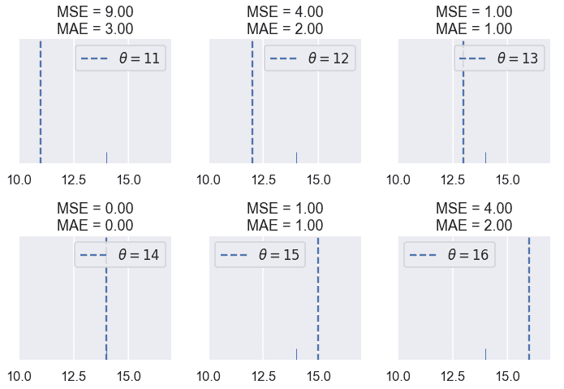

我们发现 MSE 通常高于 MAE，因为误差是平方的。让我们看看当有五个点时会发生什么：$\textbf y=[12.1，12.8，14.9，16.3，17.2]。$

```
# HIDDEN
compare_mse_abs(thetas=[12, 13, 14, 15, 16, 17],
                y_vals=[12.1, 12.8, 14.9, 16.3, 17.2],
                xlims=(11, 18))

```

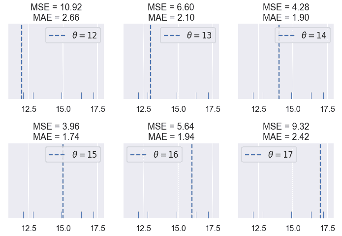

请记住，实际损失值本身对我们不是很有趣；它们只对比较不同的$theta$值有用。一旦我们选择了一个损失函数，我们将寻找产生最小损失的$\hat \theta$，即$\theta$。因此，我们感兴趣的是损失函数是否产生不同的$\hat \theta$。

到目前为止，这两个损失函数似乎在$\hat \theta 上达成一致。然而，如果我们再近一点看，就会发现一些差异。我们首先计算损失，并将它们与我们尝试的 6 个$\theta$值的$theta$进行比较。

```
# HIDDEN
thetas = np.array([12, 13, 14, 15, 16, 17])
y_vals = np.array([12.1, 12.8, 14.9, 16.3, 17.2])
mse_losses = [mse_loss(theta, y_vals) for theta in thetas]
abs_losses = [abs_loss(theta, y_vals) for theta in thetas]

plt.scatter(thetas, mse_losses, label='MSE')
plt.scatter(thetas, abs_losses, label='MAE')
plt.title(r'Loss vs. $ \theta $ when $ \bf{y}$$= [ 12.1, 12.8, 14.9, 16.3, 17.2 ] $')
plt.xlabel(r'$ \theta $ Values')
plt.ylabel('Loss')
plt.legend();

```

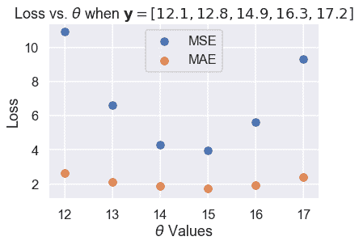

然后，我们计算更多的$\theta$值，使曲线平滑：

```
# HIDDEN
thetas = np.arange(12, 17.1, 0.05)
y_vals = np.array([12.1, 12.8, 14.9, 16.3, 17.2])
mse_losses = [mse_loss(theta, y_vals) for theta in thetas]
abs_losses = [abs_loss(theta, y_vals) for theta in thetas]

plt.plot(thetas, mse_losses, label='MSE')
plt.plot(thetas, abs_losses, label='MAE')
plt.title(r'Loss vs. $ \theta $ when $ \bf{y}$$ = [ 12.1, 12.8, 14.9, 16.3, 17.2 ] $')
plt.xlabel(r'$ \theta $ Values')
plt.ylabel('Loss')
plt.legend();

```

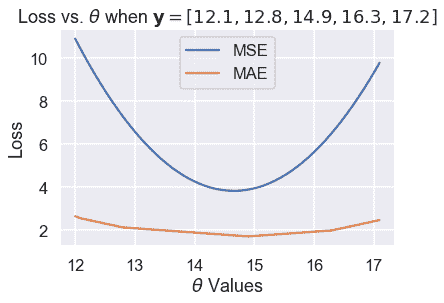

然后，我们放大 Y 轴上 1.5 到 5 之间的区域，以更清楚地看到最小值的差异。我们用虚线标出了最小值。

```
# HIDDEN
thetas = np.arange(12, 17.1, 0.05)
y_vals = np.array([12.1, 12.8, 14.9, 16.3, 17.2])
mse_losses = [mse_loss(theta, y_vals) for theta in thetas]
abs_losses = [abs_loss(theta, y_vals) for theta in thetas]

plt.figure(figsize=(7, 5))
plt.plot(thetas, mse_losses, label='MSE')
plt.plot(thetas, abs_losses, label='MAE')
plt.axvline(np.mean(y_vals), c=sns.color_palette()[0], linestyle='--',
            alpha=0.7, label='Minimum MSE')
plt.axvline(np.median(y_vals), c=sns.color_palette()[1], linestyle='--',
            alpha=0.7, label='Minimum MAE')

plt.title(r'Loss vs. $ \theta $ when $ \bf{y}$$ = [ 12.1, 12.8, 14.9, 16.3, 17.2 ] $')
plt.xlabel(r'$ \theta $ Values')
plt.ylabel('Loss')
plt.ylim(1.5, 5)
plt.legend()
plt.tight_layout();

```

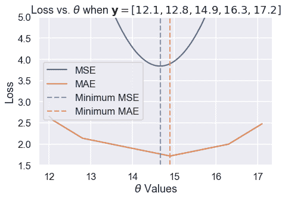

我们从经验上发现，MSE 和 MAE 可以为同一个数据集生成不同的$\hat \theta。一个更仔细的分析揭示了它们何时会不同，更重要的是，它们为什么会不同。

### 离群值[¶](#Outliers)

我们可以在上面的损失图和$\theta$图中看到的一个区别在于损失曲线的形状。绘制均方根误差会导致损失函数中平方项产生抛物线。

另一方面，绘制 MAE 会产生一系列连接的线条。当我们考虑到绝对值函数是线性的时，这是有意义的，因此取许多绝对值函数的平均值应该产生一个半线性函数。

由于 MSE 有一个平方误差项，所以它对异常值更为敏感。如果$\theta=10$且一个点位于 110，则该点的毫秒误差项将为$（10-110）^2=10000$而在 mae 中，该点的误差项将为$10-110=100$。我们可以用一组三点来说明这一点，即$textbf y=[12，13，14]$并绘制 MSE 和 MAE 的损失与$theta$曲线。

使用下面的滑块将第三个点移动到远离其余数据的位置，并观察损失曲线会发生什么。（由于 MSE 的值大于 MAE，所以我们已经缩放了曲线以保持这两个曲线都在视图中。）

```
# HIDDEN
def compare_mse_abs_curves(y3=14):
    thetas = np.arange(11.5, 26.5, 0.1)
    y_vals = np.array([12, 13, y3])

    mse_losses = [mse_loss(theta, y_vals) for theta in thetas]
    abs_losses = [abs_loss(theta, y_vals) for theta in thetas]
    mse_abs_diff = min(mse_losses) - min(abs_losses)
    mse_losses = [loss - mse_abs_diff for loss in mse_losses]

    plt.figure(figsize=(9, 2))

    ax = plt.subplot(121)
    sns.rugplot(y_vals, height=0.3, ax=ax)
    plt.xlim(11.5, 26.5)
    plt.xlabel('Points')

    ax = plt.subplot(122)
    plt.plot(thetas, mse_losses, label='MSE')
    plt.plot(thetas, abs_losses, label='MAE')
    plt.xlim(11.5, 26.5)
    plt.ylim(min(abs_losses) - 1, min(abs_losses) + 10)
    plt.xlabel(r'$ \theta $')
    plt.ylabel('Loss')
    plt.legend()

```

```
# HIDDEN
interact(compare_mse_abs_curves, y3=(14, 25));

```

<button class="js-nbinteract-widget">Loading widgets...</button>

我们已经显示了下面$y_3=14$和$y_3=25$的曲线。

```
# HIDDEN
compare_mse_abs_curves(y3=14)

```

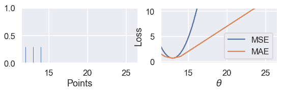

```
# HIDDEN
compare_mse_abs_curves(y3=25)

```

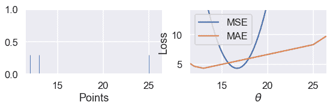

当我们将该点移离其他数据时，MSE 曲线也随之移动。当$y_=14$时，mse 和 mae 都有$that \theta=13$。然而，当$y_=25$时，MSE 损失产生的是$hat \theta=16.7$而 MAE 产生的是$hat \theta=13$，与以前没有变化。

### 最小化 mae[？](#Minimizing-the-MAE)

既然我们对 MSE 和 MAE 的区别有了定性的认识，我们就可以最小化 MAE，使这一区别更加精确。如前所述，我们将取损失函数对$\theta$的导数，并将其设为零。

然而，这一次我们必须处理这样一个事实：绝对函数并不总是可微的。当$x&gt；0$时，$\frac \部分\部分 x x=1$时。当$x&lt；0$时，$\frac \部分\部分 x x=-1$时。虽然$x 在$x=0$时在技术上是不可微的，但是我们将设置$\frac \ partial \ partial x x=0$以便方程更容易处理。

回想一下，MAE 的方程是：

$$ \begin{aligned} L(\theta, \textbf{y}) &= \frac{1}{n} \sum_{i = 1}^{n}|y_i - \theta|\\ &= \frac{1}{n} \left( \sum_{y_i < \theta}|y_i - \theta| + \sum_{y_i = \theta}|y_i - \theta| + \sum_{y_i > \theta}|y_i - \theta| \right)\\ \end{aligned} $$

在上面的行中，我们将求和分为三个单独的求和：一个是每$y_i&lt；\theta$有一个术语，一个是每$y_i=\theta$有一个术语，一个是每$y_i&gt；\theta$有一个术语。为什么求和看起来更复杂？如果我们知道$y_i&lt；\theta$我们也知道$y_i-\theta&lt；0$因此之前的$frac \ partial \ partial \theta y_i-\theta=-1$上面的每个术语都有类似的逻辑，以使取导数更容易。

现在，我们取与$\theta$相关的导数，并将其设为零：

$$ \begin{aligned} \frac{1}{n} \left( \sum_{y_i < \theta}(-1) + \sum_{y_i = \theta}(0) + \sum_{y_i > \theta}(1) \right) &= 0 \\ \sum_{y_i < \theta}(-1) + \sum_{y_i > \theta}(1) &= 0 \\ -\sum_{y_i < \theta}(1) + \sum_{y_i > \theta}(1) &= 0 \\ \sum_{y_i < \theta}(1) &= \sum_{y_i > \theta}(1) \\ \end{aligned} $$

上面的结果是什么意思？在左侧，对于每个小于$\theta$的数据点，我们有一个术语。在右边，对于每个大于$\theta$的数据点，我们都有一个。然后，为了满足这个方程，我们需要为$\theta$选择一个值，该值具有相同数量的较小和较大的点。这是一组数字的 _ 中位数 _ 的定义。因此，MAE 的$theta$的最小值是$that\theta=\text 中位数（\textbf y）$。

当我们有奇数个点时，当点按排序顺序排列时，中间值就是中间点。我们可以看到，在下面的例子中，当$\theta$位于中间值时，损失最小：

```
# HIDDEN
def points_and_loss(y_vals, xlim, loss_fn=abs_loss):
    thetas = np.arange(xlim[0], xlim[1] + 0.01, 0.05)
    abs_losses = [loss_fn(theta, y_vals) for theta in thetas]

    plt.figure(figsize=(9, 2))

    ax = plt.subplot(121)
    sns.rugplot(y_vals, height=0.3, ax=ax)
    plt.xlim(*xlim)
    plt.xlabel('Points')

    ax = plt.subplot(122)
    plt.plot(thetas, abs_losses)
    plt.xlim(*xlim)
    plt.xlabel(r'$ \theta $')
    plt.ylabel('Loss')
points_and_loss(np.array([10, 11, 12, 14, 15]), (9, 16))

```

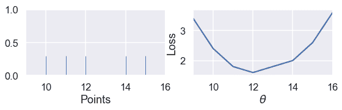

但是，当我们有偶数个点时，当$\theta$是两个中心点之间的任何值时，损失最小。

```
# HIDDEN
points_and_loss(np.array([10, 11, 14, 15]), (9, 16))

```

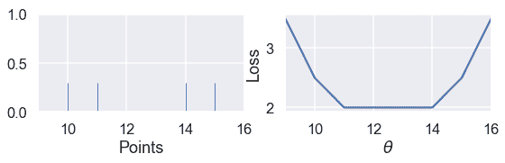

当我们使用 MSE 时，情况并非如此：

```
# HIDDEN
points_and_loss(np.array([10, 11, 14, 15]), (9, 16), mse_loss)

```

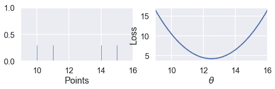

### mse 与 mae 比较[？](#MSE-and-MAE-Comparison)

我们的研究和上述推导表明，MSE 比 MAE 更容易区分，但对异常值更敏感。对于 MSE，$\hat \theta=\text mean（\textbf y）$，而对于 mae \hat \theta=\text mean（\textbf y）$。注意中位数受异常值的影响比平均值小。这一现象源于我们对两个损失函数的构造。

我们还发现 MSE 有一个唯一的$\hat \theta$，而平均绝对值在有偶数个数据点的情况下可以是多个可能的$\hat \theta$值。

### Huber 损失

第三个损失函数 huber loss 结合了 mse 和 mae，创建了一个对离群值具有可微性 _ 和 _ 的损失函数。Huber 损失通过类似于接近最小值的$\theta$值的 mse 函数和远离最小值的$\theta$值的绝对损失来实现这一点。

和往常一样，我们通过获取数据集中每个点的 Huber 损失的平均值来创建一个损失函数。

让我们看看当我们改变$\theta$时，huber loss 函数为一个数据集输出了什么样的结果。

```
# HIDDEN
def huber_loss(est, y_obs, alpha = 1):
    d = np.abs(est - y_obs)
    return np.where(d < alpha, 
                    (est - y_obs)**2 / 2.0,
                    alpha * (d - alpha / 2.0))

thetas = np.linspace(0, 50, 200)
loss = huber_loss(thetas, np.array([14]), alpha=5)
plt.plot(thetas, loss, label="Huber Loss")
plt.vlines(np.array([14]), -20, -5,colors="r", label="Observation")
plt.xlabel(r"Choice for $\theta$")
plt.ylabel(r"Loss")
plt.legend()
plt.savefig('huber_loss.pdf')

```

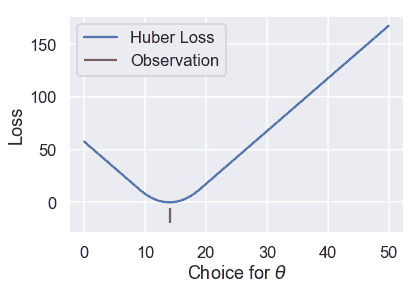

我们可以看到 Huber 损失是平稳的，不像 Mae。Huber 损失也以线性速率增加，与均方损失的二次速率不同。

然而，Huber 损失确实有一个缺点。注意，一旦$\theta$离这一点足够远，它就会从 MSE 过渡到 MAE。我们可以调整这个“足够远”来得到不同的损失曲线。例如，我们可以在离观察点只有一个单位远的地方进行一次$theta$转换：

```
# HIDDEN
loss = huber_loss(thetas, np.array([14]), alpha=1)
plt.plot(thetas, loss, label="Huber Loss")
plt.vlines(np.array([14]), -20, -5,colors="r", label="Observation")
plt.xlabel(r"Choice for $\theta$")
plt.ylabel(r"Loss")
plt.legend()
plt.savefig('huber_loss.pdf')

```

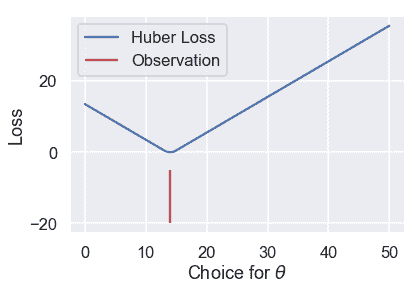

或者我们可以在离观察点 10 个单位远的地方进行转换：

```
# HIDDEN
loss = huber_loss(thetas, np.array([14]), alpha=10)
plt.plot(thetas, loss, label="Huber Loss")
plt.vlines(np.array([14]), -20, -5,colors="r", label="Observation")
plt.xlabel(r"Choice for $\theta$")
plt.ylabel(r"Loss")
plt.legend()
plt.savefig('huber_loss.pdf')

```

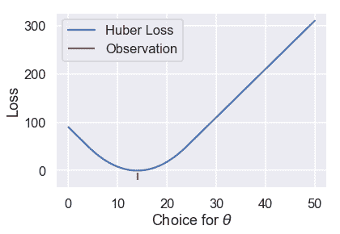

此选择会导致不同的损失曲线，因此可能会导致不同的值$\hat\theta$。如果我们想使用 Huber 损失函数，我们还有一个额外的任务，就是将这个转换点设置为合适的值。

Huber 损失函数的数学定义如下：

$$ L_\alpha(\theta, \textbf{y}) = \frac{1}{n} \sum_{i=1}^n \begin{cases} \frac{1}{2}(y_i - \theta)^2 & | y_i - \theta | \le \alpha \\ \alpha ( |y_i - \theta| - \frac{1}{2}\alpha ) & \text{otherwise} \end{cases} $$

它比以前的损失函数更复杂，因为它结合了 MSE 和 MAE。附加参数$\alpha$设置 Huber 损失从 MSE 过渡到绝对损失的点。

尝试求 Huber 损失函数的导数是繁琐的，不会产生像 mse 和 mae 这样优雅的结果。相反，我们可以使用一种称为梯度下降的计算方法来找到$\theta$的最小值。

### 摘要[¶](#Summary)

在本节中，我们介绍了两个损失函数：平均绝对误差和 Huber 损失函数。我们展示了一个使用 mae 拟合的常数模型，$\hat \theta=\text 中位数（\textbf y）$。