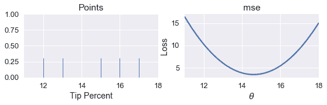
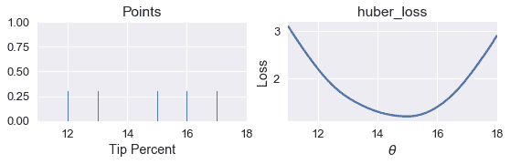
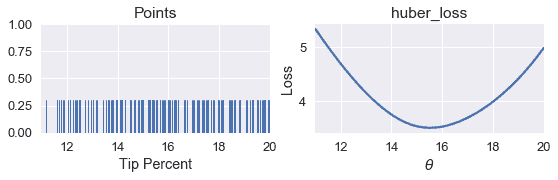
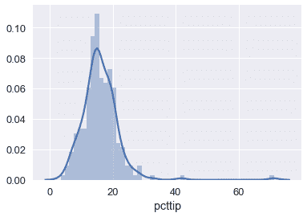

# 使用程序最小化损失

> 原文：[https://www.bookbookmark.ds100.org/ch/11/gradient_basics.html](https://www.bookbookmark.ds100.org/ch/11/gradient_basics.html)

```
# HIDDEN
# Clear previously defined variables
%reset -f

# Set directory for data loading to work properly
import os
os.chdir(os.path.expanduser('~/notebooks/11'))

```

```
# HIDDEN
import warnings
# Ignore numpy dtype warnings. These warnings are caused by an interaction
# between numpy and Cython and can be safely ignored.
# Reference: https://stackoverflow.com/a/40846742
warnings.filterwarnings("ignore", message="numpy.dtype size changed")
warnings.filterwarnings("ignore", message="numpy.ufunc size changed")

import numpy as np
import matplotlib.pyplot as plt
import pandas as pd
import seaborn as sns
%matplotlib inline
import ipywidgets as widgets
from ipywidgets import interact, interactive, fixed, interact_manual
import nbinteract as nbi

sns.set()
sns.set_context('talk')
np.set_printoptions(threshold=20, precision=2, suppress=True)
pd.options.display.max_rows = 7
pd.options.display.max_columns = 8
pd.set_option('precision', 2)
# This option stops scientific notation for pandas
# pd.set_option('display.float_format', '{:.2f}'.format)

```

```
# HIDDEN
def mse(theta, y_vals):
    return np.mean((y_vals - theta) ** 2)

def points_and_loss(y_vals, xlim, loss_fn):
    thetas = np.arange(xlim[0], xlim[1] + 0.01, 0.05)
    losses = [loss_fn(theta, y_vals) for theta in thetas]

    plt.figure(figsize=(9, 2))

    ax = plt.subplot(121)
    sns.rugplot(y_vals, height=0.3, ax=ax)
    plt.xlim(*xlim)
    plt.title('Points')
    plt.xlabel('Tip Percent')

    ax = plt.subplot(122)
    plt.plot(thetas, losses)
    plt.xlim(*xlim)
    plt.title(loss_fn.__name__)
    plt.xlabel(r'$ \theta $')
    plt.ylabel('Loss')
    plt.legend()

```

让我们回到常量模型：

$$ \theta = C $$

我们将使用均方误差损失函数：

$$ \begin{aligned} L(\theta, \textbf{y}) &= \frac{1}{n} \sum_{i = 1}^{n}(y_i - \theta)^2\\ \end{aligned} $$

为了简单起见，我们将使用数据集$\textbf y=[12，13，15，16，17]$。从上一章的分析方法中我们知道，MSE 的最小$\theta$是$\text mean（\textbf y）=14.6$。让我们看看是否可以通过编写程序找到相同的值。

如果我们写得好，我们将能够在任何损失函数上使用相同的程序，以便找到$\theta$的最小值，包括数学上复杂的 Huber 损失：

$$ L_\alpha(\theta, \textbf{y}) = \frac{1}{n} \sum_{i=1}^n \begin{cases} \frac{1}{2}(y_i - \theta)^2 & | y_i - \theta | \le \alpha \\ \alpha ( |y_i - \theta| - \frac{1}{2}\alpha ) & \text{otherwise} \end{cases} $$

首先，我们创建数据点的地毯图。在地毯图的右侧，我们绘制了不同值（$\theta$）的 MSE。

```
# HIDDEN
pts = np.array([12, 13, 15, 16, 17])
points_and_loss(pts, (11, 18), mse)

```



我们如何编写一个程序来自动找到$\theta$的最小值？最简单的方法是计算许多值的损失。然后，我们可以返回导致最小损失的\theta$值。

我们定义了一个名为`simple_minimize`的函数，它接受一个丢失函数、一个数据点数组和一个要尝试的$\theta$值数组。

```
def simple_minimize(loss_fn, dataset, thetas):
    '''
    Returns the value of theta in thetas that produces the least loss
    on a given dataset.
    '''
    losses = [loss_fn(theta, dataset) for theta in thetas]
    return thetas[np.argmin(losses)]

```

然后，我们可以定义一个函数来计算 mse 并将其传递到`simple_minimize`。

```
def mse(theta, dataset):
    return np.mean((dataset - theta) ** 2)

dataset = np.array([12, 13, 15, 16, 17])
thetas = np.arange(12, 18, 0.1)

simple_minimize(mse, dataset, thetas)

```

```
14.599999999999991
```

这接近预期值：

```
# Compute the minimizing theta using the analytical formula
np.mean(dataset)

```

```
14.6
```

现在，我们可以定义一个函数来计算 Huber 损失，并将损失与$\theta$进行比较。

```
def huber_loss(theta, dataset, alpha = 1):
    d = np.abs(theta - dataset)
    return np.mean(
        np.where(d < alpha,
                 (theta - dataset)**2 / 2.0,
                 alpha * (d - alpha / 2.0))
    )

```

```
# HIDDEN
points_and_loss(pts, (11, 18), huber_loss)

```



虽然我们可以看到，$\theta$的最小值应该接近 15，但是我们没有直接为 Huber 损失找到$\theta$的分析方法。相反，我们可以使用`simple_minimize`函数。

```
simple_minimize(huber_loss, dataset, thetas)

```

```
14.999999999999989
```

现在，我们可以返回到 Tip 百分比的原始数据集，并使用 Huber 损失找到$\theta$的最佳值。

```
tips = sns.load_dataset('tips')
tips['pcttip'] = tips['tip'] / tips['total_bill'] * 100
tips.head()

```

|  | 账单合计 | 提示 | 性别 | 吸烟者 | 白天 | 时间 | 大小 | PCTIP |
| --- | --- | --- | --- | --- | --- | --- | --- | --- |
| 零 | 十六点九九 | 1.01 年 | 女性 | 不 | 太阳 | 晚餐 | 二 | 5.944673 页 |
| --- | --- | --- | --- | --- | --- | --- | --- | --- |
| 1 个 | 十点三四 | 一点六六 | 男性 | No | Sun | Dinner | 三 | 16.054159 页 |
| --- | --- | --- | --- | --- | --- | --- | --- | --- |
| 二 | 二十一点零一 | 3.50 美元 | Male | No | Sun | Dinner | 3 | 16.658734 |
| --- | --- | --- | --- | --- | --- | --- | --- | --- |
| 三 | 二十三点六八 | 三点三一 | Male | No | Sun | Dinner | 2 | 13.978041 |
| --- | --- | --- | --- | --- | --- | --- | --- | --- |
| 四 | 二十四点五九 | 三点六一 | Female | No | Sun | Dinner | 四 | 14.680765 个 |
| --- | --- | --- | --- | --- | --- | --- | --- | --- |

```
# HIDDEN
points_and_loss(tips['pcttip'], (11, 20), huber_loss)

```



```
simple_minimize(huber_loss, tips['pcttip'], thetas)

```

```
15.499999999999988
```

我们可以看到，使用 Huber 损失给我们带来了\theta=15.5 美元。现在，我们可以比较 mse、mae 和 huber 损失的最小$\hat \theta 值。

```
print(f"               MSE: theta_hat = {tips['pcttip'].mean():.2f}")
print(f"               MAE: theta_hat = {tips['pcttip'].median():.2f}")
print(f"        Huber loss: theta_hat = 15.50")

```

```
               MSE: theta_hat = 16.08
               MAE: theta_hat = 15.48
        Huber loss: theta_hat = 15.50

```

我们可以看到，Huber 损失更接近 MAE，因为它受 Tip 百分比分布右侧的异常值影响较小：

```
sns.distplot(tips['pcttip'], bins=50);

```



## 与`simple_minimize`[¶](#Issues-with-simple_minimize)有关的问题

虽然`simple_minimize`允许我们最小化损失函数，但它有一些缺陷，使其不适合一般用途。它的主要问题是，它只使用预先确定的$theta$值进行测试。例如，在我们上面使用的代码片段中，我们必须在 12 到 18 之间手动定义$\theta$值。

```
dataset = np.array([12, 13, 15, 16, 17])
thetas = np.arange(12, 18, 0.1)

simple_minimize(mse, dataset, thetas)

```

我们如何知道检查 12 到 18 之间的范围？我们必须手动检查损耗函数的曲线图，并看到在这个范围内有一个最小值。当我们为模型增加额外的复杂性时，这个过程变得不切实际。此外，我们在上面的代码中手动指定了 0.1 的步长。然而，如果$\theta$的最佳值是 12.043，我们的`simple_minimize`函数将四舍五入到 12.00，即 0.1 的最接近倍数。

我们可以使用一个名为 _ 梯度下降 _ 的方法同时解决这两个问题。