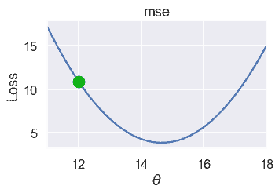
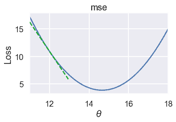
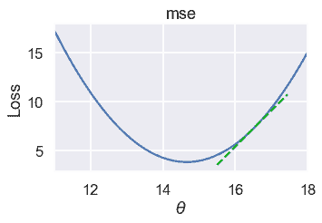
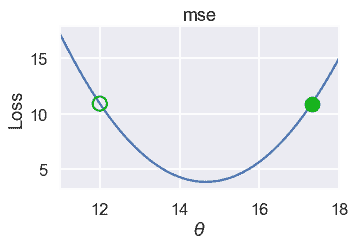
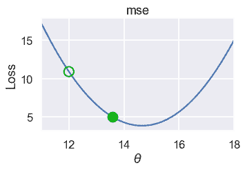
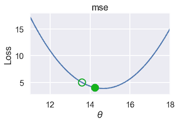
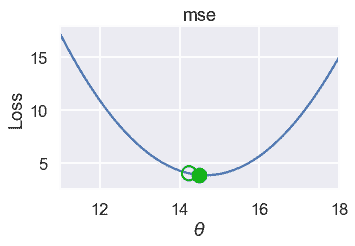
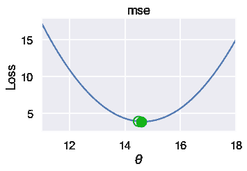

# 梯度下降

> 原文：[https://www.bookbookmark.ds100.org/ch/11/gradient_descence_define.html](https://www.bookbookmark.ds100.org/ch/11/gradient_descence_define.html)

```
# HIDDEN
# Clear previously defined variables
%reset -f

# Set directory for data loading to work properly
import os
os.chdir(os.path.expanduser('~/notebooks/11'))

```

```
# HIDDEN
import warnings
# Ignore numpy dtype warnings. These warnings are caused by an interaction
# between numpy and Cython and can be safely ignored.
# Reference: https://stackoverflow.com/a/40846742
warnings.filterwarnings("ignore", message="numpy.dtype size changed")
warnings.filterwarnings("ignore", message="numpy.ufunc size changed")

import numpy as np
import matplotlib.pyplot as plt
import pandas as pd
import seaborn as sns
%matplotlib inline
import ipywidgets as widgets
from ipywidgets import interact, interactive, fixed, interact_manual
import nbinteract as nbi

sns.set()
sns.set_context('talk')
np.set_printoptions(threshold=20, precision=2, suppress=True)
pd.options.display.max_rows = 7
pd.options.display.max_columns = 8
pd.set_option('precision', 2)
# This option stops scientific notation for pandas
# pd.set_option('display.float_format', '{:.2f}'.format)

```

```
# HIDDEN
tips = sns.load_dataset('tips')
tips['pcttip'] = tips['tip'] / tips['total_bill'] * 100

```

```
# HIDDEN
def mse(theta, y_vals):
    return np.mean((y_vals - theta) ** 2)

def grad_mse(theta, y_vals):
    return -2 * np.mean(y_vals - theta)

def plot_loss(y_vals, xlim, loss_fn):
    thetas = np.arange(xlim[0], xlim[1] + 0.01, 0.05)
    losses = [loss_fn(theta, y_vals) for theta in thetas]

    plt.figure(figsize=(5, 3))
    plt.plot(thetas, losses, zorder=1)
    plt.xlim(*xlim)
    plt.title(loss_fn.__name__)
    plt.xlabel(r'$ \theta $')
    plt.ylabel('Loss')

def plot_theta_on_loss(y_vals, theta, loss_fn, **kwargs):
    loss = loss_fn(theta, y_vals)
    default_args = dict(label=r'$ \theta $', zorder=2,
                        s=200, c=sns.xkcd_rgb['green'])
    plt.scatter([theta], [loss], **{**default_args, **kwargs})

def plot_tangent_on_loss(y_vals, theta, loss_fn, eps=1e-6):
    slope = ((loss_fn(theta + eps, y_vals) - loss_fn(theta - eps, y_vals))
             / (2 * eps))
    xs = np.arange(theta - 1, theta + 1, 0.05)
    ys = loss_fn(theta, y_vals) + slope * (xs - theta)
    plt.plot(xs, ys, zorder=3, c=sns.xkcd_rgb['green'], linestyle='--')

```

我们有兴趣创建一个函数，它可以最小化损失函数，而不必强制用户预先确定要尝试的值是\theta$。换句话说，虽然`simple_minimize`函数具有以下签名：

```
simple_minimize(loss_fn, dataset, thetas)

```

我们想要一个具有以下签名的函数：

```
minimize(loss_fn, dataset)

```

此函数需要自动查找最小化的$\theta$值，无论其大小。我们将使用一种称为梯度下降的技术来实现这个新的`minimize`函数。

### 直觉

与损失函数一样，我们将首先讨论梯度下降的直觉，然后用数学形式化我们的理解。

由于`minimize`函数没有给定要尝试的$\theta$的值，因此我们从选择需要的任何位置的$\theta$开始。然后，我们可以迭代地改进对$\theta$的估计。为了改进对$\theta$的估计，我们研究了在选择$\theta$时损失函数的斜率。

例如，假设我们对简单数据集$\textbf y=[12.1、12.8、14.9、16.3、17.2]$使用 mse，而当前选择的$\theta$是 12。

```
# HIDDEN
pts = np.array([12.1, 12.8, 14.9, 16.3, 17.2])
plot_loss(pts, (11, 18), mse)
plot_theta_on_loss(pts, 12, mse)

```



我们想为.\theta$选择一个减少损失的新值。要做到这一点，我们看损失函数在$\theta=12$时的斜率：

```
# HIDDEN
pts = np.array([12.1, 12.8, 14.9, 16.3, 17.2])
plot_loss(pts, (11, 18), mse)
plot_tangent_on_loss(pts, 12, mse)

```



坡度为负，这意味着增加$\theta$将减少损失。

另一方面，如果$\theta=16.5 美元，则损失函数的斜率为正：

```
# HIDDEN
pts = np.array([12.1, 12.8, 14.9, 16.3, 17.2])
plot_loss(pts, (11, 18), mse)
plot_tangent_on_loss(pts, 16.5, mse)

```



当坡度为正时，降低$\theta$将减少损失。

切线的斜率告诉我们移动$\theta$的方向，以减少损失。如果坡度为负，我们希望$\theta$朝正方向移动。如果坡度为正，则$\theta$应朝负方向移动。在数学上，我们写道：

$$\theta^（t+1）=\theta^（t）-\frac \部分\部分\theta l（\theta ^（t），\textbf y）$$

其中，$\theta^（t）$是当前估计数，$\theta^（t+1）$是下一个估计数。

对于 MSE，我们有：

$$ \begin{aligned} L(\theta, \textbf{y}) &= \frac{1}{n} \sum_{i = 1}^{n}(y_i - \theta)^2\\ \frac{\partial}{\partial \hat{\theta}} L(\theta, \textbf{y}) &= \frac{1}{n} \sum_{i = 1}^{n} -2(y_i - \theta) \\ &= -\frac{2}{n} \sum_{i = 1}^{n} (y_i - \theta) \\ \end{aligned} $$

当$\theta^（t）=12$时，我们可以计算$-\frac 2 n sum i=1 n（y i-\theta）=-5.32$。因此，$\theta^（t+1）=12-（-5.32）=17.32 美元。

我们将旧的$theta$值绘制为绿色轮廓圆圈，新的值绘制为下面损失曲线上的填充圆圈。

```
# HIDDEN
pts = np.array([12.1, 12.8, 14.9, 16.3, 17.2])
plot_loss(pts, (11, 18), mse)
plot_theta_on_loss(pts, 12, mse, c='none',
                   edgecolor=sns.xkcd_rgb['green'], linewidth=2)
plot_theta_on_loss(pts, 17.32, mse)

```



虽然$\theta$朝着正确的方向发展，但最终却远远超出了最低值。我们可以通过将斜率乘以一个小常数，然后从$\theta$中减去它来解决这个问题。我们的最终更新公式是：

$$\theta^（t+1）=\theta^（t）-\alpha\cdot\frac \部分\部分\theta l（\theta ^（t），\textbf y）$$

其中，$\alpha$是一个小常量。例如，如果我们设置$\alpha=0.3$，这是新的$\theta^（t+1）$：

```
# HIDDEN
def plot_one_gd_iter(y_vals, theta, loss_fn, grad_loss, alpha=0.3):
    new_theta = theta - alpha * grad_loss(theta, y_vals)
    plot_loss(pts, (11, 18), loss_fn)
    plot_theta_on_loss(pts, theta, loss_fn, c='none',
                       edgecolor=sns.xkcd_rgb['green'], linewidth=2)
    plot_theta_on_loss(pts, new_theta, loss_fn)
    print(f'old theta: {theta}')
    print(f'new theta: {new_theta}')

```

```
# HIDDEN
plot_one_gd_iter(pts, 12, mse, grad_mse)

```

```
old theta: 12
new theta: 13.596

```



以下是此过程连续迭代的$\theta$值。请注意，$\theta$随着接近最小损失而变化得更慢，因为坡度也更小。

```
# HIDDEN
plot_one_gd_iter(pts, 13.60, mse, grad_mse)

```

```
old theta: 13.6
new theta: 14.236

```



```
# HIDDEN
plot_one_gd_iter(pts, 14.24, mse, grad_mse)

```

```
old theta: 14.24
new theta: 14.492

```



```
# HIDDEN
plot_one_gd_iter(pts, 14.49, mse, grad_mse)

```

```
old theta: 14.49
new theta: 14.592

```



### 梯度下降分析

现在我们有了完整的梯度下降算法：

1.  选择一个起始值$\theta$（0 是一个常见的选择）。
2.  计算$\theta-\alpha\cdot\frac \partial \partial\theta l（\theta、\textbf y）$并将其存储为新值$\theta$。
3.  重复直到$\theta$在迭代之间不改变。

您将更常见地看到梯度$\nabla_uta$代替部分导数$\frac \部分\部分\theta$。这两个符号本质上是等效的，但是由于梯度符号更为常见，从现在起我们将在梯度更新公式中使用它：

$$\theta^（t+1）=\theta^（t）-\alpha\cdot\nabla\theta l（\theta^（t），\textbf y）$$

要查看符号：

*   $\theta^（t）$是第$t$次迭代时的当前估计值$\theta^*。
*   $\theta^（t+1）$是$\theta$的下一个选择。
*   $\alpha$称为学习率，通常设置为一个小常量。有时，从一个更大的$\alpha$开始并随着时间的推移减少它是有用的。如果在迭代之间$\alpha$发生变化，我们使用变量$\alpha^t$来标记$\alpha$随时间变化$t$。
*   $\nabla_ \theta l（\theta^（t），\textbf y）$是损失函数相对于时间$t$的偏导数/梯度。

现在您可以看到选择一个可微分损失函数的重要性：$\nabla_theta l（\theta、\textbf y）$是梯度下降算法的关键部分。（虽然可以通过计算两个稍有不同的$theta$值的损失差异并除以$theta$值之间的距离来估计梯度，但这通常会显著增加梯度下降的运行时间，因此使用它变得不切实际。）

梯度算法简单而强大，因为我们可以将它用于许多类型的模型和许多类型的损失函数。它是拟合许多重要模型的计算工具，包括大数据集和神经网络上的线性回归。

### 定义`minimize`函数[¶](#Defining-the-minimize-Function)

现在，我们回到原来的任务：定义`minimize`函数。我们将不得不稍微改变我们的函数签名，因为我们现在需要计算损失函数的梯度。

```
def minimize(loss_fn, grad_loss_fn, dataset, alpha=0.2, progress=True):
    '''
    Uses gradient descent to minimize loss_fn. Returns the minimizing value of
    theta_hat once theta_hat changes less than 0.001 between iterations.
    '''
    theta = 0
    while True:
        if progress:
            print(f'theta: {theta:.2f} | loss: {loss_fn(theta, dataset):.2f}')
        gradient = grad_loss_fn(theta, dataset)
        new_theta = theta - alpha * gradient

        if abs(new_theta - theta) < 0.001:
            return new_theta

        theta = new_theta

```

然后我们可以定义函数来计算 mse 及其梯度：

```
def mse(theta, y_vals):
    return np.mean((y_vals - theta) ** 2)

def grad_mse(theta, y_vals):
    return -2 * np.mean(y_vals - theta)

```

最后，我们可以使用`minimize`函数计算$\textbf y=[12.1，12.8，14.9，16.3，17.2]$的最小化值。

```
%%time
theta = minimize(mse, grad_mse, np.array([12.1, 12.8, 14.9, 16.3, 17.2]))
print(f'Minimizing theta: {theta}')
print()

```

```
theta: 0.00 | loss: 218.76
theta: 5.86 | loss: 81.21
theta: 9.38 | loss: 31.70
theta: 11.49 | loss: 13.87
theta: 12.76 | loss: 7.45
theta: 13.52 | loss: 5.14
theta: 13.98 | loss: 4.31
theta: 14.25 | loss: 4.01
theta: 14.41 | loss: 3.90
theta: 14.51 | loss: 3.86
theta: 14.57 | loss: 3.85
theta: 14.61 | loss: 3.85
theta: 14.63 | loss: 3.84
theta: 14.64 | loss: 3.84
theta: 14.65 | loss: 3.84
theta: 14.65 | loss: 3.84
theta: 14.66 | loss: 3.84
theta: 14.66 | loss: 3.84
Minimizing theta: 14.658511131035242

CPU times: user 7.88 ms, sys: 3.58 ms, total: 11.5 ms
Wall time: 8.54 ms

```

我们可以看到，梯度下降很快找到了与解析法相同的解：

```
np.mean([12.1, 12.8, 14.9, 16.3, 17.2])

```

```
14.66
```

### 最小化 Huber 损失

现在，我们可以应用梯度下降来最小化提示百分比数据集上的 Huber 损失。

Huber 损失为：

L 123; 123; 1 2 \ delta）&amp；\text 否则\结束案例$$

Huber 损失的梯度为：

$$\nabla_\theta l_\delta（\theta，\textbf y）=\frac 1 n \sum i=1 n\ begin cases-（y \theta）&amp；y i-\theta \le\delta\

```
- \delta \cdot \text{sign} (y_i - \theta) & \text{otherwise} 
```

\结束案例$$

（注意，在之前的 Huber 损失定义中，我们使用变量$\alpha$来表示转换点。为了避免与梯度下降中使用的$\alpha$混淆，我们将 Huber 损失的过渡点参数替换为$\delta$。）

```
def huber_loss(theta, dataset, delta = 1):
    d = np.abs(theta - dataset)
    return np.mean(
        np.where(d <= delta,
                 (theta - dataset)**2 / 2.0,
                 delta * (d - delta / 2.0))
    )

def grad_huber_loss(theta, dataset, delta = 1):
    d = np.abs(theta - dataset)
    return np.mean(
        np.where(d <= delta,
                 -(dataset - theta),
                 -delta * np.sign(dataset - theta))
    )

```

让我们最小化 Tips 数据集上的 Huber 损失：

```
%%time
theta = minimize(huber_loss, grad_huber_loss, tips['pcttip'], progress=False)
print(f'Minimizing theta: {theta}')
print()

```

```
Minimizing theta: 15.506849531471964

CPU times: user 194 ms, sys: 4.13 ms, total: 198 ms
Wall time: 208 ms

```

### 摘要[¶](#Summary)

梯度下降给了我们一种一般的方法来最小化损失函数，当我们无法通过分析来求解$\theta$的最小值时。随着我们的模型和损失函数的复杂性增加，我们将转向梯度下降作为我们选择适合模型的工具。