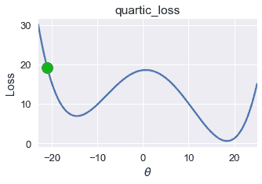
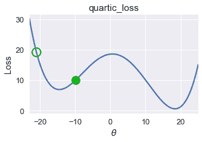
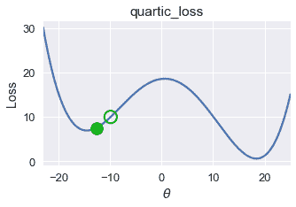
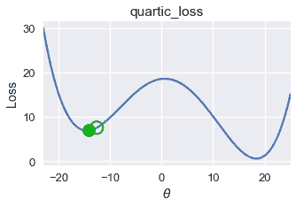
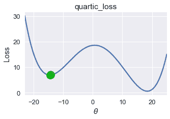
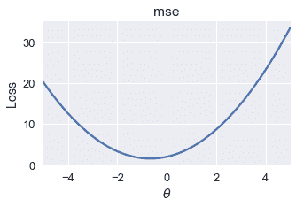
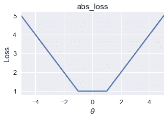
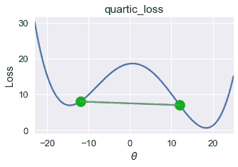
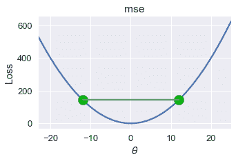

# 凸性

> 原文：[https://www.bookbookmark.ds100.org/ch/11/gradient_convexity.html](https://www.bookbookmark.ds100.org/ch/11/gradient_convexity.html)

```
# HIDDEN
# Clear previously defined variables
%reset -f

# Set directory for data loading to work properly
import os
os.chdir(os.path.expanduser('~/notebooks/11'))

```

```
# HIDDEN
import warnings
# Ignore numpy dtype warnings. These warnings are caused by an interaction
# between numpy and Cython and can be safely ignored.
# Reference: https://stackoverflow.com/a/40846742
warnings.filterwarnings("ignore", message="numpy.dtype size changed")
warnings.filterwarnings("ignore", message="numpy.ufunc size changed")

import numpy as np
import matplotlib.pyplot as plt
import pandas as pd
import seaborn as sns
%matplotlib inline
import ipywidgets as widgets
from ipywidgets import interact, interactive, fixed, interact_manual
import nbinteract as nbi

sns.set()
sns.set_context('talk')
np.set_printoptions(threshold=20, precision=2, suppress=True)
pd.options.display.max_rows = 7
pd.options.display.max_columns = 8
pd.set_option('precision', 2)
# This option stops scientific notation for pandas
# pd.set_option('display.float_format', '{:.2f}'.format)

```

```
# HIDDEN
tips = sns.load_dataset('tips')
tips['pcttip'] = tips['tip'] / tips['total_bill'] * 100

```

```
# HIDDEN
def mse(theta, y_vals):
    return np.mean((y_vals - theta) ** 2)

def abs_loss(theta, y_vals):
    return np.mean(np.abs(y_vals - theta))

def quartic_loss(theta, y_vals):
    return np.mean(1/5000 * (y_vals - theta + 12) * (y_vals - theta + 23)
                   * (y_vals - theta - 14) * (y_vals - theta - 15) + 7)

def grad_quartic_loss(theta, y_vals):
    return -1/2500 * (2 *(y_vals - theta)**3 + 9*(y_vals - theta)**2
                      - 529*(y_vals - theta) - 327)

def plot_loss(y_vals, xlim, loss_fn):
    thetas = np.arange(xlim[0], xlim[1] + 0.01, 0.05)
    losses = [loss_fn(theta, y_vals) for theta in thetas]

    plt.figure(figsize=(5, 3))
    plt.plot(thetas, losses, zorder=1)
    plt.xlim(*xlim)
    plt.title(loss_fn.__name__)
    plt.xlabel(r'$ \theta $')
    plt.ylabel('Loss')

def plot_theta_on_loss(y_vals, theta, loss_fn, **kwargs):
    loss = loss_fn(theta, y_vals)
    default_args = dict(label=r'$ \theta $', zorder=2,
                        s=200, c=sns.xkcd_rgb['green'])
    plt.scatter([theta], [loss], **{**default_args, **kwargs})

def plot_connected_thetas(y_vals, theta_1, theta_2, loss_fn, **kwargs):
    plot_theta_on_loss(y_vals, theta_1, loss_fn)
    plot_theta_on_loss(y_vals, theta_2, loss_fn)
    loss_1 = loss_fn(theta_1, y_vals)
    loss_2 = loss_fn(theta_2, y_vals)
    plt.plot([theta_1, theta_2], [loss_1, loss_2])

```

```
# HIDDEN
def plot_one_gd_iter(y_vals, theta, loss_fn, grad_loss, alpha=2.5):
    new_theta = theta - alpha * grad_loss(theta, y_vals)
    plot_loss(pts, (-23, 25), loss_fn)
    plot_theta_on_loss(pts, theta, loss_fn, c='none',
                       edgecolor=sns.xkcd_rgb['green'], linewidth=2)
    plot_theta_on_loss(pts, new_theta, loss_fn)
    print(f'old theta: {theta}')
    print(f'new theta: {new_theta[0]}')

```

梯度下降提供了一种最小化函数的一般方法。我们观察到 Huber 损耗，当函数的最小值难以解析地找到时，梯度下降特别有用。

## 梯度下降找到局部最小值[¶](#Gradient-Descent-Finds-Local-Minima)

不幸的是，梯度下降并不总是找到全局最小化的$\theta$。考虑使用下面的损失函数的初始$\theta=-21$进行以下梯度下降运行。

```
# HIDDEN
pts = np.array([0])
plot_loss(pts, (-23, 25), quartic_loss)
plot_theta_on_loss(pts, -21, quartic_loss)

```



```
# HIDDEN
plot_one_gd_iter(pts, -21, quartic_loss, grad_quartic_loss)

```

```
old theta: -21
new theta: -9.944999999999999

```



```
# HIDDEN
plot_one_gd_iter(pts, -9.9, quartic_loss, grad_quartic_loss)

```

```
old theta: -9.9
new theta: -12.641412

```



```
# HIDDEN
plot_one_gd_iter(pts, -12.6, quartic_loss, grad_quartic_loss)

```

```
old theta: -12.6
new theta: -14.162808

```



```
# HIDDEN
plot_one_gd_iter(pts, -14.2, quartic_loss, grad_quartic_loss)

```

```
old theta: -14.2
new theta: -14.497463999999999

```



在这个损失函数和$theta$值上，梯度下降收敛到$theta=-14.5$，产生大约 8 的损失。但是，这个损失函数的全局最小值是$\theta=18$，相当于几乎为零的损失。从这个例子中，我们观察到梯度下降发现了一个局部最小值 _，它可能不一定具有与 _ 全局最小值 _ 相同的损失。_

幸运的是，许多有用的损失函数具有相同的局部和全局最小值。考虑常见的均方误差损失函数，例如：

```
# HIDDEN
pts = np.array([-2, -1, 1])
plot_loss(pts, (-5, 5), mse)

```



在这个损失函数上以适当的学习速率进行梯度下降，总是会找到全局最优的$\theta$，因为唯一的局部最小值也是全局最小值。

平均绝对误差有时有多个局部极小值。然而，所有的局部最小值产生的损失可能是全球最低的。

```
# HIDDEN
pts = np.array([-1, 1])
plot_loss(pts, (-5, 5), abs_loss)

```



在这个损失函数上，梯度下降将收敛到$[-1，1]$范围内的一个局部极小值。由于所有这些局部极小值都具有此函数可能的最小损失，因此梯度下降仍将返回一个最优选择$\theta$。

## 凸性的定义

对于某些函数，任何局部最小值也是全局最小值。这组函数被称为**凸函数**，因为它们向上弯曲。对于常数模型，MSE、MAE 和 Huber 损耗都是凸的。

在适当的学习速率下，梯度下降找到凸损失函数的全局最优值。由于这个有用的性质，我们更喜欢使用凸损失函数来拟合我们的模型，除非我们有充分的理由不这样做。

形式上，函数$f$是凸的，前提是并且仅当它满足以下不等式时，对于所有可能的函数输入$a$和$b$，对于[0，1]$中的所有$t\

$$tf(a) + (1-t)f(b) \geq f(ta + (1-t)b)$$

这个不等式表明，连接函数两点的所有线必须位于函数本身之上或之上。对于本节开头的损失函数，我们可以很容易地找到出现在图下面的一条线：

```
# HIDDEN
pts = np.array([0])
plot_loss(pts, (-23, 25), quartic_loss)
plot_connected_thetas(pts, -12, 12, quartic_loss)

```



因此，这个损失函数是非凸的。

对于 mse，连接图上两点的所有线都显示在图的上方。我们在下面画一条这样的线。

```
# HIDDEN
pts = np.array([0])
plot_loss(pts, (-23, 25), mse)
plot_connected_thetas(pts, -12, 12, mse)

```



凸性的数学定义给了我们一个精确的方法来确定函数是否是凸的。在这本教科书中，我们将省略凸性的数学证明，而是说明所选的损失函数是否凸。

## 摘要[¶](#Summary)

对于凸函数，任何局部极小值也是全局极小值。这种有用的性质使得梯度下降能够有效地找到给定损失函数的全局最优模型参数。当非凸损失函数的梯度下降收敛到局部极小值时，这些局部极小值不能保证是全局最优的。