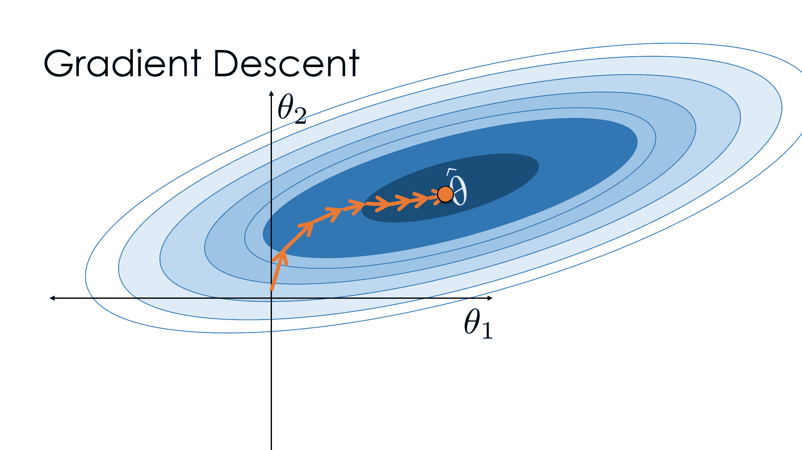
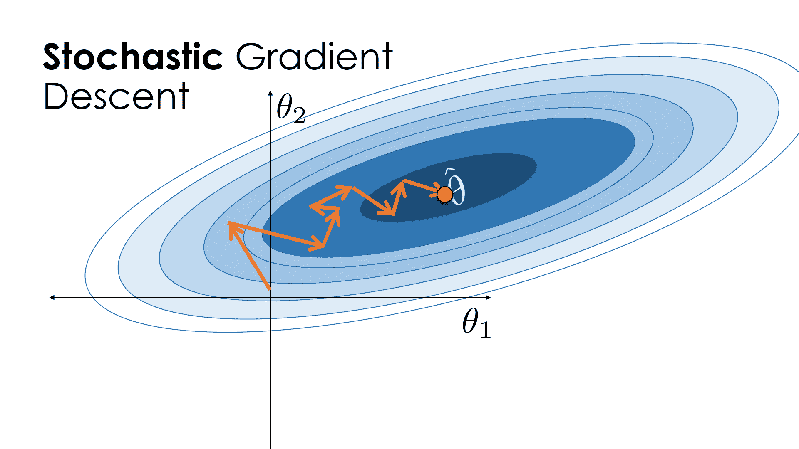

# 随机梯度下降法

> 原文：[https://www.bookbookmark.ds100.org/ch/11/gradient_randomatic.html](https://www.bookbookmark.ds100.org/ch/11/gradient_randomatic.html)

```
# HIDDEN
# Clear previously defined variables
%reset -f

# Set directory for data loading to work properly
import os
os.chdir(os.path.expanduser('~/notebooks/11'))

```

```
# HIDDEN
import warnings
# Ignore numpy dtype warnings. These warnings are caused by an interaction
# between numpy and Cython and can be safely ignored.
# Reference: https://stackoverflow.com/a/40846742
warnings.filterwarnings("ignore", message="numpy.dtype size changed")
warnings.filterwarnings("ignore", message="numpy.ufunc size changed")

import numpy as np
import matplotlib.pyplot as plt
import pandas as pd
import seaborn as sns
%matplotlib inline
import ipywidgets as widgets
from ipywidgets import interact, interactive, fixed, interact_manual
import nbinteract as nbi

sns.set()
sns.set_context('talk')
np.set_printoptions(threshold=20, precision=2, suppress=True)
pd.options.display.max_rows = 7
pd.options.display.max_columns = 8
pd.set_option('precision', 2)
# This option stops scientific notation for pandas
# pd.set_option('display.float_format', '{:.2f}'.format)

```

在本节中，我们将讨论对梯度下降的修改，这使得它对大型数据集更有用。修改后的算法称为**随机梯度下降**。

回忆梯度下降使用所选损失函数的梯度更新模型参数$\theta$。具体来说，我们使用了这个梯度更新公式：

$$ {\theta}^{(t+1)} = \theta^{(t)} - \alpha \cdot \nabla_{\theta} L(\theta^{(t)}, \textbf{y}) $$

在这个方程中：

*   $\theta^（t）$是我们在第$t$th 次迭代时对$\theta^*$的当前估计值。
*   $\alpha$是学习率
*   $是损失函数的梯度
*   我们计算下一个估计值$\theta^（t+1）$减去以\theta^（t）（t）计算的$\alpha$和$\nabla \theta l（\theta，textbf y）$的乘积。$

### 批梯度下降的限制

在上面的表达式中，我们使用损失函数$\ell（\theta，y_i）$的平均梯度（使用**整个数据集**计算$\nabla \theta（\theta，y）$的值。换句话说，每次更新$\theta$时，我们都会作为一个完整的批处理查询数据集中的所有其他点。因此，上面的梯度更新规则通常被称为**批梯度下降**。

不幸的是，我们经常使用大型数据集。虽然批量梯度下降通常会在相对较少的迭代中找到一个最优的$\theta$，但是如果训练集包含多个点，则每次迭代都需要很长的时间来计算。

### 随机梯度下降

为了避免在整个训练集中计算梯度的困难，随机梯度下降使用单个随机选择的数据点来近似整体梯度。由于观测是随机选择的，我们期望在每个单独观测中使用梯度最终会收敛到与批梯度下降相同的参数。

再次考虑批次梯度下降的公式：

$$ {\theta}^{(t+1)} = \theta^{(t)} - \alpha \cdot \nabla_{\theta} L(\theta^{(t)}, \textbf{y}) $$

在这个公式中，我们有一个术语“$\nabla \theta l（\theta ^（t）、\textbf y）”$，培训集中所有点的损失函数平均梯度。即：

$$ \begin{aligned} \nabla_{\theta} L(\theta^{(t)}, \textbf{y}) &= \frac{1}{n} \sum_{i=1}^{n} \nabla_{\theta} \ell(\theta^{(t)}, y_i) \end{aligned} $$

其中，$\ell（\theta，y_i）$是训练集中某一点的损失。为了进行随机梯度下降，我们只需将平均梯度替换为单点的梯度。随机梯度下降的梯度更新公式为：

$$ {\theta}^{(t+1)} = \theta^{(t)} - \alpha \cdot \nabla_{\theta} \ell(\theta^{(t)}, y_i) $$

在这个公式中，$Y I$是从$\textbf Y$中随机选择的。注意，随机选择点对随机梯度下降的成功至关重要！如果不随机选取点，随机梯度下降可能比批量梯度下降产生更差的结果。

我们最常用的方法是随机梯度下降，通过改变数据点的排列顺序，使用每个点的排列顺序，直到完成一个完整的训练数据。如果算法没有收敛，我们就重新组合点，并运行另一个数据传递。随机梯度下降的每个**迭代**都会查看一个数据点；每个完整的数据传递都称为**epoch**。

#### 使用 MSE 损耗[¶](#Using-the-MSE-Loss)

作为一个例子，我们推导了均方损失的随机梯度下降更新公式。回顾平均平方损失的定义：

$$ \begin{aligned} L(\theta, \textbf{y}) &= \frac{1}{n} \sum_{i = 1}^{n}(y_i - \theta)^2 \end{aligned} $$

考虑到$\theta$的梯度，我们有：

$$ \begin{aligned} \nabla_{\theta} L(\theta, \textbf{y}) &= \frac{1}{n} \sum_{i = 1}^{n} -2(y_i - \theta) \end{aligned} $$

因为上面的公式给出了数据集中所有点的平均梯度损失，所以单个点的梯度损失只是被平均的公式的一部分：

$$ \begin{aligned} \nabla_{\theta} \ell(\theta, y_i) &= -2(y_i - \theta) \end{aligned} $$

因此，MSE 损失的批梯度更新规则为：

$$ \begin{aligned} {\theta}^{(t+1)} = \theta^{(t)} - \alpha \cdot \left( \frac{1}{n} \sum_{i = 1}^{n} -2(y_i - \theta) \right) \end{aligned} $$

随机梯度更新规则为：

$$ \begin{aligned} {\theta}^{(t+1)} = \theta^{(t)} - \alpha \cdot \left( -2(y_i - \theta) \right) \end{aligned} $$

### 随机梯度下降行为

由于随机下降一次只检查一个数据点，因此它可能会比批梯度下降的更新更准确地更新$\theta$然而，由于随机梯度下降计算更新比批梯度下降快得多，随机梯度下降可以在批梯度下降完成单个更新时，朝着最优的$\theta$取得显著进展。

在下面的图片中，我们使用批梯度下降显示对$\theta$的连续更新。图中最暗的区域对应于我们训练数据中的最优值$\theta$，$\hat \theta$。

（此图从技术上显示了一个具有两个参数的模型，但更重要的是，批梯度下降总是朝着$\hat \theta 的方向迈出一步。）



另一方面，随机梯度下降通常会从$\hat \theta$开始逐步下降！然而，由于它使更新更频繁，所以它通常比批梯度下降更快地收敛。



### 定义随机梯度下降函数

正如我们之前对批梯度下降所做的那样，我们定义了一个函数来计算损失函数的随机梯度下降。它将类似于我们的`minimize`函数，但我们需要在每次迭代中实现一个观测的随机选择。

```
def minimize_sgd(loss_fn, grad_loss_fn, dataset, alpha=0.2):
    """
    Uses stochastic gradient descent to minimize loss_fn.
    Returns the minimizing value of theta once theta changes
    less than 0.001 between iterations.
    """
    NUM_OBS = len(dataset)
    theta = 0
    np.random.shuffle(dataset)
    while True:
        for i in range(0, NUM_OBS, 1):
            rand_obs = dataset[i]
            gradient = grad_loss_fn(theta, rand_obs)
            new_theta = theta - alpha * gradient

            if abs(new_theta - theta) < 0.001:
                return new_theta

            theta = new_theta
        np.random.shuffle(dataset)

```

### 小批量梯度下降

**小批量梯度下降**通过增加我们在每次迭代中选择的观测次数，实现了批量梯度下降和随机梯度下降之间的平衡。在小批量梯度下降中，我们对每个梯度更新使用一些数据点，而不是单个点。

我们利用损失函数梯度的平均值来估计交叉熵损失的真实梯度。如果$\mathcal b$是我们从$n$观察值中随机抽样的一小批数据点，则以下近似值成立。

$$ \nabla_\theta L(\theta, \textbf{y}) \approx \frac{1}{|\mathcal{B}|} \sum_{i\in\mathcal{B}}\nabla_{\theta}\ell(\theta, y_i) $$

与随机梯度下降一样，我们通过改变训练数据的格式和通过迭代随机数据选择小批量来执行小批量梯度下降。在每个时代之后，我们重新洗牌我们的数据并选择新的小批量。

虽然我们已经在这本教科书中区分了随机和小批量梯度下降，但随机梯度下降有时被用作一个涵盖选择任何大小的小批量的总称。

#### 选择小批量大小[¶](#Selecting-the-Mini-Batch-Size)

在某些计算机中的图形处理单元（GPU）芯片上运行时，最小批量梯度下降最为理想。由于这些硬件类型的计算可以并行执行，因此使用小批量可以在不增加计算时间的情况下提高梯度的精度。根据 GPU 的内存，小批量通常设置在 10 到 100 个观察值之间。

### 为小批量梯度下降定义函数

用于小批量梯度下降的函数要求能够选择批量大小。下面是实现此功能的函数。

```
def minimize_mini_batch(loss_fn, grad_loss_fn, dataset, minibatch_size, alpha=0.2):
    """
    Uses mini-batch gradient descent to minimize loss_fn.
    Returns the minimizing value of theta once theta changes
    less than 0.001 between iterations.
    """
    NUM_OBS = len(dataset)
    assert minibatch_size < NUM_OBS

    theta = 0
    np.random.shuffle(dataset)
    while True:
        for i in range(0, NUM_OBS, minibatch_size):
            mini_batch = dataset[i:i+minibatch_size]
            gradient = grad_loss_fn(theta, mini_batch)
            new_theta = theta - alpha * gradient

            if abs(new_theta - theta) < 0.001:
                return new_theta

            theta = new_theta
        np.random.shuffle(dataset)

```

## 摘要[¶](#Summary)

我们使用批梯度下降迭代改进模型参数，直到模型达到最小损失。由于批量梯度下降是大数据集难以计算的问题，我们经常使用随机梯度下降来拟合模型。在使用 GPU 时，在相同的计算代价下，小批量梯度下降比随机梯度下降收敛得更快。对于大型数据集，随机梯度下降和小批量梯度下降通常比批量梯度下降更为可取，因为它们的计算速度更快。