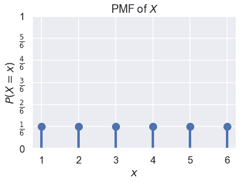

# 随机变量

> 原文：[https://www.bookbookmark.ds100.org/ch/12/prob_random_vars.html](https://www.bookbookmark.ds100.org/ch/12/prob_random_vars.html)

```
# HIDDEN
# Clear previously defined variables
%reset -f

# Set directory for data loading to work properly
import os
os.chdir(os.path.expanduser('~/notebooks/12'))

```

```
# HIDDEN
import warnings
# Ignore numpy dtype warnings. These warnings are caused by an interaction
# between numpy and Cython and can be safely ignored.
# Reference: https://stackoverflow.com/a/40846742
warnings.filterwarnings("ignore", message="numpy.dtype size changed")
warnings.filterwarnings("ignore", message="numpy.ufunc size changed")

import numpy as np
import matplotlib.pyplot as plt
import pandas as pd
import seaborn as sns
%matplotlib inline
import ipywidgets as widgets
from ipywidgets import interact, interactive, fixed, interact_manual
import nbinteract as nbi

sns.set()
sns.set_context('talk')
np.set_printoptions(threshold=20, precision=2, suppress=True)
pd.options.display.max_rows = 7
pd.options.display.max_columns = 8
pd.set_option('precision', 2)
# This option stops scientific notation for pandas
# pd.set_option('display.float_format', '{:.2f}'.format)

```

```
# HIDDEN
import scipy.stats as stats

```

几乎所有现实世界中的现象都包含一定程度的随机性，使得数据生成和收集本身就是随机过程。由于我们将模型与这些数据相匹配，因此我们的模型也包含随机性。为了数学上表示这些随机过程，我们使用随机变量。

**随机变量**是一个代数变量，表示由概率事件确定的**数值。在本书中，我们总是使用大写字母（不是希腊字母），如$X$或$Y$来表示随机变量。尽管随机变量可以代表离散的（如 10 人样本中男性的数量）或连续的数量（如洛杉矶的平均温度），但我们将仅在本教材中使用离散随机变量。**

我们必须总是指定一个给定的随机变量代表什么。例如，我们可以写下随机变量$x$表示 10 个硬币翻转中的头数。随机变量的定义决定了它可以接受的值。在本例中，$x$只能包含 0$到 10$之间的值。

我们还必须能够确定随机变量接受每个可能值的概率。例如，$x=0$被写为$p（x=0）=（0.5）^ 10$的概率，我们同样可以计算$x$是任何以$0，1，ldots，10 为单位的值的概率。

### 概率质量函数

随机变量$x$的**概率质量函数（pmf）**或**分布**提供$x$接受其每个可能值的概率。如果我们将$\mathbb x 设为$x$可以接受的一组值，并且$x$是$\mathbb x 中的特定值，则$x$的 PMF 必须满足以下规则：

$$ 1) \sum_{x \in \mathbb{X}} P(X = x) = 1 $$$$ 2) \text{ For all } x \in \mathbb{X}, 0 \leq P(X = x) \leq 1 $$

第一条规则规定，$x$sum 到$1$的所有可能值的概率。

第二条规则规定，给定值$x$的每个概率必须介于$0$和$1$之间。

假设我们让 x 美元代表一个公平的六面骰子的一个骰子的结果。我们知道，$x 在 1、2、3、4、5、6 中，$p（x=1）=p（x=2）=\ldots=p（x=6）=\frac 1 6 美元。我们可以绘制$x$的 PMF 作为概率分布：

```
# HIDDEN

def plot_pmf(xs, probs, rv_name='X'):
    plt.plot(xs, probs, 'ro', ms=12, mec='b', color='b')
    plt.vlines(xs, 0, probs, colors='b', lw=4)
    plt.xlabel('$x$')
    plt.ylabel('$P(X = x)$')
    plt.ylim(0, 1)
    plt.title('PMF of $X$');

```

```
# HIDDEN
xk = np.arange(1, 7)
pk = (1/6, 1/6, 1/6, 1/6, 1/6, 1/6)

plot_pmf(np.arange(1, 7), np.repeat(1/6, 6))

plt.yticks(np.linspace(0, 1, 7),
           ('0', r'$\frac{1}{6}$', r'$\frac{2}{6}$', r'$\frac{3}{6}$',
            r'$\frac{4}{6}$', r'$\frac{5}{6}$', '1'));

```



### 关节分布

单随机变量的 PMF 概念自然地扩展到多随机变量的联合分布。特别是，两个或多个随机变量的**联合分布**产生这些随机变量同时接受一组特定值的概率。

例如，让随机变量$X$表示 10 个硬币翻转中的头数，让$Y$表示同一组 10 个硬币翻转中的尾部数。我们可以注意到：

$$P(X=0, Y=10) = P(X=10, Y=0) = (0.5)^{10}$$

同时$P（x=6，y=6）=0 美元，因为我们不可能在 10 个硬币翻转中有 6 个头部和 6 个尾部。

#### 边际分布

有时，我们从两个随机变量$X$和$Y$的联合分布开始，但只想找到$X$的分布。这个分布称为**边际分布**。为了找出$x$接受某个特定值的概率，我们必须考虑所有可能的$y$值（用$\mathbb y 表示），这些值可以与$x$同时发生，并对所有这些联合概率求和：

$$ \begin{aligned} \sum_{y \in \mathbb{Y}} P(X=x, Y=y) &= P(X=x) \end{aligned} $$

我们可以证明如下身份：

$$ \begin{aligned} \sum_{y \in \mathbb{Y}} P(X=x, Y=y) &= \sum_{y \in \mathbb{Y}} P(X=x) \times P(Y=y \; \vert \; X=x)\\ &= P(X=x) \times \sum_{y \in \mathbb{Y}} P(Y=y \; \vert \; X=x)\\ &= P(X=x) \times 1 \\ &= P(X=x) \end{aligned} $$

在这个证明的最后一行中，我们将$y\；\vert\；x=x$作为一个带有未知 pmf 的随机变量。这一点很重要，因为我们使用了一个属性，即 pmf 中的概率总和为 1 美元，这意味着在 mathbb y p（y=y \ vert \ x=x）=1 美元。

#### 独立随机变量

像事件一样，两个随机变量可以是相依的或独立的。任何两个随机变量都是独立的，只要知道一个变量的结果不会改变观察另一个变量任何结果的概率。

例如，假设我们把一枚硬币掷十次，让$x$作为头的数目，让$y$作为尾的数目。显然，$x$和$y$是因变量，因为知道$x=0$意味着$y$必须等于$10$。如果我们没有观察到$X$的值，$Y$可以以非零概率在$0$和$10$之间取任何值。

我们可以做两组十次翻转。如果$x$是第一组翻转中的头数，$y$是第二组翻转中的头数，$x$和$y$是独立的，因为第一组十个翻转的结果不会影响第二组翻转的结果。

### 年龄[¶](#An-Example-with-Ages)的例子

假设我们有一个由四个人组成的小数据集：

```
# HIDDEN
data={"Name":["Carol","Bob","John","Dave"], 'Age': [50,52,51,50]}
people = pd.DataFrame(data)
people

```

|  | 姓名 | 年龄 |
| --- | --- | --- |
| 零 | 颂歌 | 五十 |
| --- | --- | --- |
| 1 个 | 鲍勃 | 五十二 |
| --- | --- | --- |
| 二 | 约翰 | 五十一 |
| --- | --- | --- |
| 三 | 戴夫 | 50 |
| --- | --- | --- |

假设我们从这个数据集中抽取两个人进行替换。如果随机变量$Z$代表样本中第一和第二个人的年龄差异，那么$Z$的 PMF 是什么？

为了解决这个问题，我们定义了两个新的随机变量。我们将$X$定义为第一个人的年龄，$Y$定义为第二个人的年龄。那么，$Z=X-Y$就可以了。然后，我们找到 x$和 y$的联合概率分布：x$和 y$可以同时接受的每个值的概率。在这种情况下，请注意$x$和$y$是独立的，分布相同；这两个随机变量表示来自同一数据集的两个独立的提取，第一个提取对第二个提取没有影响。例如，$x=51$和$y=50$的概率是$p（x=51，y=50）=\frac 1 4 \cdot\frac 2 4 frac 2 16。以类似的方式，我们得到：

|  | Y＝50 美元 | Y＝51 美元 | Y＝52 美元 |
| --- | --- | --- | --- |
| X＝50 美元 | 4/16 | 2/16 | 2/16 |
| X＝51 美元 | 2/16 | 1/16 | 1/16 |
| X＝52 美元 | 2/16 | 1/16 | 1/16 |

现在让我们考虑一下这样的情况：我们从上面相同的数据集中抽取两个人，但没有替换。如前所述，我们将$X$定义为第一个人的年龄，$Y$定义为第二个人的年龄，$Z=X-Y$。但是，现在$X$和$Y$不是独立的；例如，如果我们知道$X=51$，那么$Y\neq 51$。我们发现 X 美元和 Y 美元的联合分配如下：

|  | $Y=50$ | $Y=51$ | $Y=52$ |
| --- | --- | --- | --- |
| $X=50$ | 2/12 | 2/12 | 2/12 |
| $X=51$ | 2/12 | 零 | 1/12 |
| $X=52$ | 2/12 | 1/12 | 0 |

我们还可以从表中找到$Y$的边际分布。

$$ \begin{aligned} P(Y = 50) &= P(Y = 50, X = 50) + P(Y = 50, X = 51) + P(Y = 50, X = 52) \\ &= \frac{2}{12} + \frac{2}{12} + \frac{2}{12} \\ &= \frac{1}{2} \\ P(Y = 51) &= \frac{2}{12} + 0 + \frac{1}{12} = \frac{1}{4} \\ P(Y = 52) &= \frac{2}{12} + \frac{1}{12} + 0 = \frac{1}{4} \end{aligned} $$

注意，我们对上面的联合分布表的每一列进行了汇总。我们可以想象计算每一列的总和，并将结果写在下表的空白处；这是术语边际分布的起源。

您还应该注意到，$X$和$Y$在没有替换的情况下采样时是不独立的。例如，如果 x=52 美元，$y\neq 52 美元。然而，$x$和$y$的边际分布仍然相同。

## 摘要[¶](#Summary)

在本节中，我们将介绍随机变量，即根据随机过程获取值的数学变量。这些结果必须完全准确地定义，每个结果都必须有明确的发生概率。随机变量可以用来表示许多随机现象，包括数据收集过程。