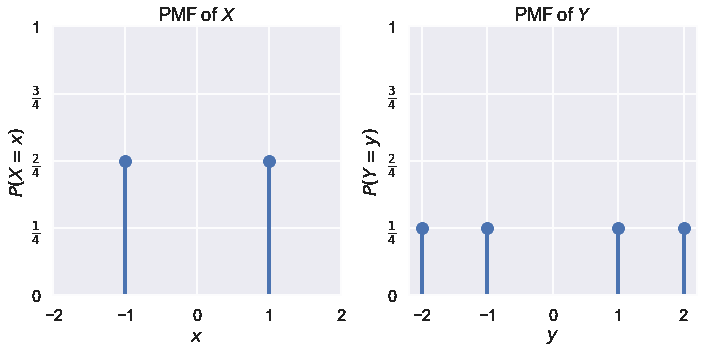

# 期望和方差

> 原文：[https://www.bookbookmark.ds100.org/ch/12/prob_exp_var.html](https://www.bookbookmark.ds100.org/ch/12/prob_exp_var.html)

```
# HIDDEN
# Clear previously defined variables
%reset -f

# Set directory for data loading to work properly
import os
os.chdir(os.path.expanduser('~/notebooks/12'))

```

```
# HIDDEN
import warnings
# Ignore numpy dtype warnings. These warnings are caused by an interaction
# between numpy and Cython and can be safely ignored.
# Reference: https://stackoverflow.com/a/40846742
warnings.filterwarnings("ignore", message="numpy.dtype size changed")
warnings.filterwarnings("ignore", message="numpy.ufunc size changed")

import numpy as np
import matplotlib.pyplot as plt
import pandas as pd
import seaborn as sns
%matplotlib inline
import ipywidgets as widgets
from ipywidgets import interact, interactive, fixed, interact_manual
import nbinteract as nbi

sns.set()
sns.set_context('talk')
np.set_printoptions(threshold=20, precision=2, suppress=True)
pd.options.display.max_rows = 7
pd.options.display.max_columns = 8
pd.set_option('precision', 2)
# This option stops scientific notation for pandas
# pd.set_option('display.float_format', '{:.2f}'.format)

```

虽然随机变量完全由其概率质量函数（PMF）描述，但我们经常使用**期望**和**方差**来描述变量的长期平均值和分布。这两个值具有独特的数学性质，对数据科学具有特别重要的意义，例如，我们可以通过显示其预期值等于总体参数来证明长期的估计是准确的。我们通过定义期望值和方差，介绍它们最有用的数学性质，并用一个简单的估计应用来结束。

### 期望值[¶](#Expectation)

我们经常对随机变量的长期平均值感兴趣，因为它给我们一个变量分布中心的感觉。我们将这种长期平均值称为随机变量的**期望值**或**期望值**。随机变量$x$的预期值为：

$$\mathbb{E}[X] = \sum_{x\in \mathbb{X}} x \cdot P(X = x)$$

例如，如果$x$表示一个公平的六面骰子的滚动，

$$ \begin{aligned} \mathbb{E}[X] &= 1 \cdot P(X = 1) + 2 \cdot P(X = 2) + \ldots + 6 \cdot P(X = 6) \\ &= 1 \cdot \frac{1}{6} + 2 \cdot \frac{1}{6} + \ldots + 6 \cdot \frac{1}{6} \\ &= 3.5 \end{aligned} $$

注意$x$的预期值不一定是$x$的可能值。虽然$\mathbb e[x]=3.5$，但$x$实际上不能接受$3.5$的值。

**示例：**从上一节调用数据集：

```
# HIDDEN
data={"Name":["Carol","Bob","John","Dave"], 'Age': [50,52,51,50]}
people = pd.DataFrame(data)
people

```

|  | 姓名 | 年龄 |
| --- | --- | --- |
| 零 | 颂歌 | 五十 |
| --- | --- | --- |
| 1 个 | 鲍勃 | 五十二 |
| --- | --- | --- |
| 二 | 约翰 | 五十一 |
| --- | --- | --- |
| 三 | 戴夫 | 50 |
| --- | --- | --- |

我们从这个数据集中随机选择一个人。假设$Y$是表示此人年龄的随机变量。然后：

$$ \begin{aligned} \mathbb{E}[Y] &= 50 \cdot P(Y = 50) + 51 \cdot P(Y = 51) + 52 \cdot P(Y = 52) \\ &= 50 \cdot \frac{2}{4} + 51 \cdot \frac{1}{4} + 52 \cdot \frac{1}{4} \\ &= 50.75 \end{aligned} $$

**示例：**假设我们从数据集中抽取两个人进行替换。如果随机变量$Z$表示样本中第一和第二个人的年龄差，那么什么是$\mathbb e[Z]$？

如前一节所述，我们将$X$定义为第一个人的年龄，将$Y$定义为第二个人的年龄，这样$Z=X-Y$。从上一节给出的 x 美元和 y 美元的联合分配中，我们可以找到 z 美元的 PMF。例如，$P（Z=1）=P（X=51，Y=50）+P（X=52，Y=51）=\frac 3 16$。因此，

$$ \begin{aligned} \mathbb{E}[Z] &= (-2) \cdot P(Z = -2) + (-1) \cdot P(Z = -1) + \ldots + (2) \cdot P(Z = 2) \\ &= (-2) \cdot \frac{2}{16} + (-1) \cdot \frac{3}{16}+ \ldots + (2) \cdot \frac{2}{16} \\ &= 0 \end{aligned} $$

由于$\mathbb e[z]=0$，我们预计从长远来看，2 号样本中的人的年龄差异将为 0。

#### 期望线性度

当我们像上面所做的那样处理随机变量的线性组合时，我们通常可以很好地利用期望**的线性**，而不是单调地单独计算每个联合概率。

期望的线性表示：

$$ \begin{aligned} \mathbb{E}[X + Y] &= \mathbb{E}[X] + \mathbb{E}[Y] \\ \end{aligned} $$

根据这一说法，我们还可以得出：

$$ \begin{aligned} \mathbb{E}[cX] &= c\mathbb{E}[X] \\ \end{aligned} $$

其中$x$和$y$是随机变量，而$c$是常量。

换句话说，任意两个随机变量之和的期望值等于这些变量的期望值之和。

在上一个示例中，我们看到$Z=X-Y$。因此，$\mathbb e[z]=\mathbb[x-y]=\mathbb[x]-\mathbb[y]$。

现在我们可以分别计算$\mathbb e[x]$和$\mathbb e[y]$了。因为$\mathbb e[x]=\mathbb e[y]=50.75$，$\mathbb e[z]=50.75-50.75=0$。

即使 X 美元和 Y 美元相互依赖，期望的线性关系仍然存在！作为一个例子，让我们再次考虑一下这样一种情况：我们从前面部分的小数据集中抽取两个人进行样本，而不进行替换。如前所述，我们将$X$定义为第一个人的年龄，$Y$定义为第二个人的年龄，$Z=X-Y$。很明显，$X$和$Y$不是独立的，例如，知道$X=52$就意味着$Y\neq 52$。

从上一节给出的$x$和$y$的联合分配中，我们可以找到$\mathbb e[z]$：

$$ \begin{aligned} \mathbb{E}[Z] &= (-2) \cdot P(Z = -2) + (-1) \cdot P(Z = -1) + \ldots + (2) \cdot P(Z = 2) \\ &= (-2) \cdot \frac{2}{12} + (-1) \cdot \frac{3}{12}+ \ldots + (2) \cdot \frac{2}{12} \\ &= 0 \end{aligned} $$

计算这个期望的一个简单方法是使用期望的线性。即使$X$和$Y$依赖，$\MathBB E[Z]=\MathBB E[X-Y]=\MathBB[X]-\MathBB[Y]$。回想上一节，$x$和$y$具有相同的 pmf，即使我们在不替换的情况下采样，这意味着$\mathbb e[x]=\mathbb[y]=50.75$。因此，与第一个场景一样，$\mathbb e[z]=0$。

注意期望的线性仅适用于随机变量的线性组合。例如，$\mathbb e[x y]=\mathbb[x]\mathbb[y]$不是$x$和$y$的线性组合。在这种情况下，$\mathbb e[x y]=\mathbb[x]\mathbb[y]$通常仅适用于独立随机变量。

### 方差[¶](#Variance)

随机变量的方差是变量排列的数值描述。对于随机变量$X$：

$$ \begin{aligned} Var(X) &= \mathbb{E}[(X - \mathbb{E}[X])^2] \\ \end{aligned} $$

上述公式表明，x$的方差是 x$预期值的平均平方距离。

对于我们为了简洁而省略的一些代数操作，我们也可以等效地写：

$$ \begin{aligned} Var(X) &= \mathbb{E}[X^2] - \mathbb{E}[X]^2 \\ \end{aligned} $$

考虑以下两个随机变量$X$和$Y$的概率分布：

```
# HIDDEN

def plot_pmf(xs, probs, rv_name='X', val_name='x', prob_denom=4):
    plt.plot(xs, probs, 'ro', ms=12, mec='b', color='b')
    plt.vlines(xs, 0, probs, colors='b', lw=4)
    plt.xlabel(f'${val_name}$')
    plt.ylabel(f'$P({rv_name} = {val_name})$')
    plt.ylim(0, 1)
    plt.yticks(np.linspace(0, 1, prob_denom + 1),
               ['0']
               + [rf'$\frac{{{n}}}{{{prob_denom}}}$'
                  for n in range(1, prob_denom)]
               + ['1'])
    plt.title(f'PMF of ${rv_name}$');

```

```
# HIDDEN

plt.figure(figsize=(10, 5))

plt.subplot(1, 2, 1)
plot_pmf([-1, 1], [0.5, 0.5])
plt.xlim(-2, 2);

plt.subplot(1, 2, 2)
plot_pmf((-2, -1, 1, 2), (1/4, 1/4, 1/4, 1/4), rv_name='Y', val_name='y')
plt.tight_layout()

```



$x$的值为-1 和 1，概率分别为\frac 1 2。$Y$的值为-2、-1、1 和 2，概率分别为\frac 1 4。我们发现$\mathbb e[x]=\mathbb e[y]=0$。由于$Y$的分布比$X$的分布更高，我们预计$var（y）$大于$var（x）$。

$$ \begin{aligned} Var(X) &= \mathbb{E}[X^2] - \mathbb{E}[X]^2 \\ &= \mathbb{E}[X^2] - 0^2 \\ &= \mathbb{E}[X^2] \\ &= (-1)^2 P(X = -1) + (1)^2 P(X = 1) \\ &= 1 \cdot 0.5 + 1 \cdot 0.5 \\ &= 1 \\\\ Var(Y) &= \mathbb{E}[Y^2] - \mathbb{E}[Y]^2 \\ &= \mathbb{E}[Y^2] - 0^2 \\ &= \mathbb{E}[Y^2] \\ &= (-2)^2 P(Y = -2) + (-1)^2 P(Y = -1) + (1)^2 P(Y = 1) + (2)^2 P(Y = 2) \\ &= 4 \cdot 0.25 + 1 \cdot 0.25 + 1 \cdot 0.25 + 4 \cdot 0.25\\ &= 2.5 \end{aligned} $$

如预期的那样，$Y$的差异大于$X$的差异。

方差有一个有用的特性来简化一些计算。如果$x$是随机变量：

$$ \begin{aligned} Var(aX + b) &= a^2 Var(X) \end{aligned} $$

如果两个随机变量$x$和$y$是独立的：

$$ \begin{aligned} Var(X + Y) = Var(X) + Var(Y) \end{aligned} $$

请注意，期望的线性度适用于任何 x 美元和 y 美元，即使它们是相互依赖的。然而，$var（x+y）=var（x）+var（y）$只有当$x$和$y$独立于**时才持有。**

#### 协方差

两个随机变量$x$和$y$的协方差定义为：

$$ \begin{aligned} Cov(X, Y) &= \mathbb{E}[(X - \mathbb{E}[X])(Y - \mathbb{E}[Y])] \end{aligned} $$

同样，我们可以执行一些代数操作来获得：

$$ \begin{aligned} Cov(X, Y) = \mathbb{E}[XY] - \mathbb{E}[X]\mathbb{E}[Y] \end{aligned} $$

注意，虽然一个随机变量的方差必须是非负的，但是两个随机变量的协方差可以是负的。事实上，协方差有助于测量两个随机变量之间的相关性；协方差的符号有助于我们确定两个随机变量是正相关还是负相关。如果两个随机变量$x$和$y$是独立的，那么$cov（x，y）=0$和$\mathbb[xy]=\mathbb[x]\mathbb[y]$。

### 伯努利随机变量

假设我们想使用一个随机变量$x$来模拟一个带有$p（头）=p$的有偏硬币。我们可以说，如果硬币是正面的，x=1 美元；如果硬币是反面的，x=0 美元。因此，$P（x=1）=P$和$P（x=0）=1-P$之间。这种二元随机变量称为伯努利随机变量，我们可以计算其期望值和方差如下：

$$\mathbb{E}[X] = 1 \times p + 0 \times (1 - p) = p$$$$ \begin{aligned} Var(X) &= \mathbb{E}[X^2] - \mathbb{E}[X]^2 \\ &= 1^2 \times p + 0^2 \times (1 - p) - p^2 \\ &= p - p^2 \\ &= p(1 - p) \end{aligned} $$

### 样本是指[¶](#Sample-Means)

假设我们拥有一个有偏见的硬币，它的面值为$P（头）=P$并且我们想估计$P$的价值。我们可以将硬币翻转$n$次，以收集翻转样本，并计算样本中头部的比例，$\hat p$。如果我们知道$\hat p$经常接近$p$，我们可以将$\hat p$用作$p$的**估计量**。

注意$P$是 _ 而不是 _ 一个随机的数量；它是一个基于硬币偏差的固定值。然而，$\hat p$是一个随机量，因为它是由抛硬币的随机结果产生的。因此，我们可以计算期望值和方差，以精确地理解它对$P$的估计。

要计算$\mathbb e[\hat p]$，我们将首先为示例中的每个翻转定义随机变量。让$x_i$成为$i_th$coin flip 的伯努利随机变量。那么，我们知道：

$$ \begin{aligned} \hat p = \frac{X_1 + X_2 + \ldots + X_n}{n} \end{aligned} $$

为了计算期望值为$\hat p$，我们可以插入上面的公式，并使用这样一个事实，$\mathbb e[x_i]=p$，因为$x_i$是伯努利随机变量。

$$ \begin{aligned} \mathbb{E}[\hat p] &= \mathbb{E} \left[ \frac{X_1 + X_2 + \ldots + X_n}{n} \right] \\ &= \frac{1}{n} \mathbb{E}[X_1 + \ldots + X_n] \\ &= \frac{1}{n} \left( \mathbb{E}[X_1] + \ldots + \mathbb{E}[X_n] \right) \\ &= \frac{1}{n} (p + \ldots + p) \\ &= \frac{1}{n} (np) \\ \mathbb{E}[\hat p] &= p \end{aligned} $$

我们发现$\mathbb e[\hat p]=p$。换句话说，有了足够的翻转，我们预计我们的估值器$\hat p$将收敛到真正的硬币偏差$p$。我们说，P$是一个$P$的**无偏估计量**。

接下来，我们计算出 p$的方差。因为每个翻转都独立于其他翻转，我们知道$x_i$是独立的。这允许我们使用方差的线性。

$$ \begin{aligned} Var(\hat p) &= Var \left(\frac{1}{n} \sum_{i=1}^{n} X_i \right) \\ &= \frac{1}{n^2} \sum_{i=1}^{n}Var(X_i) \\ &= \frac{1}{n^2} \times np(1-p) \\ Var(\hat p) &= \frac{p(1-p)}{n} \end{aligned} $$

从上面的等价性可以看出，随着样本中翻转次数的增加，估计量的方差会减少。换句话说，如果我们收集了大量的数据，我们可以更确定我们的估计值。这种行为被称为大数定律。

## 摘要[¶](#Summary)

我们使用期望和方差来简单描述随机变量的中心和分布。这些数学工具使我们能够确定从一个样本计算出的一个数量如何估计人口中的一个数量。

最小化损失函数将创建一个对其训练数据精确的模型。期望值和方差允许我们对模型对来自人群的未知数据的准确性做出一般性的陈述。